<p align="center">
  
</p>

# DriftBench

DriftBench is a benchmarking toolkit that quantifies how data drift and workload drift influence database behavior. It powers the experiments in the DriftBench paper with reproducible drift generation, query synthesis, and downstream evaluation utilities.

---

## Highlights
- Unified handling of data and workload drift with shared abstractions.
- Declarative experiment definitions through DriftSpec YAML files.
- Support for CSV, Parquet, and PostgreSQL sources plus downstream workloads.
- End-to-end assets (schemas, templates, workloads, plots) for paper reproduction.

## DriftSpec at a Glance

DriftSpec is the YAML contract that tells DriftBench which drift scenario to build. A single file captures the drift family, data source, variables, and optional workload generation hooks, making experiments portable and versionable.

### Key Elements
- `type`: declares whether the pattern targets data or workloads (single-table or multi-table).
- `data_source`: describes how to access the base data and optionally extract a schema.
- `variables`: parameterizes the drift operators, output paths, and workload knobs.
- Optional sections cover temporal stamps, query generation, and downstream processors.

### Minimal Example

```yaml
pattern_id: census-cardinality-demo
seed: 42

type:
  family: data
  category: drift
  subtype: single_table

data_source:
  kind: csv
  path: ./data/census_original.csv

variables:
  base_table: census_original
  drifts:
    - name: vary_cardinality_scale_1
      drift_type: vary_cardinality
      scale: 1.0
      output_path: ./output/data/cardinality/scale/census_original_cardinality_1.csv
```

Run any specification with:

```bash
python -m driftbench.cli run-yaml <path-to-yaml>
```

### Custom Deletion Filters (registry + DriftSpec)

DriftSpec cannot serialize Python callables, so use the filter registry to reference a filter by name.

1) Register a filter in code:

```python
# my_project/filters.py
from driftbench.core.data.filter_registry import register_filter

@register_filter("age_gt_60")
def age_gt_60(series, config):
    return series > 60
```

2) Import the module and reference it in YAML:

```yaml
filter_registry_modules:
  - my_project.filters

variables:
  base_table: census_original
  drifts:
    - name: delete_age_gt_60
      drift_type: selective_deletion
      n: 5000
      filter:
        column: age
        func_name: age_gt_60
      output_path: ./output/data/cardinality/update/census_original_deletion_age_gt_60.csv
```

You can also use simple declarative filters without registration:

```yaml
filter:
  column: timestamp
  min: "2025-07-02T00:00:00"
  max: "2025-07-03T00:00:00"
```

### Trace to DriftSpec (mock flow)

If you already parsed a real database trace into a compact CSV/JSON summary, you can generate a DriftSpec YAML directly:

```bash
python -m driftbench.cli trace-to-spec driftspec/trace_inputs/trace_data_mock.csv driftspec/generated/trace_data_mock.yaml
python -m driftbench.cli trace-to-spec driftspec/trace_inputs/trace_workload_mock.json driftspec/generated/trace_workload_mock.yaml
```

The mock inputs live in `driftspec/trace_inputs/` and show the minimal fields the generator expects.

Explore complete templates in `driftspec/examples/`, including:
- Data drift patterns: [`demo_data_single.yaml`](driftspec/examples/demo_data_single.yaml)
- PostgreSQL single-table: [`demo_postgres.yaml`](driftspec/examples/demo_postgres.yaml)
- PostgreSQL multi-table: [`demo_postgres_multi.yaml`](driftspec/examples/demo_postgres_multi.yaml)
- Workload drift: [`workload_census.yaml`](driftspec/examples/workload_census.yaml)

### Census Temporal Demos (Data)

These specs create timestamped census data and time growth scenarios under `output/data/time_demo/`.

- [`demo_data_census_timestamp.yaml`](driftspec/examples/demo_data_census_timestamp.yaml): add a `timestamp` column with uniform arrivals.
- [`demo_data_census_time_growth.yaml`](driftspec/examples/demo_data_census_time_growth.yaml): combine a base day with an age-skewed day to show a distribution shift.
- [`demo_data_census_time_growth_3x.yaml`](driftspec/examples/demo_data_census_time_growth_3x.yaml): 3-day time growth (uniform + periodic + bursty).
- [`demo_data_census_time_growth_4x.yaml`](driftspec/examples/demo_data_census_time_growth_4x.yaml): 4-day time growth (adds a long-tail day).

Run them with:

```bash
python -m driftbench.cli run-yaml driftspec/examples/demo_data_census_timestamp.yaml
python -m driftbench.cli run-yaml driftspec/examples/demo_data_census_time_growth.yaml
python -m driftbench.cli run-yaml driftspec/examples/demo_data_census_time_growth_3x.yaml
python -m driftbench.cli run-yaml driftspec/examples/demo_data_census_time_growth_4x.yaml
```

Behind the scenes, the runner loads type handlers registered in `driftbench/spec/types/` and executes them through `driftbench/spec/core.py`.

---

## Paper Artifacts

Everything required to reproduce the results in the DriftBench paper lives in this repository.

- **Input datasets**
  - `data/census_original.csv`: baseline census table.
  - `data/census_outliers.csv`: injected outliers for case studies.
  - `data/PG_info.json`: PostgreSQL connection metadata.
- **Schemas and templates**
  - `output/intermediate/census_original_schema.json`: extracted single-table schema.
  - `output/intermediate/census_original_templates.json`: workload templates for the census data.
  - `output/intermediate/tpcds_schema.json`: inferred multi-table schema from TPC-DS.
- **Data drift outputs**
  - `output/data/cardinality/scale/`: scaled datasets (e.g., ×0.1, ×1).
  - `output/data/cardinality/update/`: selective deletion scenarios.
  - `output/data/distributional/column/`: column distribution shifts.
  - `output/data/distributional/outlier/`: rare value injections.
- **Workload drift outputs**
  - `output/workload/parametric/distribution/`: predicate distribution changes.
  - `output/workload/parametric/selectivity/`: workloads with varying selectivity.
  - `output/workload/tpcds_sqls_default.csv`: multi-table workload derived from TPC-DS.

---

## Case Study Gallery

All visuals were generated from notebooks in `driftbench/notebooks/` using the assets listed above.

- **Varying Cardinality**
  <p align="center">
    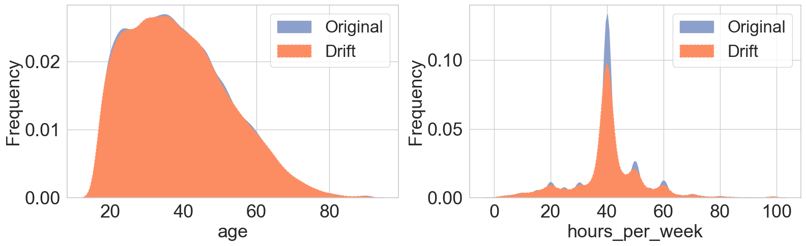
  </p>
  <p align="center">
    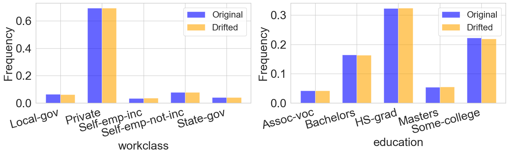
  </p>

- **Selective Deletions**
  <p align="center">
    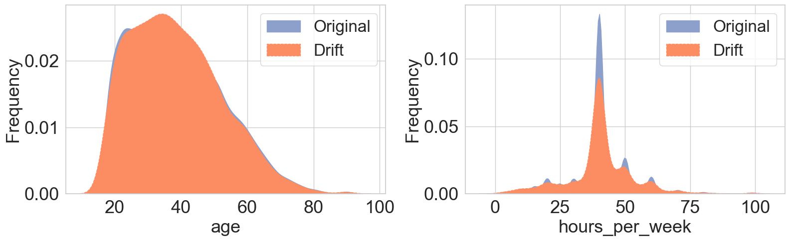
  </p>
  <p align="center">
    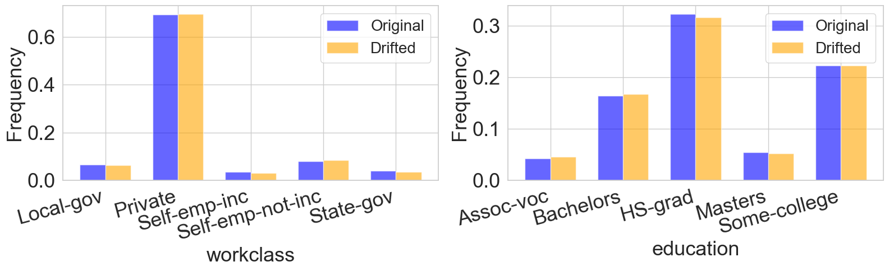
  </p>

- **Column Distribution Shifts**
  <p align="center">
    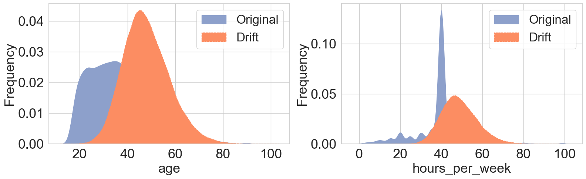
  </p>
  <p align="center">
    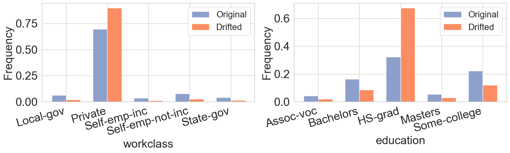
  </p>

- **Outlier Injection**
  <p align="center">
    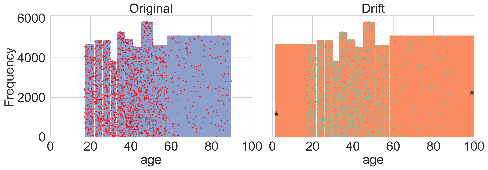
  </p>

- **Workload Drift**
  <p align="center">
    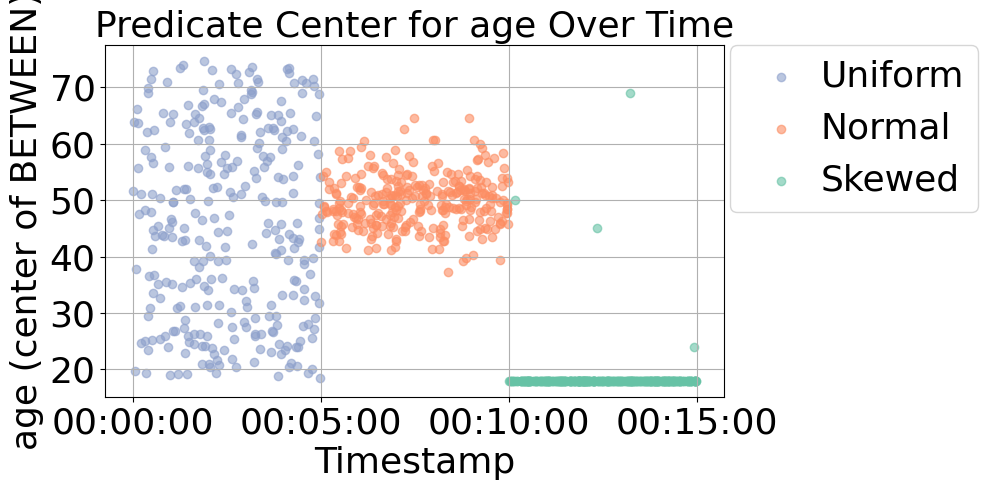
  </p>
  <p align="center">
    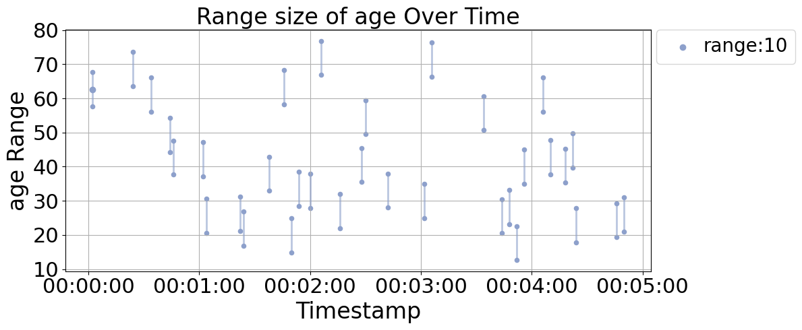
  </p>
  <p align="center">
    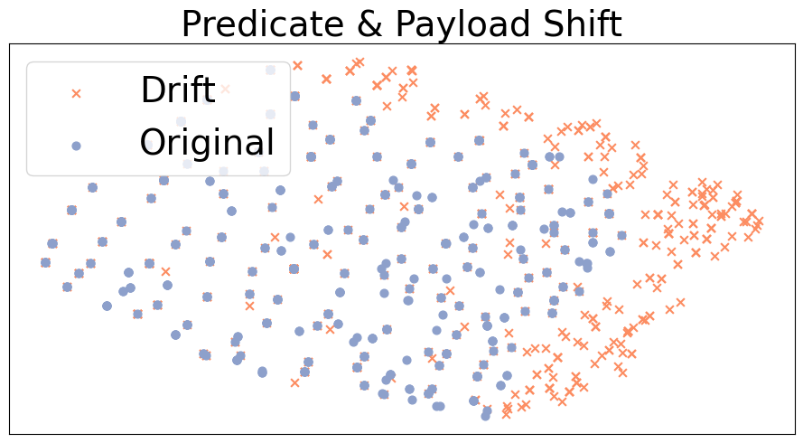
  </p>

- **Q-Error Benchmarks**
  <p align="center">
    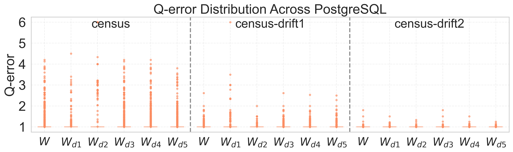
  </p>
  <p align="center">
    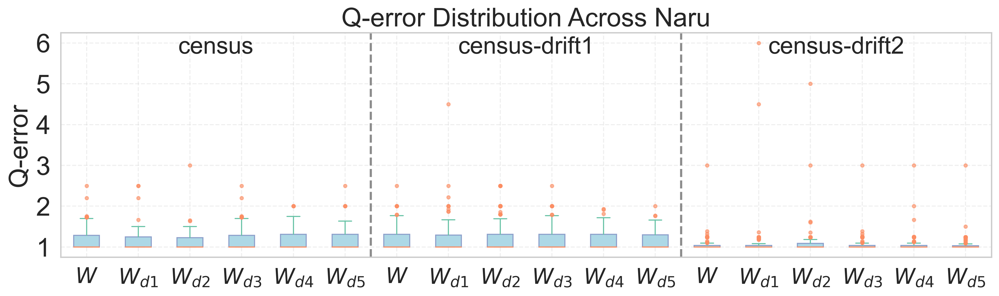
  </p>
  <p align="center">
    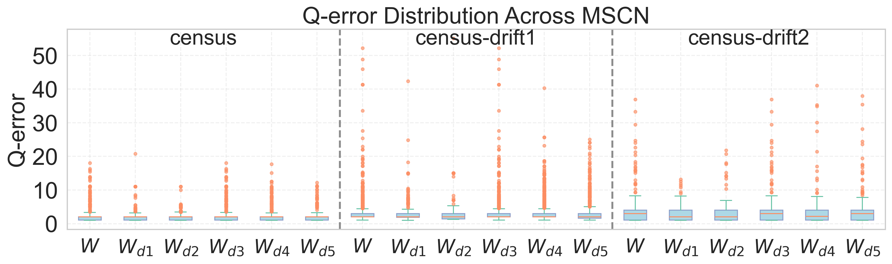
  </p>

- **Join-Aware Drift Templates**
  <details>
  <summary>Click to expand a generated multi-table template</summary>

  ```json
  {
    "template_id": "T000",
    "cardinality": 1441548,
    "tables": {
      "base": "public.catalog_sales",
      "joins": [
        {
          "type": "FULL JOIN",
          "table": "public.store_sales",
          "condition": "public.catalog_sales.cs_net_profit = public.store_sales.ss_net_profit"
        }
      ]
    },
    "predicate": [
      {
        "column": "public.catalog_sales.cs_warehouse_sk",
        "operator": "<=",
        "type": "numeric",
        "value": "",
        "range": {
          "min": 1,
          "max": 5
        },
        "selectivity": 0.1
      }
    ],
    "payload": {
      "columns": [
        "public.catalog_sales.cs_order_number"
      ],
      "aggregation": null,
      "order_by": "public.catalog_sales.cs_order_number",
      "limit": 100
    }
  }
  ```
  </details>

---

## Installation

- Requires Python 3.9 or later.
- Optional: PostgreSQL instance if you plan to run the database-backed examples.
- Create a virtual environment and install the runtime libraries used across the repo:

```bash
python -m venv .venv
source .venv/bin/activate
pip install pandas numpy scipy scikit-learn PyYAML psycopg2-binary
```

Run commands from the repository root so `python -m driftbench.cli ...` resolves local modules.

---

## Quickstart Workflow

1. **Extract Schemas**
   ```bash
   python -m test.test_csv_schema_extractor
   python -m test.test_postgresql_extractor
   ```
   Outputs appear in `output/intermediate/`.

2. **Generate Workload Templates**
   ```bash
   python -m test.test_template_generator_single_table
   python -m test.test_template_generator_multi_table
   ```
   Templates are written to `output/intermediate/`.

3. **Produce Drifted Data**
   ```bash
   python -m test.test_data_generator_single_table
   ```
   Generated datasets land in `output/data/…`.

4. **Produce Drifted Workloads**
   ```bash
   python -m test.test_sql_generator_single_table
   python -m test.test_sql_generator_multi_table
   ```
   Workloads are saved under `output/workload/`.

These scripts mirror the pipeline used for the case studies and figures. Substitute any of the provided DriftSpec YAML files in `driftspec/examples/` to experiment with alternative drift scenarios.
