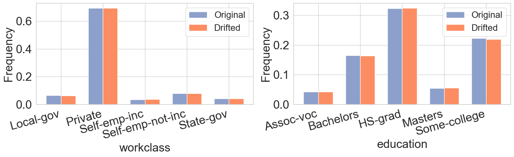
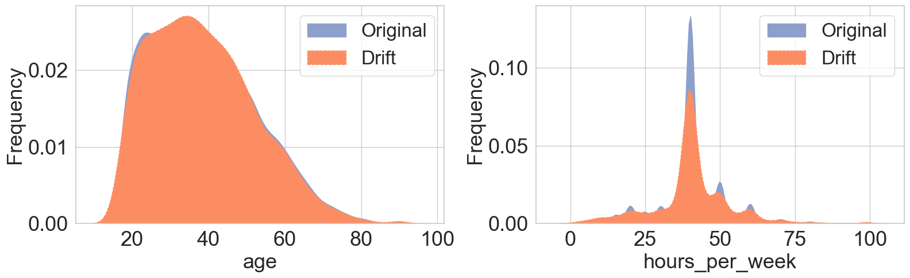
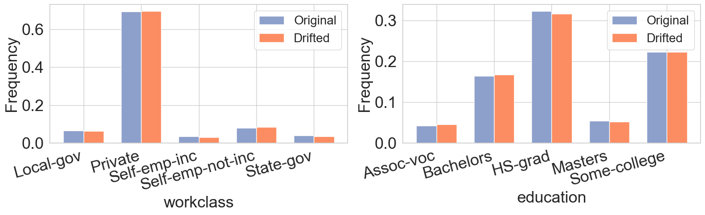
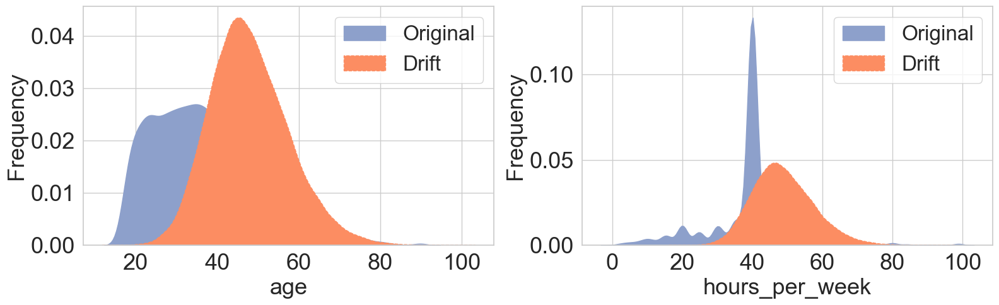
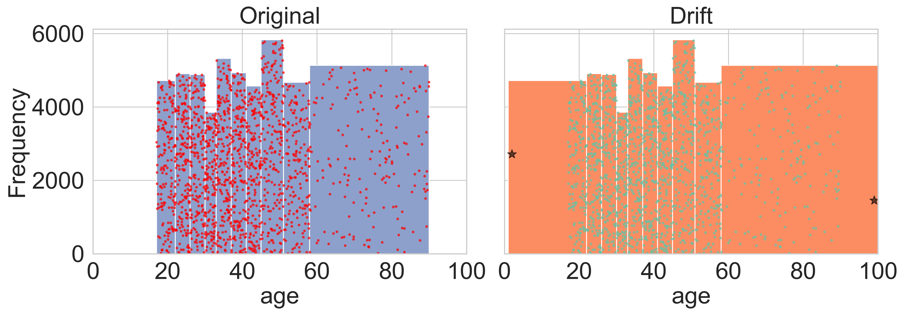
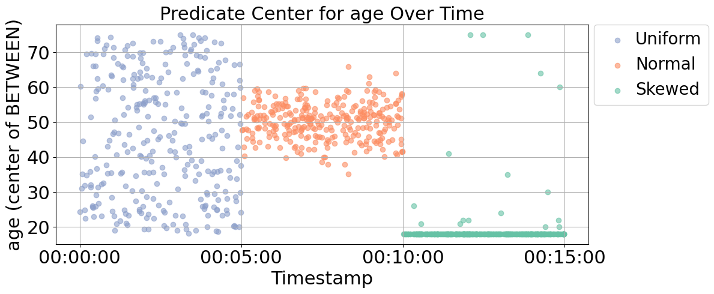
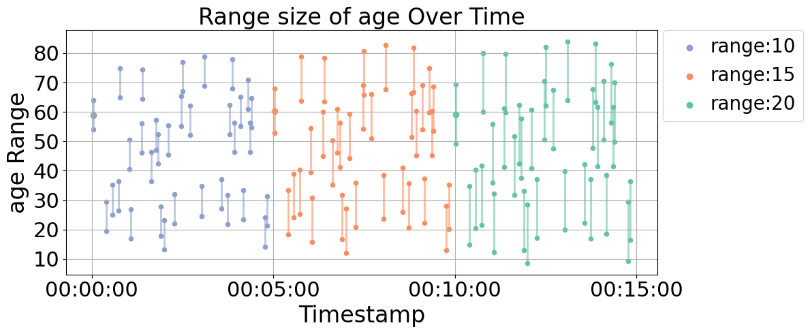
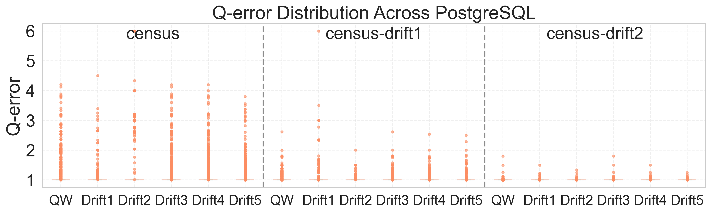

<p align="center">
  
</p>


# DriftBench

**DriftBench** is a benchmarking toolkit for evaluating the impact of **data drift** and **workload drift** in database systems. It supports controlled drift generation, query synthesis, and downstream tasks such as cardinality estimation analysis.

---


## Resources used in the Paper

This repository includes all essential artifacts used in the DriftBench paper.

### Input Datasets
- `data/census_original.csv`: Real-world census dataset used as the base.
- `data/census_outliers.csv`: Dataset with injected outliers for case studies.
- `data/PG_info.json`: Metadata for PostgreSQL integration.

### Schema & Templates
- `output/intermediate/census_original_schema.json`: Extracted schema used across all experiments.
- `output/intermediate/census_original_templates.json`: Query templates generated from the base schema.
- `output/intermediate/tpcds_schema.json`: Multi-table schema inferred from TPC-DS.

### Data Drift
- `output/data/cardinality/scale/`: Scaled datasets (e.g., 0.1×, 1×).
- `output/data/cardinality/update/`: Deleted subsets.
- `output/data/distributional/outlier/`: Datasets with rare value injection.
- `output/data/distributional/column/`: Skewed datasets based on value distributions.

### Workloads Drift
- `output/workload/parametric/distribution/`: Workloads with uniform, normal, and skewed predicate distributions.
- `output/workload/parametric/selectivity/`: Workloads with varying selectivity levels.
- `output/workload/tpcds_sqls_default.csv`: Default multi-table workload for TPC-DS.

### Case Study: Data Drift

#### Varying Cardinality

<p align="center">
  
</p>

<p align="center">
  
</p>

#### Updating Cardinality

<p align="center">
  
</p>

<p align="center">
  
</p>

#### Shifting Column Distributions

<p align="center">
  
</p>

<p align="center">
  
</p>

#### Injecting Outliers

<p align="center">
  
</p>


### Case Study: Workload Drift

#### Varying Cardinality

<p align="center">
  
</p>


#### Varying Selectivity

<p align="center">
  
</p>

#### Predicate & Payload Shift

<p align="center">
  
</p>


### Case Study: Q-Error Comparison

<p align="center">
  
</p>

<p align="center">
  
</p>

<p align="center">
  
</p>


### Case Study: Join-Aware Drift


The following shows an example of a generated multi-table query template:

<details>
<summary>Click to expand JSON template example</summary>

```json
{
  "template_id": "T000",
  "cardinality": 1441548,
  "tables": {
    "base": "public.catalog_sales",
    "joins": [
      {
        "type": "FULL JOIN",
        "table": "public.store_sales",
        "condition": "public.catalog_sales.cs_net_profit = public.store_sales.ss_net_profit"
      }
    ]
  },
  "predicate": [
    {
      "column": "public.catalog_sales.cs_warehouse_sk",
      "operator": "<=",
      "type": "numeric",
      "value": "",
      "range": {
        "min": 1,
        "max": 5
      },
      "selectivity": 0.1
    }
  ],
  "payload": {
    "columns": [
      "public.catalog_sales.cs_order_number"
    ],
    "aggregation": null,
    "order_by": "public.catalog_sales.cs_order_number",
    "limit": 100
  }
}
```
</details> 


These resources are sufficient to **reproduce all experiments and plots** presented in the paper.


<!-- 
## 🔧 Features

- Drift-aware synthetic data generator (distributional shift, cardinality changes, outliers)
- Workload drift simulation (predicate range, distribution, selectivity)
- Multi-table and temporal query generation
- Output formats compatible with PostgreSQL, Naru, MSCN, etc. -->

---

## 📦 Installation

```bash
git clone https://github.com/your-username/driftbench.git
```

## 🚀 Quick Start

### 1. Extract Schema

```bash
python -m test.test_csv_schema_extractor

python -m test.test_postgresql_extractor
```

output: 

```bash
./output/intermediate/census_original_schema.json

./output/intermediate/tpcds_schema.json
```

### 2. Workload Template Generate

#### 2.1 Single Table

```bash
python -m test.test_template_generator_single_table
```

output: 

```bash
./output/intermediate/census_original_templates.json
```

#### 2.2 Multi Table

```bash
python -m test.test_template_generator_multi_table
```

output: 

```bash
./output/intermediate/tpcds_templates_multi_table.json
```

### 3 Generate Drifted Dataset

```bash
python -m test.test_data_generator_single_table
```

output: 
```bash
./output/data/cardinality/scale/census_original_cardinality_1.csv

./output/data/cardinality/update/census_original_deletion_5000.csv

./output/data/distributional/column/census_original_skew_2.csv

./output/data/distributional/outlier/census_original_outlier.csv
```

### 3 Generate Drifted Workloads

#### 3.1 Single Table

```bash
python -m test.test_sql_generator_single_table
```

output: 
```bash
./output/workload/parametric/distribution/census_original_uniform_sqls.csv
./output/workload/parametric/distribution/census_original_normal_sqls.csv
./output/workload/parametric/distribution/census_original_skew_sqls.csv

./output/workload/parametric/selectivity/census_original_sqls_selectivity_1.csv
./output/workload/parametric/selectivity/census_original_sqls_selectivity_2.csv
./output/workload/parametric/selectivity/census_original_sqls_selectivity_3.csv
```

#### 3.2 Multi Table

```bash
python -m test.test_sql_generator_multi_table
```

output: 
```bash
./output/workload/tpcds_sqls_default.csv
```