# DriftBench Visualization Gallery

Canonical seed `42`, observed sample size `1,000`. Every entry below is a validated one-to-one PNG ↔ manifest ↔ executable DriftSpec result; no target database performance test is run.

## Canonical verdict and trace matrix

| Benchmark | Data scenarios | Query scenarios | Verdict |
|---|---|---|---|
| `tpch` | `price_outliers`, `price_skew`, `lineitem_cardinality_reduction` | `hotset_concentration`, `complexity_mix_shift` | 5/5 PASS |
| `tpcds` | `item_cardinality_reduction`, `price_skew`, `price_outliers` | `early_id_hotset`, `late_id_hotset` | 5/5 PASS |
| `tpcc` | `discount_skew`, `customer_cardinality_reduction`, `order_amount_outliers` | `new_order_hotset`, `complexity_mix_shift` | 5/5 PASS |
| `tpcc_skew` | `stock_quantity_skew`, `stock_quantity_outliers`, `stock_cardinality_reduction` | `new_order_hotset`, `complexity_mix_shift` | 5/5 PASS |
| `job` | `pre_1980_title_deletion`, `production_year_skew`, `post_2000_title_deletion` | `hotset_concentration`, `complexity_mix_shift` | 5/5 PASS |
| `ycsb` | `field0_hot_value_skew`, `record_cardinality_reduction`, `record_cardinality_growth` | `scan_heavy_profile`, `read_only_profile` | 5/5 PASS |
| `dsb` | `revenue_outliers`, `revenue_skew`, `lineorder_cardinality_reduction` | `region_hotset`, `margin_hotset` | 5/5 PASS |
| `pgbench` | `balance_skew`, `balance_outliers`, `account_cardinality_reduction` | `select_only_hotset`, `complexity_mix_shift` | 5/5 PASS |

## Reading the diagnostics

- Numeric dashboards combine shared-bin distributions, ECDF or log-tail CCDF, quantile shifts, row scale, KS-D, W₁, and a visible effect verdict.
- Categorical/query dashboards use full-support JSD/TVD, ranked movers, concentration, entropy/effective count, and shared Baseline/Drifted scales.
- Predicate selectivity and temporal arrival metrics remain Unsupported; SQL complexity is lexical only when public adapter SQL exists.

## TPC-H (`tpch`)

Decision-support workload with 22 parameterized analytical query templates.

### Data Drift

#### `price_outliers` — PASS

Inject a visible high-price tail while preserving the original lineitem population.

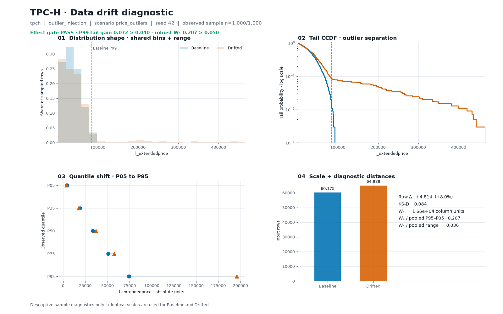

- DriftSpec: [`specs/data/tpch/price_outliers.yaml`](specs/data/tpch/price_outliers.yaml)
- Manifest: [`manifests/data/tpch/price_outliers.json`](manifests/data/tpch/price_outliers.json)
- Configuration: `{"column":"l_extendedprice","drift_type":"outlier_injection","extreme_direction":"high","extreme_scale":4,"n_ratio":0.08,"table":"lineitem"}`
- Effect: **PASS** — tail_gain_over_baseline_p99 `0.0720` gte `0.0400` (✓); normalized_wasserstein_p95_p05 `0.2070` gte `0.0500` (✓)
- Seed/sample: `42` / `1000`
- Reproduce: `python -m visualization.cli generate --benchmark tpch --kind data --scenario price_outliers --seed 42 --sample-size 1000 --offline`

#### `price_skew` — PASS

Reweight most extended prices toward a strongly right-skewed distribution.

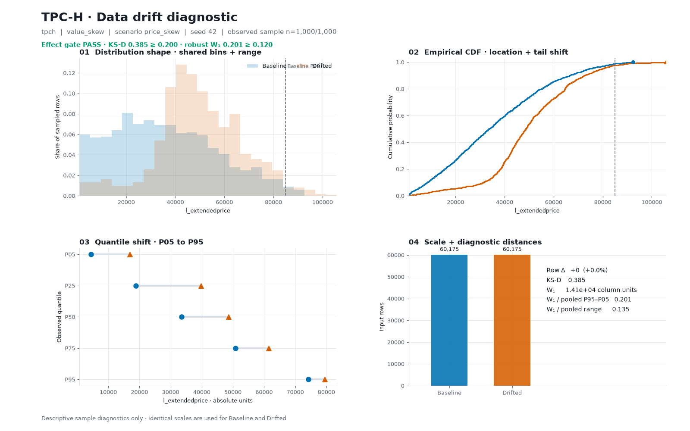

- DriftSpec: [`specs/data/tpch/price_skew.yaml`](specs/data/tpch/price_skew.yaml)
- Manifest: [`manifests/data/tpch/price_skew.json`](manifests/data/tpch/price_skew.json)
- Configuration: `{"column":"l_extendedprice","columns":["l_extendedprice"],"drift_type":"value_skew","portion":0.8,"skewness":5,"table":"lineitem"}`
- Effect: **PASS** — ks_distance `0.3850` gte `0.2000` (✓); normalized_wasserstein_p95_p05 `0.2009` gte `0.1200` (✓)
- Seed/sample: `42` / `1000`
- Reproduce: `python -m visualization.cli generate --benchmark tpch --kind data --scenario price_skew --seed 42 --sample-size 1000 --offline`

#### `lineitem_cardinality_reduction` — PASS

Reduce the lineitem population by 45% so input-scale drift is unmistakable.

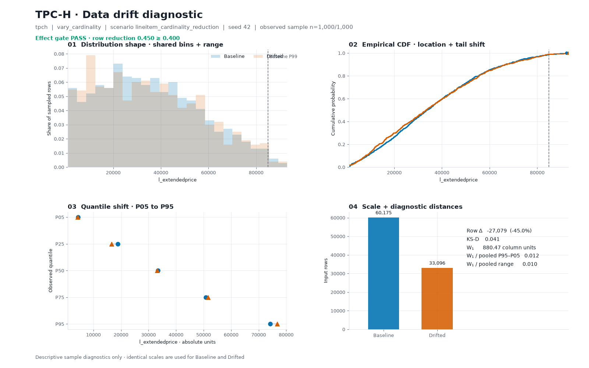

- DriftSpec: [`specs/data/tpch/lineitem_cardinality_reduction.yaml`](specs/data/tpch/lineitem_cardinality_reduction.yaml)
- Manifest: [`manifests/data/tpch/lineitem_cardinality_reduction.json`](manifests/data/tpch/lineitem_cardinality_reduction.json)
- Configuration: `{"column":"l_extendedprice","drift_type":"vary_cardinality","scale":0.55,"table":"lineitem"}`
- Effect: **PASS** — row_reduction_rate `0.4500` gte `0.4000` (✓)
- Seed/sample: `42` / `1000`
- Reproduce: `python -m visualization.cli generate --benchmark tpch --kind data --scenario lineitem_cardinality_reduction --seed 42 --sample-size 1000 --offline`

### Query Drift

#### `hotset_concentration` — PASS

Concentrate the workload on Q1, Q9, and Q18.

- DriftSpec: [`specs/query/tpch/hotset_concentration.yaml`](specs/query/tpch/hotset_concentration.yaml)
- Manifest: [`manifests/query/tpch/hotset_concentration.json`](manifests/query/tpch/hotset_concentration.json)
- Configuration: `{"baseline_weights":{"q1":0.045454545454545456,"q10":0.045454545454545456,"q11":0.045454545454545456,"q12":0.045454545454545456,"q13":0.045454545454545456,"q14":0.045454545454545456,"q15":0.045454545454545456,"q16":0.045454545454545456,"q17":0.045454545454545456,"q18":0.045454545454545456,"q19":0.045454545454545456,"q2":0.045454545454545456,"q20":0.045454545454545456,"q21":0.045454545454545456,"q22":0.045454545454545456,"q3":0.045454545454545456,"q4":0.045454545454545456,"q5":0.045454545454545456,"q6":0.045454545454545456,"q7":0.045454545454545456,"q8":0.045454545454545456,"q9":0.045454545454545456},"sample_size":1000,"target_weights":{"q1":0.3,"q10":0.005263157894736842,"q11":0.005263157894736842,"q12":0.005263157894736842,"q13":0.005263157894736842,"q14":0.005263157894736842,"q15":0.005263157894736842,"q16":0.005263157894736842,"q17":0.005263157894736842,"q18":0.3,"q19":0.005263157894736842,"q2":0.005263157894736842,"q20":0.005263157894736842,"q21":0.005263157894736842,"q22":0.005263157894736842,"q3":0.005263157894736842,"q4":0.005263157894736842,"q5":0.005263157894736842,"q6":0.005263157894736842,"q7":0.005263157894736842,"q8":0.005263157894736842,"q9":0.3}}`
- Effect: **PASS** — jensen_shannon_divergence_bits `0.4995` gte `0.2000` (✓); total_variation_distance `0.7720` gte `0.3000` (✓); max_mover_absolute_pp `26.5000` gte `15` (✓)
- Seed/sample: `42` / `1000`
- Reproduce: `python -m visualization.cli generate --benchmark tpch --kind query --scenario hotset_concentration --seed 42 --sample-size 1000 --offline`

#### `complexity_mix_shift` — PASS

Reweight toward lexically more involved Q19, Q2, and Q21 templates.

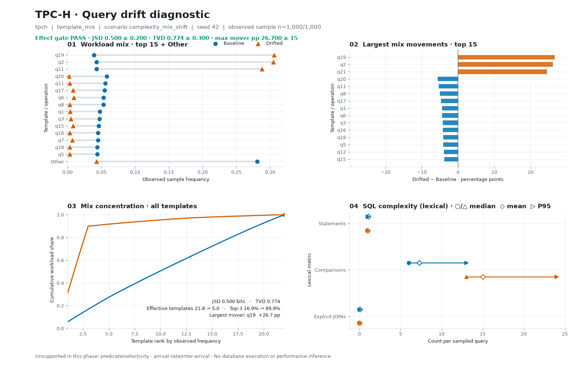

- DriftSpec: [`specs/query/tpch/complexity_mix_shift.yaml`](specs/query/tpch/complexity_mix_shift.yaml)
- Manifest: [`manifests/query/tpch/complexity_mix_shift.json`](manifests/query/tpch/complexity_mix_shift.json)
- Configuration: `{"baseline_weights":{"q1":0.045454545454545456,"q10":0.045454545454545456,"q11":0.045454545454545456,"q12":0.045454545454545456,"q13":0.045454545454545456,"q14":0.045454545454545456,"q15":0.045454545454545456,"q16":0.045454545454545456,"q17":0.045454545454545456,"q18":0.045454545454545456,"q19":0.045454545454545456,"q2":0.045454545454545456,"q20":0.045454545454545456,"q21":0.045454545454545456,"q22":0.045454545454545456,"q3":0.045454545454545456,"q4":0.045454545454545456,"q5":0.045454545454545456,"q6":0.045454545454545456,"q7":0.045454545454545456,"q8":0.045454545454545456,"q9":0.045454545454545456},"sample_size":1000,"target_weights":{"q1":0.005263157894736842,"q10":0.005263157894736842,"q11":0.005263157894736842,"q12":0.005263157894736842,"q13":0.005263157894736842,"q14":0.005263157894736842,"q15":0.005263157894736842,"q16":0.005263157894736842,"q17":0.005263157894736842,"q18":0.005263157894736842,"q19":0.3,"q2":0.3,"q20":0.005263157894736842,"q21":0.3,"q22":0.005263157894736842,"q3":0.005263157894736842,"q4":0.005263157894736842,"q5":0.005263157894736842,"q6":0.005263157894736842,"q7":0.005263157894736842,"q8":0.005263157894736842,"q9":0.005263157894736842}}`
- Effect: **PASS** — jensen_shannon_divergence_bits `0.4996` gte `0.2000` (✓); total_variation_distance `0.7740` gte `0.3000` (✓); max_mover_absolute_pp `26.7000` gte `15` (✓)
- Seed/sample: `42` / `1000`
- Reproduce: `python -m visualization.cli generate --benchmark tpch --kind query --scenario complexity_mix_shift --seed 42 --sample-size 1000 --offline`

**Current limitations:** Real predicate selectivity and observed query arrival times are not available without database execution.

## TPC-DS (`tpcds`)

Synthetic small-scale TPC-DS data with the public 99-query identifier workload.

### Data Drift

#### `item_cardinality_reduction` — PASS

Reduce the item population to expose a clear input-scale change.

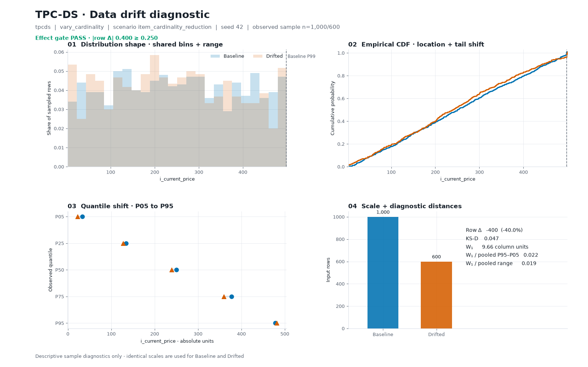

- DriftSpec: [`specs/data/tpcds/item_cardinality_reduction.yaml`](specs/data/tpcds/item_cardinality_reduction.yaml)
- Manifest: [`manifests/data/tpcds/item_cardinality_reduction.json`](manifests/data/tpcds/item_cardinality_reduction.json)
- Configuration: `{"column":"i_current_price","drift_type":"vary_cardinality","scale":0.6,"table":"item"}`
- Effect: **PASS** — absolute_row_rate `0.4000` gte `0.2500` (✓)
- Seed/sample: `42` / `1000`
- Reproduce: `python -m visualization.cli generate --benchmark tpcds --kind data --scenario item_cardinality_reduction --seed 42 --sample-size 1000 --offline`

#### `price_skew` — PASS

Shift the current-price distribution without changing row count.

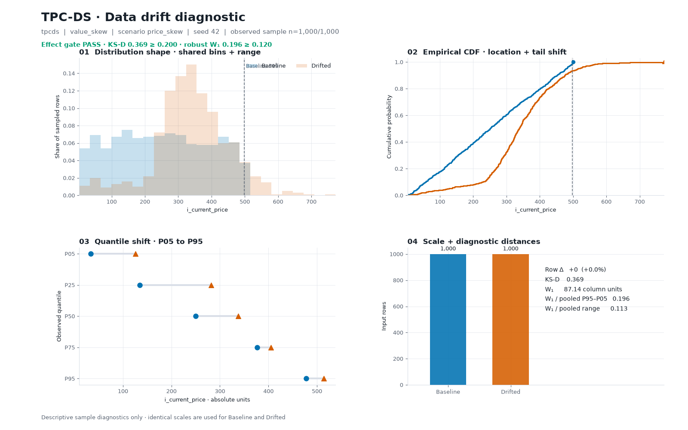

- DriftSpec: [`specs/data/tpcds/price_skew.yaml`](specs/data/tpcds/price_skew.yaml)
- Manifest: [`manifests/data/tpcds/price_skew.json`](manifests/data/tpcds/price_skew.json)
- Configuration: `{"column":"i_current_price","columns":["i_current_price"],"drift_type":"value_skew","portion":0.8,"skewness":5,"table":"item"}`
- Effect: **PASS** — ks_distance `0.3690` gte `0.2000` (✓); normalized_wasserstein_p95_p05 `0.1964` gte `0.1200` (✓)
- Seed/sample: `42` / `1000`
- Reproduce: `python -m visualization.cli generate --benchmark tpcds --kind data --scenario price_skew --seed 42 --sample-size 1000 --offline`

#### `price_outliers` — PASS

Inject a 10% high-price population with a pronounced upper tail.

- DriftSpec: [`specs/data/tpcds/price_outliers.yaml`](specs/data/tpcds/price_outliers.yaml)
- Manifest: [`manifests/data/tpcds/price_outliers.json`](manifests/data/tpcds/price_outliers.json)
- Configuration: `{"column":"i_current_price","drift_type":"outlier_injection","extreme_direction":"high","extreme_scale":5,"n_ratio":0.1,"table":"item"}`
- Effect: **PASS** — row_growth_rate `0.1000` gte `0.0950` (✓); row_growth_rate `0.1000` lte `0.1050` (✓); tail_gain_over_baseline_p99 `0.0940` gte `0.0800` (✓); normalized_wasserstein_p95_p05 `0.2825` gte `0.0800` (✓)
- Seed/sample: `42` / `1000`
- Reproduce: `python -m visualization.cli generate --benchmark tpcds --kind data --scenario price_outliers --seed 42 --sample-size 1000 --offline`

### Query Drift

#### `early_id_hotset` — PASS

Concentrate identifier-only workload artifacts on query01-query03.

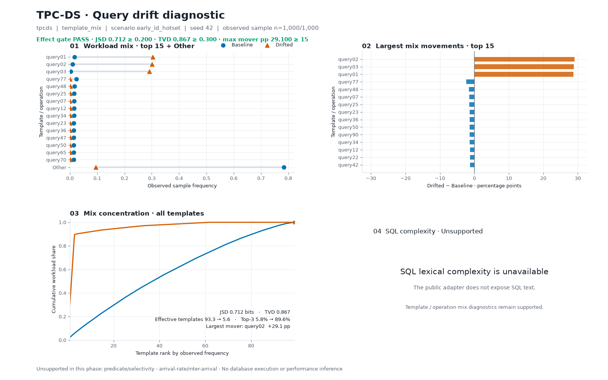

- DriftSpec: [`specs/query/tpcds/early_id_hotset.yaml`](specs/query/tpcds/early_id_hotset.yaml)
- Manifest: [`manifests/query/tpcds/early_id_hotset.json`](manifests/query/tpcds/early_id_hotset.json)
- Configuration: `{"baseline_weights":{"query01":0.010101010101010102,"query02":0.010101010101010102,"query03":0.010101010101010102,"query04":0.010101010101010102,"query05":0.010101010101010102,"query06":0.010101010101010102,"query07":0.010101010101010102,"query08":0.010101010101010102,"query09":0.010101010101010102,"query10":0.010101010101010102,"query11":0.010101010101010102,"query12":0.010101010101010102,"query13":0.010101010101010102,"query14":0.010101010101010102,"query15":0.010101010101010102,"query16":0.010101010101010102,"query17":0.010101010101010102,"query18":0.010101010101010102,"query19":0.010101010101010102,"query20":0.010101010101010102,"query21":0.010101010101010102,"query22":0.010101010101010102,"query23":0.010101010101010102,"query24":0.010101010101010102,"query25":0.010101010101010102,"query26":0.010101010101010102,"query27":0.010101010101010102,"query28":0.010101010101010102,"query29":0.010101010101010102,"query30":0.010101010101010102,"query31":0.010101010101010102,"query32":0.010101010101010102,"query33":0.010101010101010102,"query34":0.010101010101010102,"query35":0.010101010101010102,"query36":0.010101010101010102,"query37":0.010101010101010102,"query38":0.010101010101010102,"query39":0.010101010101010102,"query40":0.010101010101010102,"query41":0.010101010101010102,"query42":0.010101010101010102,"query43":0.010101010101010102,"query44":0.010101010101010102,"query45":0.010101010101010102,"query46":0.010101010101010102,"query47":0.010101010101010102,"query48":0.010101010101010102,"query49":0.010101010101010102,"query50":0.010101010101010102,"query51":0.010101010101010102,"query52":0.010101010101010102,"query53":0.010101010101010102,"query54":0.010101010101010102,"query55":0.010101010101010102,"query56":0.010101010101010102,"query57":0.010101010101010102,"query58":0.010101010101010102,"query59":0.010101010101010102,"query60":0.010101010101010102,"query61":0.010101010101010102,"query62":0.010101010101010102,"query63":0.010101010101010102,"query64":0.010101010101010102,"query65":0.010101010101010102,"query66":0.010101010101010102,"query67":0.010101010101010102,"query68":0.010101010101010102,"query69":0.010101010101010102,"query70":0.010101010101010102,"query71":0.010101010101010102,"query72":0.010101010101010102,"query73":0.010101010101010102,"query74":0.010101010101010102,"query75":0.010101010101010102,"query76":0.010101010101010102,"query77":0.010101010101010102,"query78":0.010101010101010102,"query79":0.010101010101010102,"query80":0.010101010101010102,"query81":0.010101010101010102,"query82":0.010101010101010102,"query83":0.010101010101010102,"query84":0.010101010101010102,"query85":0.010101010101010102,"query86":0.010101010101010102,"query87":0.010101010101010102,"query88":0.010101010101010102,"query89":0.010101010101010102,"query90":0.010101010101010102,"query91":0.010101010101010102,"query92":0.010101010101010102,"query93":0.010101010101010102,"query94":0.010101010101010102,"query95":0.010101010101010102,"query96":0.010101010101010102,"query97":0.010101010101010102,"query98":0.010101010101010102,"query99":0.010101010101010102},"sample_size":1000,"target_weights":{"query01":0.3,"query02":0.3,"query03":0.3,"query04":0.0010416666666666667,"query05":0.0010416666666666667,"query06":0.0010416666666666667,"query07":0.0010416666666666667,"query08":0.0010416666666666667,"query09":0.0010416666666666667,"query10":0.0010416666666666667,"query11":0.0010416666666666667,"query12":0.0010416666666666667,"query13":0.0010416666666666667,"query14":0.0010416666666666667,"query15":0.0010416666666666667,"query16":0.0010416666666666667,"query17":0.0010416666666666667,"query18":0.0010416666666666667,"query19":0.0010416666666666667,"query20":0.0010416666666666667,"query21":0.0010416666666666667,"query22":0.0010416666666666667,"query23":0.0010416666666666667,"query24":0.0010416666666666667,"query25":0.0010416666666666667,"query26":0.0010416666666666667,"query27":0.0010416666666666667,"query28":0.0010416666666666667,"query29":0.0010416666666666667,"query30":0.0010416666666666667,"query31":0.0010416666666666667,"query32":0.0010416666666666667,"query33":0.0010416666666666667,"query34":0.0010416666666666667,"query35":0.0010416666666666667,"query36":0.0010416666666666667,"query37":0.0010416666666666667,"query38":0.0010416666666666667,"query39":0.0010416666666666667,"query40":0.0010416666666666667,"query41":0.0010416666666666667,"query42":0.0010416666666666667,"query43":0.0010416666666666667,"query44":0.0010416666666666667,"query45":0.0010416666666666667,"query46":0.0010416666666666667,"query47":0.0010416666666666667,"query48":0.0010416666666666667,"query49":0.0010416666666666667,"query50":0.0010416666666666667,"query51":0.0010416666666666667,"query52":0.0010416666666666667,"query53":0.0010416666666666667,"query54":0.0010416666666666667,"query55":0.0010416666666666667,"query56":0.0010416666666666667,"query57":0.0010416666666666667,"query58":0.0010416666666666667,"query59":0.0010416666666666667,"query60":0.0010416666666666667,"query61":0.0010416666666666667,"query62":0.0010416666666666667,"query63":0.0010416666666666667,"query64":0.0010416666666666667,"query65":0.0010416666666666667,"query66":0.0010416666666666667,"query67":0.0010416666666666667,"query68":0.0010416666666666667,"query69":0.0010416666666666667,"query70":0.0010416666666666667,"query71":0.0010416666666666667,"query72":0.0010416666666666667,"query73":0.0010416666666666667,"query74":0.0010416666666666667,"query75":0.0010416666666666667,"query76":0.0010416666666666667,"query77":0.0010416666666666667,"query78":0.0010416666666666667,"query79":0.0010416666666666667,"query80":0.0010416666666666667,"query81":0.0010416666666666667,"query82":0.0010416666666666667,"query83":0.0010416666666666667,"query84":0.0010416666666666667,"query85":0.0010416666666666667,"query86":0.0010416666666666667,"query87":0.0010416666666666667,"query88":0.0010416666666666667,"query89":0.0010416666666666667,"query90":0.0010416666666666667,"query91":0.0010416666666666667,"query92":0.0010416666666666667,"query93":0.0010416666666666667,"query94":0.0010416666666666667,"query95":0.0010416666666666667,"query96":0.0010416666666666667,"query97":0.0010416666666666667,"query98":0.0010416666666666667,"query99":0.0010416666666666667}}`
- Effect: **PASS** — jensen_shannon_divergence_bits `0.7122` gte `0.2000` (✓); total_variation_distance `0.8670` gte `0.3000` (✓); max_mover_absolute_pp `29.1000` gte `15` (✓)
- Seed/sample: `42` / `1000`
- Reproduce: `python -m visualization.cli generate --benchmark tpcds --kind query --scenario early_id_hotset --seed 42 --sample-size 1000 --offline`

#### `late_id_hotset` — PASS

Shift the identifier-only hotset to query97-query99.

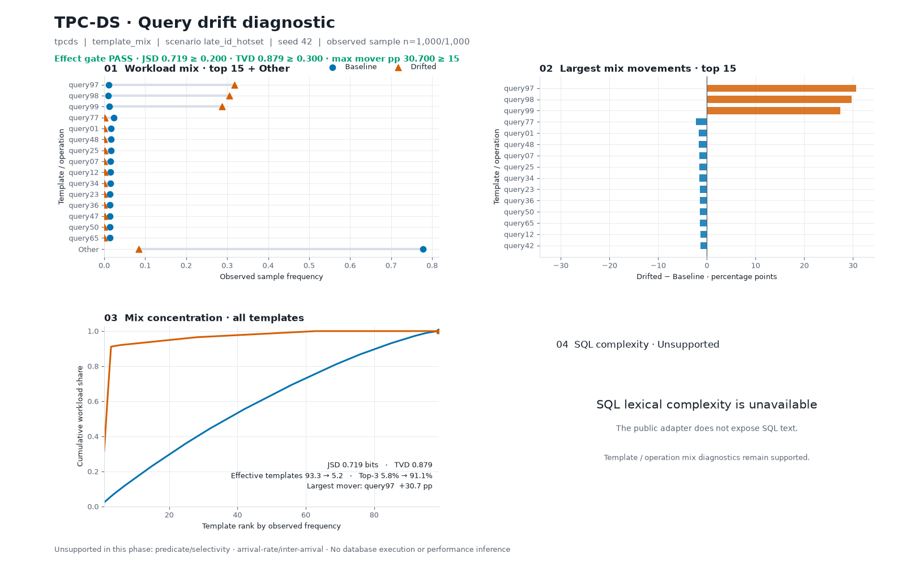

- DriftSpec: [`specs/query/tpcds/late_id_hotset.yaml`](specs/query/tpcds/late_id_hotset.yaml)
- Manifest: [`manifests/query/tpcds/late_id_hotset.json`](manifests/query/tpcds/late_id_hotset.json)
- Configuration: `{"baseline_weights":{"query01":0.010101010101010102,"query02":0.010101010101010102,"query03":0.010101010101010102,"query04":0.010101010101010102,"query05":0.010101010101010102,"query06":0.010101010101010102,"query07":0.010101010101010102,"query08":0.010101010101010102,"query09":0.010101010101010102,"query10":0.010101010101010102,"query11":0.010101010101010102,"query12":0.010101010101010102,"query13":0.010101010101010102,"query14":0.010101010101010102,"query15":0.010101010101010102,"query16":0.010101010101010102,"query17":0.010101010101010102,"query18":0.010101010101010102,"query19":0.010101010101010102,"query20":0.010101010101010102,"query21":0.010101010101010102,"query22":0.010101010101010102,"query23":0.010101010101010102,"query24":0.010101010101010102,"query25":0.010101010101010102,"query26":0.010101010101010102,"query27":0.010101010101010102,"query28":0.010101010101010102,"query29":0.010101010101010102,"query30":0.010101010101010102,"query31":0.010101010101010102,"query32":0.010101010101010102,"query33":0.010101010101010102,"query34":0.010101010101010102,"query35":0.010101010101010102,"query36":0.010101010101010102,"query37":0.010101010101010102,"query38":0.010101010101010102,"query39":0.010101010101010102,"query40":0.010101010101010102,"query41":0.010101010101010102,"query42":0.010101010101010102,"query43":0.010101010101010102,"query44":0.010101010101010102,"query45":0.010101010101010102,"query46":0.010101010101010102,"query47":0.010101010101010102,"query48":0.010101010101010102,"query49":0.010101010101010102,"query50":0.010101010101010102,"query51":0.010101010101010102,"query52":0.010101010101010102,"query53":0.010101010101010102,"query54":0.010101010101010102,"query55":0.010101010101010102,"query56":0.010101010101010102,"query57":0.010101010101010102,"query58":0.010101010101010102,"query59":0.010101010101010102,"query60":0.010101010101010102,"query61":0.010101010101010102,"query62":0.010101010101010102,"query63":0.010101010101010102,"query64":0.010101010101010102,"query65":0.010101010101010102,"query66":0.010101010101010102,"query67":0.010101010101010102,"query68":0.010101010101010102,"query69":0.010101010101010102,"query70":0.010101010101010102,"query71":0.010101010101010102,"query72":0.010101010101010102,"query73":0.010101010101010102,"query74":0.010101010101010102,"query75":0.010101010101010102,"query76":0.010101010101010102,"query77":0.010101010101010102,"query78":0.010101010101010102,"query79":0.010101010101010102,"query80":0.010101010101010102,"query81":0.010101010101010102,"query82":0.010101010101010102,"query83":0.010101010101010102,"query84":0.010101010101010102,"query85":0.010101010101010102,"query86":0.010101010101010102,"query87":0.010101010101010102,"query88":0.010101010101010102,"query89":0.010101010101010102,"query90":0.010101010101010102,"query91":0.010101010101010102,"query92":0.010101010101010102,"query93":0.010101010101010102,"query94":0.010101010101010102,"query95":0.010101010101010102,"query96":0.010101010101010102,"query97":0.010101010101010102,"query98":0.010101010101010102,"query99":0.010101010101010102},"sample_size":1000,"target_weights":{"query01":0.0010416666666666667,"query02":0.0010416666666666667,"query03":0.0010416666666666667,"query04":0.0010416666666666667,"query05":0.0010416666666666667,"query06":0.0010416666666666667,"query07":0.0010416666666666667,"query08":0.0010416666666666667,"query09":0.0010416666666666667,"query10":0.0010416666666666667,"query11":0.0010416666666666667,"query12":0.0010416666666666667,"query13":0.0010416666666666667,"query14":0.0010416666666666667,"query15":0.0010416666666666667,"query16":0.0010416666666666667,"query17":0.0010416666666666667,"query18":0.0010416666666666667,"query19":0.0010416666666666667,"query20":0.0010416666666666667,"query21":0.0010416666666666667,"query22":0.0010416666666666667,"query23":0.0010416666666666667,"query24":0.0010416666666666667,"query25":0.0010416666666666667,"query26":0.0010416666666666667,"query27":0.0010416666666666667,"query28":0.0010416666666666667,"query29":0.0010416666666666667,"query30":0.0010416666666666667,"query31":0.0010416666666666667,"query32":0.0010416666666666667,"query33":0.0010416666666666667,"query34":0.0010416666666666667,"query35":0.0010416666666666667,"query36":0.0010416666666666667,"query37":0.0010416666666666667,"query38":0.0010416666666666667,"query39":0.0010416666666666667,"query40":0.0010416666666666667,"query41":0.0010416666666666667,"query42":0.0010416666666666667,"query43":0.0010416666666666667,"query44":0.0010416666666666667,"query45":0.0010416666666666667,"query46":0.0010416666666666667,"query47":0.0010416666666666667,"query48":0.0010416666666666667,"query49":0.0010416666666666667,"query50":0.0010416666666666667,"query51":0.0010416666666666667,"query52":0.0010416666666666667,"query53":0.0010416666666666667,"query54":0.0010416666666666667,"query55":0.0010416666666666667,"query56":0.0010416666666666667,"query57":0.0010416666666666667,"query58":0.0010416666666666667,"query59":0.0010416666666666667,"query60":0.0010416666666666667,"query61":0.0010416666666666667,"query62":0.0010416666666666667,"query63":0.0010416666666666667,"query64":0.0010416666666666667,"query65":0.0010416666666666667,"query66":0.0010416666666666667,"query67":0.0010416666666666667,"query68":0.0010416666666666667,"query69":0.0010416666666666667,"query70":0.0010416666666666667,"query71":0.0010416666666666667,"query72":0.0010416666666666667,"query73":0.0010416666666666667,"query74":0.0010416666666666667,"query75":0.0010416666666666667,"query76":0.0010416666666666667,"query77":0.0010416666666666667,"query78":0.0010416666666666667,"query79":0.0010416666666666667,"query80":0.0010416666666666667,"query81":0.0010416666666666667,"query82":0.0010416666666666667,"query83":0.0010416666666666667,"query84":0.0010416666666666667,"query85":0.0010416666666666667,"query86":0.0010416666666666667,"query87":0.0010416666666666667,"query88":0.0010416666666666667,"query89":0.0010416666666666667,"query90":0.0010416666666666667,"query91":0.0010416666666666667,"query92":0.0010416666666666667,"query93":0.0010416666666666667,"query94":0.0010416666666666667,"query95":0.0010416666666666667,"query96":0.0010416666666666667,"query97":0.3,"query98":0.3,"query99":0.3}}`
- Effect: **PASS** — jensen_shannon_divergence_bits `0.7187` gte `0.2000` (✓); total_variation_distance `0.8790` gte `0.3000` (✓); max_mover_absolute_pp `30.7000` gte `15` (✓)
- Seed/sample: `42` / `1000`
- Reproduce: `python -m visualization.cli generate --benchmark tpcds --kind query --scenario late_id_hotset --seed 42 --sample-size 1000 --offline`

**Current limitations:** The adapter exposes query IDs and XML only; SQL complexity, predicate selectivity, and temporal observations are unsupported.

## TPC-C (`tpcc`)

Synthetic one-warehouse transactional data with five public SQL transaction templates.

### Data Drift

#### `discount_skew` — PASS

Concentrate customer discounts into a visibly skewed operating regime.

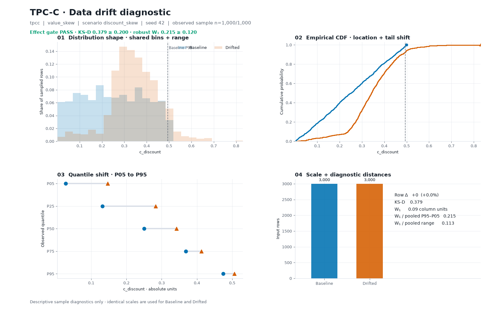

- DriftSpec: [`specs/data/tpcc/discount_skew.yaml`](specs/data/tpcc/discount_skew.yaml)
- Manifest: [`manifests/data/tpcc/discount_skew.json`](manifests/data/tpcc/discount_skew.json)
- Configuration: `{"column":"c_discount","columns":["c_discount"],"drift_type":"value_skew","portion":0.8,"skewness":5,"table":"customer"}`
- Effect: **PASS** — ks_distance `0.3790` gte `0.2000` (✓); normalized_wasserstein_p95_p05 `0.2150` gte `0.1200` (✓)
- Seed/sample: `42` / `1000`
- Reproduce: `python -m visualization.cli generate --benchmark tpcc --kind data --scenario discount_skew --seed 42 --sample-size 1000 --offline`

#### `customer_cardinality_reduction` — PASS

Reduce the customer population while retaining adapter-shaped records.

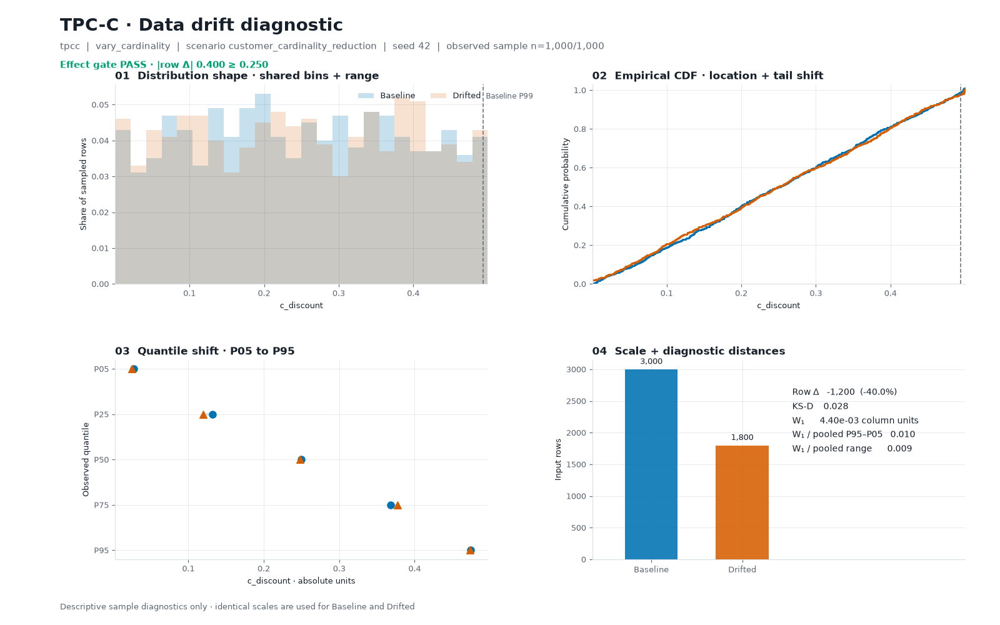

- DriftSpec: [`specs/data/tpcc/customer_cardinality_reduction.yaml`](specs/data/tpcc/customer_cardinality_reduction.yaml)
- Manifest: [`manifests/data/tpcc/customer_cardinality_reduction.json`](manifests/data/tpcc/customer_cardinality_reduction.json)
- Configuration: `{"column":"c_discount","drift_type":"vary_cardinality","scale":0.6,"table":"customer"}`
- Effect: **PASS** — absolute_row_rate `0.4000` gte `0.2500` (✓)
- Seed/sample: `42` / `1000`
- Reproduce: `python -m visualization.cli generate --benchmark tpcc --kind data --scenario customer_cardinality_reduction --seed 42 --sample-size 1000 --offline`

#### `order_amount_outliers` — PASS

Inject a 10% high-value tail into order-line amounts.

- DriftSpec: [`specs/data/tpcc/order_amount_outliers.yaml`](specs/data/tpcc/order_amount_outliers.yaml)
- Manifest: [`manifests/data/tpcc/order_amount_outliers.json`](manifests/data/tpcc/order_amount_outliers.json)
- Configuration: `{"column":"ol_amount","drift_type":"outlier_injection","extreme_direction":"high","extreme_scale":5,"n_ratio":0.1,"table":"order_line"}`
- Effect: **PASS** — row_growth_rate `0.1000` gte `0.0950` (✓); row_growth_rate `0.1000` lte `0.1050` (✓); tail_gain_over_baseline_p99 `0.0870` gte `0.0800` (✓); normalized_wasserstein_p95_p05 `0.2934` gte `0.0800` (✓)
- Seed/sample: `42` / `1000`
- Reproduce: `python -m visualization.cli generate --benchmark tpcc --kind data --scenario order_amount_outliers --seed 42 --sample-size 1000 --offline`

### Query Drift

#### `new_order_hotset` — PASS

Move the native transaction mix decisively toward New-Order.

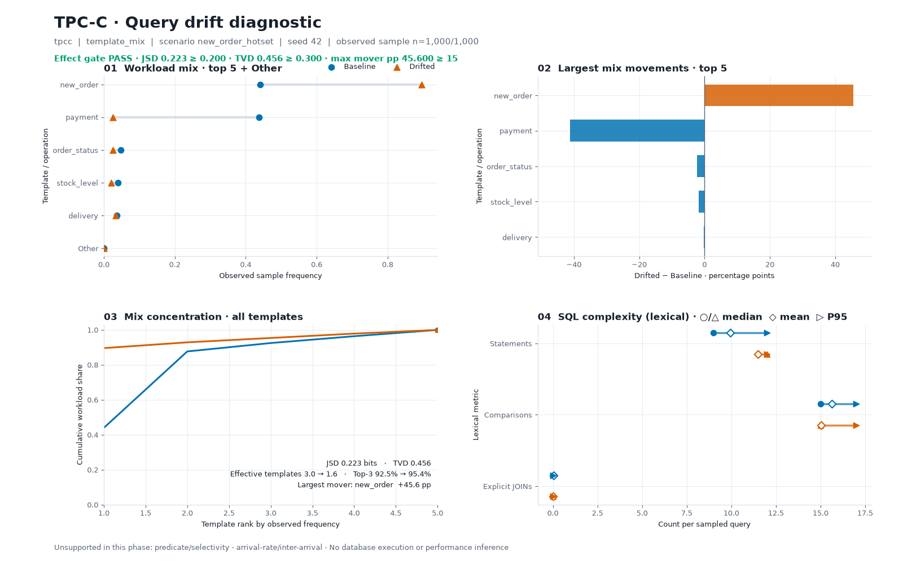

- DriftSpec: [`specs/query/tpcc/new_order_hotset.yaml`](specs/query/tpcc/new_order_hotset.yaml)
- Manifest: [`manifests/query/tpcc/new_order_hotset.json`](manifests/query/tpcc/new_order_hotset.json)
- Configuration: `{"baseline_weights":{"delivery":0.04,"new_order":0.45,"order_status":0.04,"payment":0.43,"stock_level":0.04},"sample_size":1000,"target_weights":{"delivery":0.025,"new_order":0.9,"order_status":0.025,"payment":0.025,"stock_level":0.025}}`
- Effect: **PASS** — jensen_shannon_divergence_bits `0.2228` gte `0.2000` (✓); total_variation_distance `0.4560` gte `0.3000` (✓); max_mover_absolute_pp `45.6000` gte `15` (✓)
- Seed/sample: `42` / `1000`
- Reproduce: `python -m visualization.cli generate --benchmark tpcc --kind query --scenario new_order_hotset --seed 42 --sample-size 1000 --offline`

#### `complexity_mix_shift` — PASS

Reweight the transaction mix toward Delivery's SQL template.

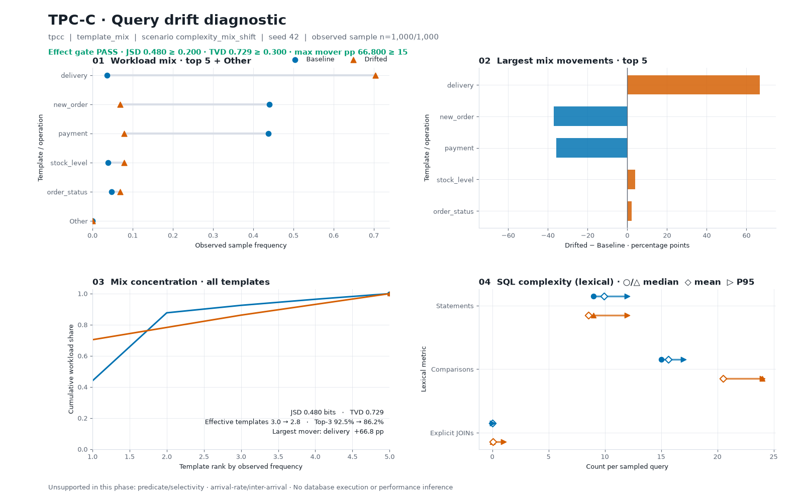

- DriftSpec: [`specs/query/tpcc/complexity_mix_shift.yaml`](specs/query/tpcc/complexity_mix_shift.yaml)
- Manifest: [`manifests/query/tpcc/complexity_mix_shift.json`](manifests/query/tpcc/complexity_mix_shift.json)
- Configuration: `{"baseline_weights":{"delivery":0.04,"new_order":0.45,"order_status":0.04,"payment":0.43,"stock_level":0.04},"sample_size":1000,"target_weights":{"delivery":0.7,"new_order":0.075,"order_status":0.075,"payment":0.075,"stock_level":0.075}}`
- Effect: **PASS** — jensen_shannon_divergence_bits `0.4800` gte `0.2000` (✓); total_variation_distance `0.7290` gte `0.3000` (✓); max_mover_absolute_pp `66.8000` gte `15` (✓)
- Seed/sample: `42` / `1000`
- Reproduce: `python -m visualization.cli generate --benchmark tpcc --kind query --scenario complexity_mix_shift --seed 42 --sample-size 1000 --offline`

**Current limitations:** SQL metrics are lexical; no database selectivity or observed arrival timestamps are measured.

## TPC-C Skew (`tpcc_skew`)

TPC-C data and transactions annotated with a skewed warehouse-access profile.

### Data Drift

#### `stock_quantity_skew` — PASS

Add a second strong stock-quantity skew on top of the benchmark's native access skew.

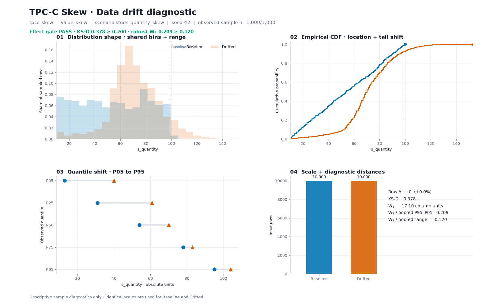

- DriftSpec: [`specs/data/tpcc_skew/stock_quantity_skew.yaml`](specs/data/tpcc_skew/stock_quantity_skew.yaml)
- Manifest: [`manifests/data/tpcc_skew/stock_quantity_skew.json`](manifests/data/tpcc_skew/stock_quantity_skew.json)
- Configuration: `{"column":"s_quantity","columns":["s_quantity"],"drift_type":"value_skew","portion":0.85,"skewness":6,"table":"stock"}`
- Effect: **PASS** — ks_distance `0.3780` gte `0.2000` (✓); normalized_wasserstein_p95_p05 `0.2085` gte `0.1200` (✓)
- Seed/sample: `42` / `1000`
- Reproduce: `python -m visualization.cli generate --benchmark tpcc_skew --kind data --scenario stock_quantity_skew --seed 42 --sample-size 1000 --offline`

#### `stock_quantity_outliers` — PASS

Inject a distinct high-quantity tail into the stock table.

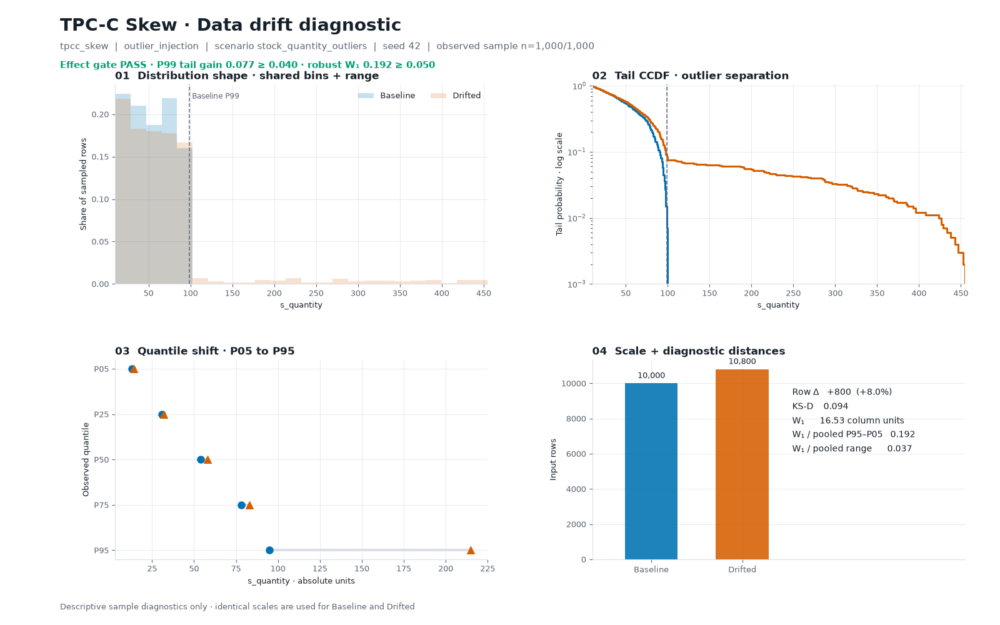

- DriftSpec: [`specs/data/tpcc_skew/stock_quantity_outliers.yaml`](specs/data/tpcc_skew/stock_quantity_outliers.yaml)
- Manifest: [`manifests/data/tpcc_skew/stock_quantity_outliers.json`](manifests/data/tpcc_skew/stock_quantity_outliers.json)
- Configuration: `{"column":"s_quantity","drift_type":"outlier_injection","extreme_direction":"high","extreme_scale":4,"n_ratio":0.08,"table":"stock"}`
- Effect: **PASS** — tail_gain_over_baseline_p99 `0.0770` gte `0.0400` (✓); normalized_wasserstein_p95_p05 `0.1922` gte `0.0500` (✓)
- Seed/sample: `42` / `1000`
- Reproduce: `python -m visualization.cli generate --benchmark tpcc_skew --kind data --scenario stock_quantity_outliers --seed 42 --sample-size 1000 --offline`

#### `stock_cardinality_reduction` — PASS

Reduce the stock population by 45% while retaining the skew benchmark's input shape.

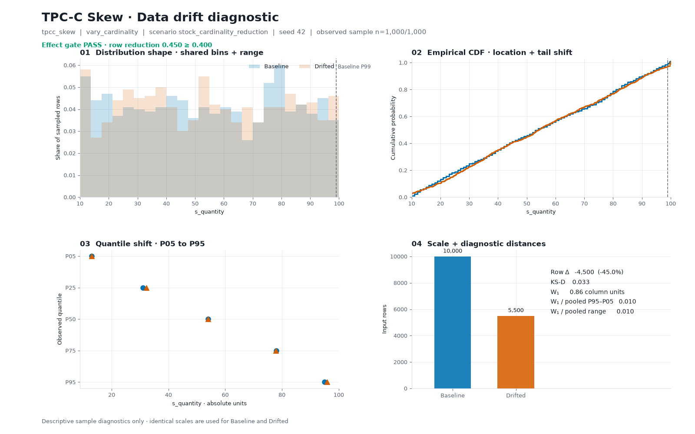

- DriftSpec: [`specs/data/tpcc_skew/stock_cardinality_reduction.yaml`](specs/data/tpcc_skew/stock_cardinality_reduction.yaml)
- Manifest: [`manifests/data/tpcc_skew/stock_cardinality_reduction.json`](manifests/data/tpcc_skew/stock_cardinality_reduction.json)
- Configuration: `{"column":"s_quantity","drift_type":"vary_cardinality","scale":0.55,"table":"stock"}`
- Effect: **PASS** — row_reduction_rate `0.4500` gte `0.4000` (✓)
- Seed/sample: `42` / `1000`
- Reproduce: `python -m visualization.cli generate --benchmark tpcc_skew --kind data --scenario stock_cardinality_reduction --seed 42 --sample-size 1000 --offline`

### Query Drift

#### `new_order_hotset` — PASS

Combine skewed access with a strongly New-Order-heavy transaction mix.

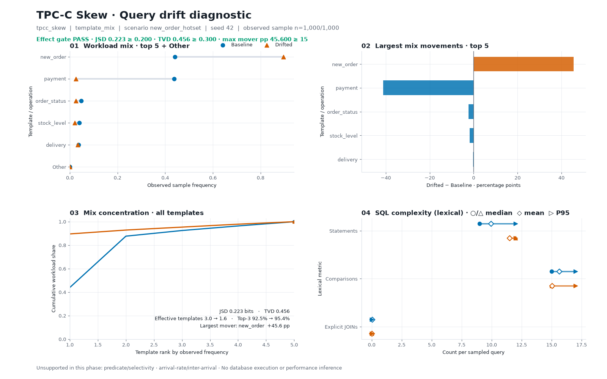

- DriftSpec: [`specs/query/tpcc_skew/new_order_hotset.yaml`](specs/query/tpcc_skew/new_order_hotset.yaml)
- Manifest: [`manifests/query/tpcc_skew/new_order_hotset.json`](manifests/query/tpcc_skew/new_order_hotset.json)
- Configuration: `{"baseline_weights":{"delivery":0.04,"new_order":0.45,"order_status":0.04,"payment":0.43,"stock_level":0.04},"sample_size":1000,"target_weights":{"delivery":0.025,"new_order":0.9,"order_status":0.025,"payment":0.025,"stock_level":0.025}}`
- Effect: **PASS** — jensen_shannon_divergence_bits `0.2228` gte `0.2000` (✓); total_variation_distance `0.4560` gte `0.3000` (✓); max_mover_absolute_pp `45.6000` gte `15` (✓)
- Seed/sample: `42` / `1000`
- Reproduce: `python -m visualization.cli generate --benchmark tpcc_skew --kind query --scenario new_order_hotset --seed 42 --sample-size 1000 --offline`

#### `complexity_mix_shift` — PASS

Reweight the skewed benchmark toward Delivery's SQL template.

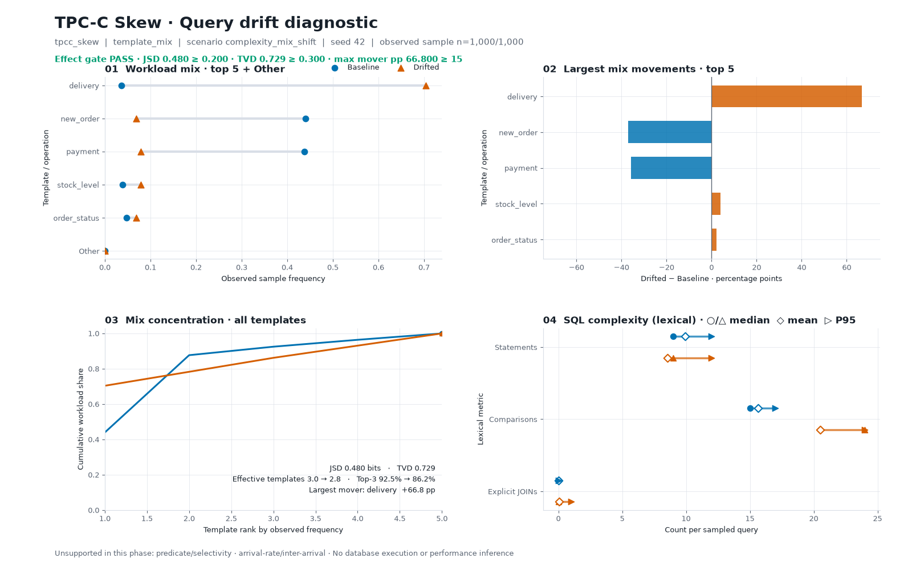

- DriftSpec: [`specs/query/tpcc_skew/complexity_mix_shift.yaml`](specs/query/tpcc_skew/complexity_mix_shift.yaml)
- Manifest: [`manifests/query/tpcc_skew/complexity_mix_shift.json`](manifests/query/tpcc_skew/complexity_mix_shift.json)
- Configuration: `{"baseline_weights":{"delivery":0.04,"new_order":0.45,"order_status":0.04,"payment":0.43,"stock_level":0.04},"sample_size":1000,"target_weights":{"delivery":0.7,"new_order":0.075,"order_status":0.075,"payment":0.075,"stock_level":0.075}}`
- Effect: **PASS** — jensen_shannon_divergence_bits `0.4800` gte `0.2000` (✓); total_variation_distance `0.7290` gte `0.3000` (✓); max_mover_absolute_pp `66.8000` gte `15` (✓)
- Seed/sample: `42` / `1000`
- Reproduce: `python -m visualization.cli generate --benchmark tpcc_skew --kind query --scenario complexity_mix_shift --seed 42 --sample-size 1000 --offline`

**Current limitations:** SQL metrics are lexical; configured warehouse weights are not observed arrival timestamps.

## JOB (`job`)

Synthetic 11-table IMDB subset with 20 representative join-order query templates.

### Data Drift

#### `pre_1980_title_deletion` — PASS

Delete a seeded share of pre-1980 titles and propagate keys across dependent tables.

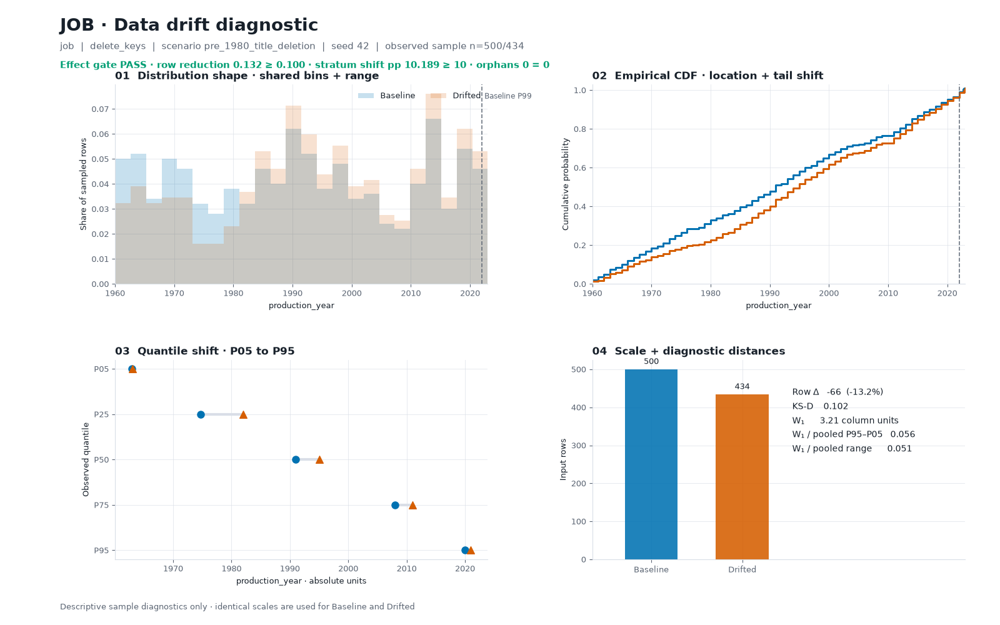

- DriftSpec: [`specs/data/job/pre_1980_title_deletion.yaml`](specs/data/job/pre_1980_title_deletion.yaml)
- Manifest: [`manifests/data/job/pre_1980_title_deletion.json`](manifests/data/job/pre_1980_title_deletion.json)
- Configuration: `{"column":"production_year","drift_steps":[{"filter":{"column":"production_year","max":1980},"fraction":0.4,"key_column":"id","op":"delete_keys","propagate":[{"policy":"drop","relationship":"cast_info_title"},{"policy":"drop","relationship":"movie_info_title"},{"policy":"drop","relationship":"movie_companies_title"},{"policy":"drop","relationship":"movie_keyword_title"}],"target":"title"}],"table":"title","validate_integrity":true}`
- Effect: **PASS** — row_reduction_rate `0.1320` gte `0.1000` (✓); target_stratum_share_shift_pp `10.1889` gte `10` (✓); orphan_count `0` eq `0` (✓)
- Seed/sample: `42` / `1000`
- Reproduce: `python -m visualization.cli generate --benchmark job --kind data --scenario pre_1980_title_deletion --seed 42 --sample-size 1000 --offline`

#### `production_year_skew` — PASS

Shift the title production-year distribution without fabricating query execution.

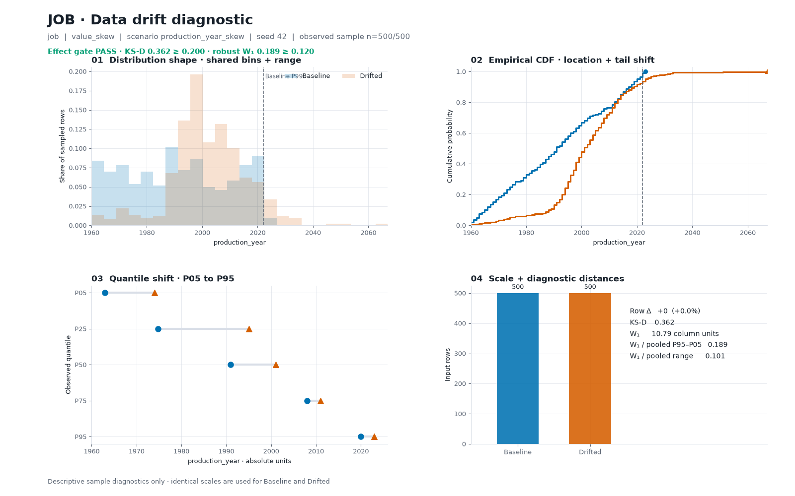

- DriftSpec: [`specs/data/job/production_year_skew.yaml`](specs/data/job/production_year_skew.yaml)
- Manifest: [`manifests/data/job/production_year_skew.json`](manifests/data/job/production_year_skew.json)
- Configuration: `{"column":"production_year","columns":["production_year"],"drift_type":"value_skew","portion":0.8,"skewness":5,"table":"title"}`
- Effect: **PASS** — ks_distance `0.3620` gte `0.2000` (✓); normalized_wasserstein_p95_p05 `0.1893` gte `0.1200` (✓)
- Seed/sample: `42` / `1000`
- Reproduce: `python -m visualization.cli generate --benchmark job --kind data --scenario production_year_skew --seed 42 --sample-size 1000 --offline`

#### `post_2000_title_deletion` — PASS

Delete a seeded share of titles after 2000 and propagate every affected foreign key.

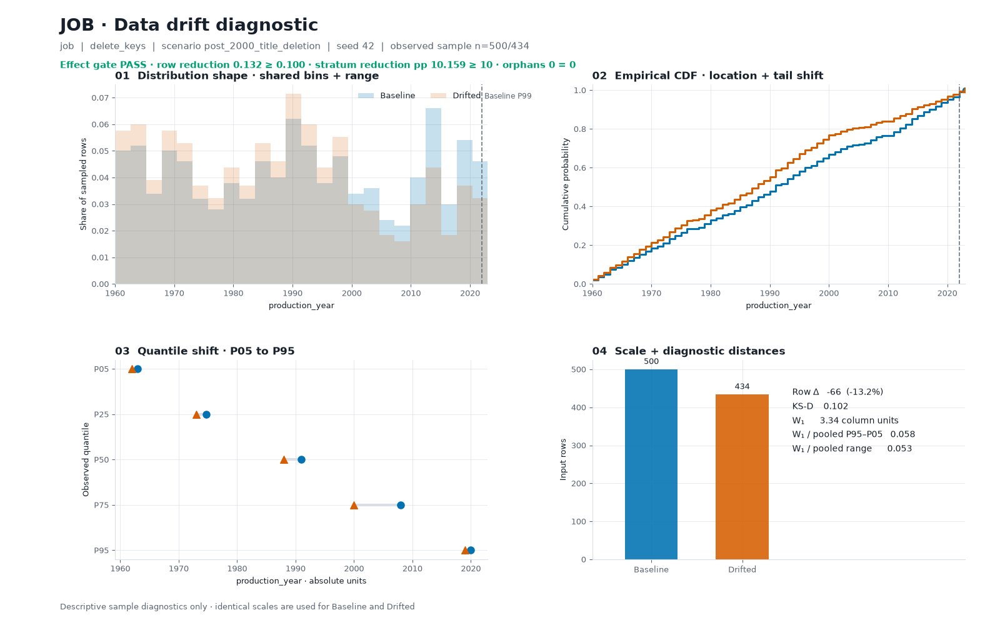

- DriftSpec: [`specs/data/job/post_2000_title_deletion.yaml`](specs/data/job/post_2000_title_deletion.yaml)
- Manifest: [`manifests/data/job/post_2000_title_deletion.json`](manifests/data/job/post_2000_title_deletion.json)
- Configuration: `{"column":"production_year","drift_steps":[{"filter":{"column":"production_year","min":2001},"fraction":0.4,"key_column":"id","op":"delete_keys","propagate":[{"policy":"drop","relationship":"cast_info_title"},{"policy":"drop","relationship":"movie_info_title"},{"policy":"drop","relationship":"movie_companies_title"},{"policy":"drop","relationship":"movie_keyword_title"}],"target":"title"}],"table":"title","validate_integrity":true}`
- Effect: **PASS** — row_reduction_rate `0.1320` gte `0.1000` (✓); target_stratum_share_reduction_pp `10.1585` gte `10` (✓); orphan_count `0` eq `0` (✓)
- Seed/sample: `42` / `1000`
- Reproduce: `python -m visualization.cli generate --benchmark job --kind data --scenario post_2000_title_deletion --seed 42 --sample-size 1000 --offline`

### Query Drift

#### `hotset_concentration` — PASS

Concentrate the JOB mix on two selective low-index families.

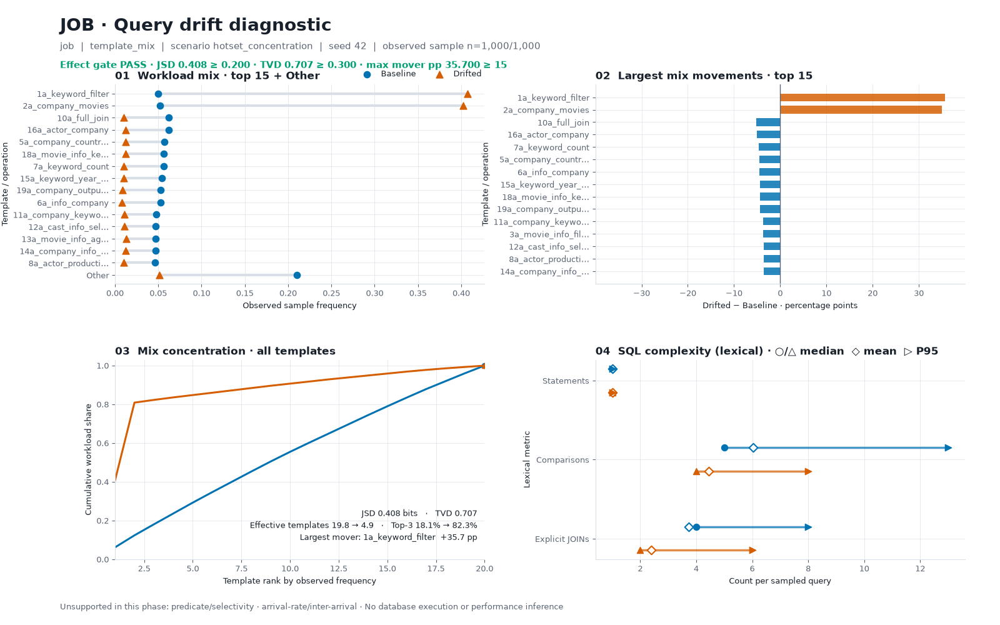

- DriftSpec: [`specs/query/job/hotset_concentration.yaml`](specs/query/job/hotset_concentration.yaml)
- Manifest: [`manifests/query/job/hotset_concentration.json`](manifests/query/job/hotset_concentration.json)
- Configuration: `{"baseline_weights":{"10a_full_join":0.05,"11a_company_keyword_year":0.05,"12a_cast_info_selective":0.05,"13a_movie_info_aggregate":0.05,"14a_company_info_cast":0.05,"15a_keyword_year_range":0.05,"16a_actor_company":0.05,"17a_selective_cast_keyword":0.05,"18a_movie_info_keyword":0.05,"19a_company_output_volume":0.05,"1a_keyword_filter":0.05,"20a_full_eight_table":0.05,"2a_company_movies":0.05,"3a_movie_info_filter":0.05,"4a_cast_keyword":0.05,"5a_company_country_cast":0.05,"6a_info_company":0.05,"7a_keyword_count":0.05,"8a_actor_productivity":0.05,"9a_multi_keyword_movie":0.05},"sample_size":1000,"target_weights":{"10a_full_join":0.011111111111111112,"11a_company_keyword_year":0.011111111111111112,"12a_cast_info_selective":0.011111111111111112,"13a_movie_info_aggregate":0.011111111111111112,"14a_company_info_cast":0.011111111111111112,"15a_keyword_year_range":0.011111111111111112,"16a_actor_company":0.011111111111111112,"17a_selective_cast_keyword":0.011111111111111112,"18a_movie_info_keyword":0.011111111111111112,"19a_company_output_volume":0.011111111111111112,"1a_keyword_filter":0.4,"20a_full_eight_table":0.011111111111111112,"2a_company_movies":0.4,"3a_movie_info_filter":0.011111111111111112,"4a_cast_keyword":0.011111111111111112,"5a_company_country_cast":0.011111111111111112,"6a_info_company":0.011111111111111112,"7a_keyword_count":0.011111111111111112,"8a_actor_productivity":0.011111111111111112,"9a_multi_keyword_movie":0.011111111111111112}}`
- Effect: **PASS** — jensen_shannon_divergence_bits `0.4078` gte `0.2000` (✓); total_variation_distance `0.7070` gte `0.3000` (✓); max_mover_absolute_pp `35.7000` gte `15` (✓)
- Seed/sample: `42` / `1000`
- Reproduce: `python -m visualization.cli generate --benchmark job --kind query --scenario hotset_concentration --seed 42 --sample-size 1000 --offline`

#### `complexity_mix_shift` — PASS

Reweight JOB toward the ten-table and eight-table join families.

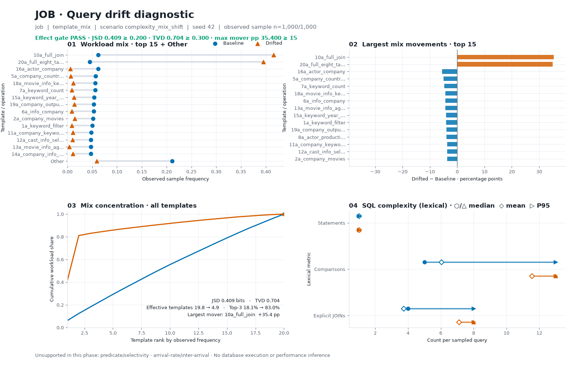

- DriftSpec: [`specs/query/job/complexity_mix_shift.yaml`](specs/query/job/complexity_mix_shift.yaml)
- Manifest: [`manifests/query/job/complexity_mix_shift.json`](manifests/query/job/complexity_mix_shift.json)
- Configuration: `{"baseline_weights":{"10a_full_join":0.05,"11a_company_keyword_year":0.05,"12a_cast_info_selective":0.05,"13a_movie_info_aggregate":0.05,"14a_company_info_cast":0.05,"15a_keyword_year_range":0.05,"16a_actor_company":0.05,"17a_selective_cast_keyword":0.05,"18a_movie_info_keyword":0.05,"19a_company_output_volume":0.05,"1a_keyword_filter":0.05,"20a_full_eight_table":0.05,"2a_company_movies":0.05,"3a_movie_info_filter":0.05,"4a_cast_keyword":0.05,"5a_company_country_cast":0.05,"6a_info_company":0.05,"7a_keyword_count":0.05,"8a_actor_productivity":0.05,"9a_multi_keyword_movie":0.05},"sample_size":1000,"target_weights":{"10a_full_join":0.4,"11a_company_keyword_year":0.011111111111111112,"12a_cast_info_selective":0.011111111111111112,"13a_movie_info_aggregate":0.011111111111111112,"14a_company_info_cast":0.011111111111111112,"15a_keyword_year_range":0.011111111111111112,"16a_actor_company":0.011111111111111112,"17a_selective_cast_keyword":0.011111111111111112,"18a_movie_info_keyword":0.011111111111111112,"19a_company_output_volume":0.011111111111111112,"1a_keyword_filter":0.011111111111111112,"20a_full_eight_table":0.4,"2a_company_movies":0.011111111111111112,"3a_movie_info_filter":0.011111111111111112,"4a_cast_keyword":0.011111111111111112,"5a_company_country_cast":0.011111111111111112,"6a_info_company":0.011111111111111112,"7a_keyword_count":0.011111111111111112,"8a_actor_productivity":0.011111111111111112,"9a_multi_keyword_movie":0.011111111111111112}}`
- Effect: **PASS** — jensen_shannon_divergence_bits `0.4091` gte `0.2000` (✓); total_variation_distance `0.7040` gte `0.3000` (✓); max_mover_absolute_pp `35.4000` gte `15` (✓)
- Seed/sample: `42` / `1000`
- Reproduce: `python -m visualization.cli generate --benchmark job --kind query --scenario complexity_mix_shift --seed 42 --sample-size 1000 --offline`

**Current limitations:** The adapter contains 20 representative templates rather than the complete 113-query JOB corpus; selectivity is unsupported.

## YCSB (`ycsb`)

Synthetic key-value records and public YCSB operation-mix profiles.

### Data Drift

#### `field0_hot_value_skew` — PASS

Turn a near-unique string field into a pronounced hot-value distribution.

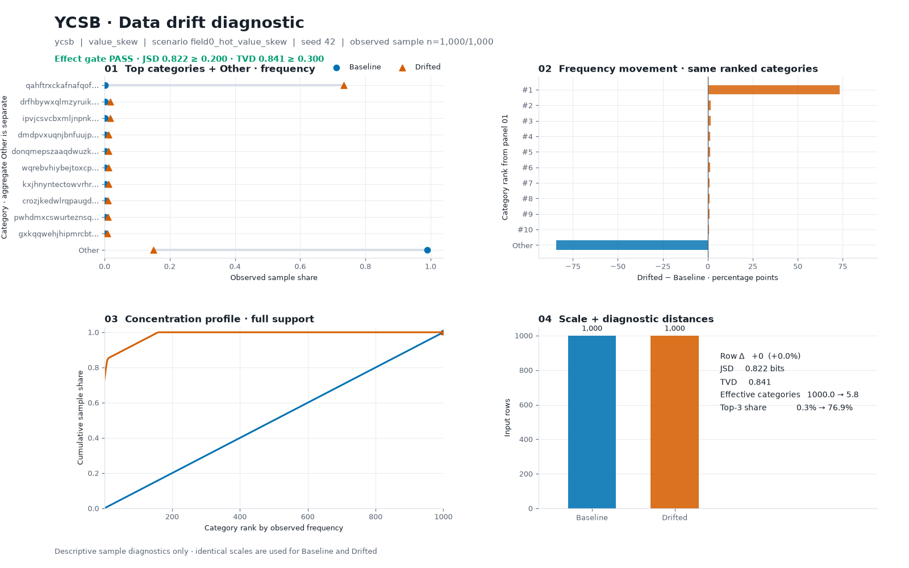

- DriftSpec: [`specs/data/ycsb/field0_hot_value_skew.yaml`](specs/data/ycsb/field0_hot_value_skew.yaml)
- Manifest: [`manifests/data/ycsb/field0_hot_value_skew.json`](manifests/data/ycsb/field0_hot_value_skew.json)
- Configuration: `{"column":"FIELD0","columns":["FIELD0"],"drift_type":"value_skew","portion":0.85,"skewness":6,"table":"usertable"}`
- Effect: **PASS** — jensen_shannon_divergence_bits `0.8223` gte `0.2000` (✓); total_variation_distance `0.8410` gte `0.3000` (✓)
- Seed/sample: `42` / `1000`
- Reproduce: `python -m visualization.cli generate --benchmark ycsb --kind data --scenario field0_hot_value_skew --seed 42 --sample-size 1000 --offline`

#### `record_cardinality_reduction` — PASS

Reduce the record population while preserving the adapter's field schema.

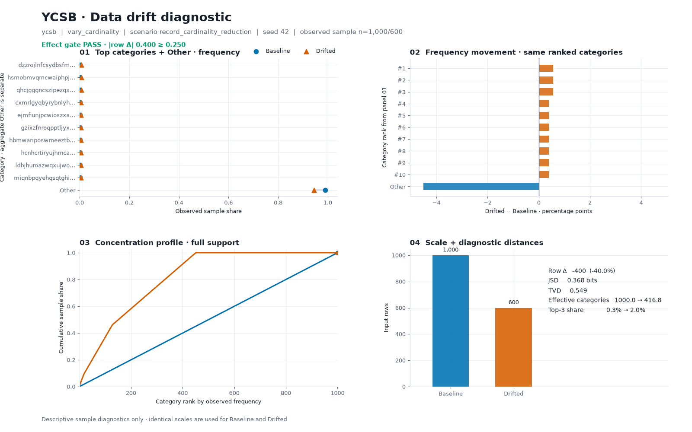

- DriftSpec: [`specs/data/ycsb/record_cardinality_reduction.yaml`](specs/data/ycsb/record_cardinality_reduction.yaml)
- Manifest: [`manifests/data/ycsb/record_cardinality_reduction.json`](manifests/data/ycsb/record_cardinality_reduction.json)
- Configuration: `{"column":"FIELD0","drift_type":"vary_cardinality","scale":0.6,"table":"usertable"}`
- Effect: **PASS** — absolute_row_rate `0.4000` gte `0.2500` (✓)
- Seed/sample: `42` / `1000`
- Reproduce: `python -m visualization.cli generate --benchmark ycsb --kind data --scenario record_cardinality_reduction --seed 42 --sample-size 1000 --offline`

#### `record_cardinality_growth` — PASS

Grow adapter-shaped records by 50%; this is a volume drift and makes no key-integrity claim.

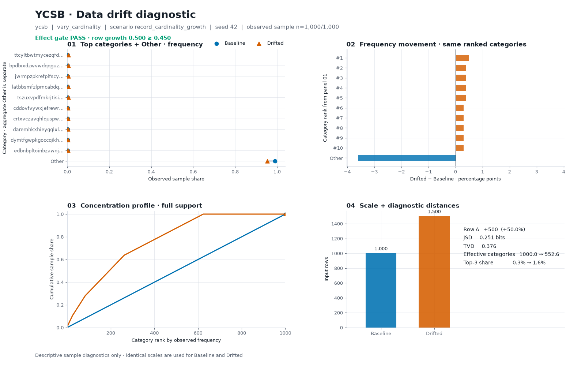

- DriftSpec: [`specs/data/ycsb/record_cardinality_growth.yaml`](specs/data/ycsb/record_cardinality_growth.yaml)
- Manifest: [`manifests/data/ycsb/record_cardinality_growth.json`](manifests/data/ycsb/record_cardinality_growth.json)
- Configuration: `{"column":"FIELD0","drift_type":"vary_cardinality","scale":1.5,"table":"usertable"}`
- Effect: **PASS** — row_growth_rate `0.5000` gte `0.4500` (✓)
- Seed/sample: `42` / `1000`
- Reproduce: `python -m visualization.cli generate --benchmark ycsb --kind data --scenario record_cardinality_growth --seed 42 --sample-size 1000 --offline`

### Query Drift

#### `scan_heavy_profile` — PASS

Shift public workload profile A to scan-heavy profile E.

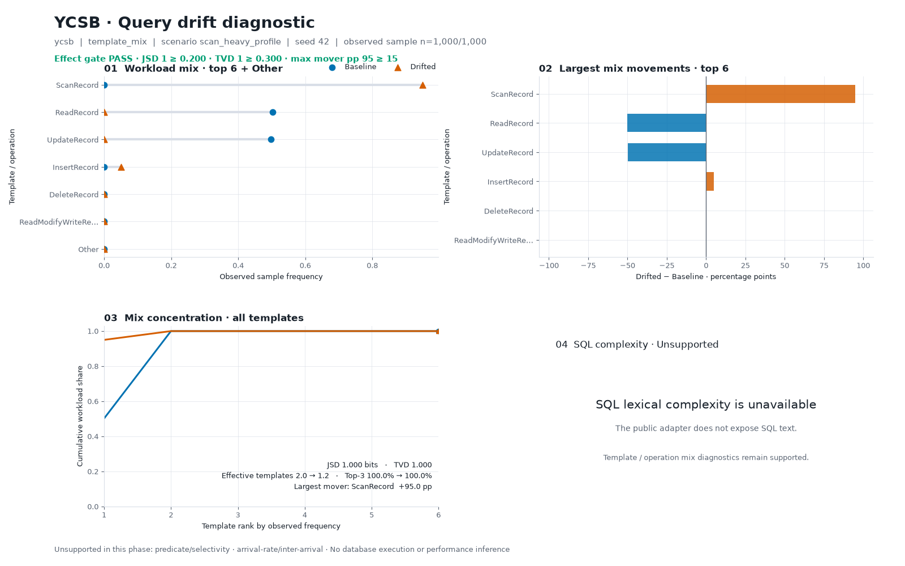

- DriftSpec: [`specs/query/ycsb/scan_heavy_profile.yaml`](specs/query/ycsb/scan_heavy_profile.yaml)
- Manifest: [`manifests/query/ycsb/scan_heavy_profile.json`](manifests/query/ycsb/scan_heavy_profile.json)
- Configuration: `{"baseline_weights":{"DeleteRecord":0.0,"InsertRecord":0.0,"ReadModifyWriteRecord":0.0,"ReadRecord":0.5,"ScanRecord":0.0,"UpdateRecord":0.5},"sample_size":1000,"target_weights":{"DeleteRecord":0.0,"InsertRecord":0.05,"ReadModifyWriteRecord":0.0,"ReadRecord":0.0,"ScanRecord":0.95,"UpdateRecord":0.0}}`
- Effect: **PASS** — jensen_shannon_divergence_bits `1` gte `0.2000` (✓); total_variation_distance `1` gte `0.3000` (✓); max_mover_absolute_pp `95` gte `15` (✓)
- Seed/sample: `42` / `1000`
- Reproduce: `python -m visualization.cli generate --benchmark ycsb --kind query --scenario scan_heavy_profile --seed 42 --sample-size 1000 --offline`

#### `read_only_profile` — PASS

Shift public workload profile A to read-only profile C.

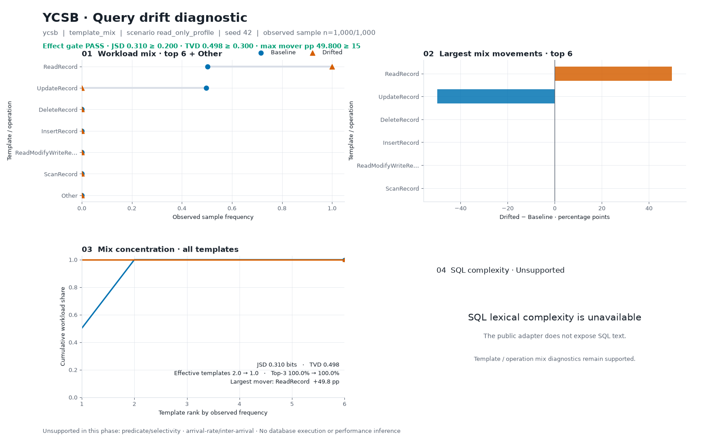

- DriftSpec: [`specs/query/ycsb/read_only_profile.yaml`](specs/query/ycsb/read_only_profile.yaml)
- Manifest: [`manifests/query/ycsb/read_only_profile.json`](manifests/query/ycsb/read_only_profile.json)
- Configuration: `{"baseline_weights":{"DeleteRecord":0.0,"InsertRecord":0.0,"ReadModifyWriteRecord":0.0,"ReadRecord":0.5,"ScanRecord":0.0,"UpdateRecord":0.5},"sample_size":1000,"target_weights":{"DeleteRecord":0.0,"InsertRecord":0.0,"ReadModifyWriteRecord":0.0,"ReadRecord":1.0,"ScanRecord":0.0,"UpdateRecord":0.0}}`
- Effect: **PASS** — jensen_shannon_divergence_bits `0.3097` gte `0.2000` (✓); total_variation_distance `0.4980` gte `0.3000` (✓); max_mover_absolute_pp `49.8000` gte `15` (✓)
- Seed/sample: `42` / `1000`
- Reproduce: `python -m visualization.cli generate --benchmark ycsb --kind query --scenario read_only_profile --seed 42 --sample-size 1000 --offline`

**Current limitations:** YCSB exposes operation weights rather than SQL; SQL complexity, selectivity, and observed temporal metrics are unsupported.

## DSB (`dsb`)

Synthetic star-schema benchmark with three analytical SQL templates.

### Data Drift

#### `revenue_outliers` — PASS

Add a measurable high-revenue tail to lineorder.

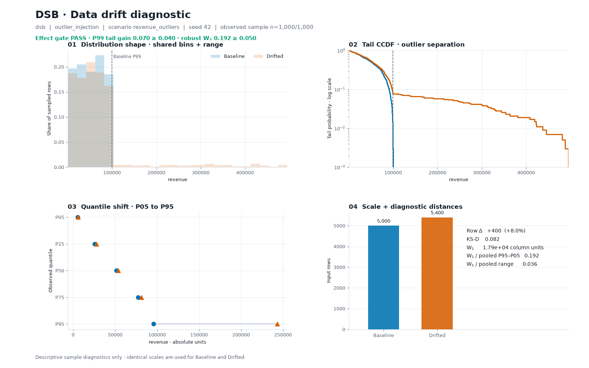

- DriftSpec: [`specs/data/dsb/revenue_outliers.yaml`](specs/data/dsb/revenue_outliers.yaml)
- Manifest: [`manifests/data/dsb/revenue_outliers.json`](manifests/data/dsb/revenue_outliers.json)
- Configuration: `{"column":"revenue","drift_type":"outlier_injection","extreme_direction":"high","extreme_scale":4,"n_ratio":0.08,"table":"lineorder"}`
- Effect: **PASS** — tail_gain_over_baseline_p99 `0.0700` gte `0.0400` (✓); normalized_wasserstein_p95_p05 `0.1917` gte `0.0500` (✓)
- Seed/sample: `42` / `1000`
- Reproduce: `python -m visualization.cli generate --benchmark dsb --kind data --scenario revenue_outliers --seed 42 --sample-size 1000 --offline`

#### `revenue_skew` — PASS

Shift most revenue values toward a right-skewed regime.

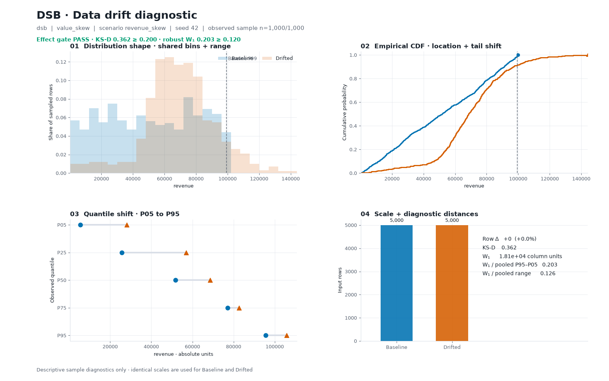

- DriftSpec: [`specs/data/dsb/revenue_skew.yaml`](specs/data/dsb/revenue_skew.yaml)
- Manifest: [`manifests/data/dsb/revenue_skew.json`](manifests/data/dsb/revenue_skew.json)
- Configuration: `{"column":"revenue","columns":["revenue"],"drift_type":"value_skew","portion":0.8,"skewness":5,"table":"lineorder"}`
- Effect: **PASS** — ks_distance `0.3620` gte `0.2000` (✓); normalized_wasserstein_p95_p05 `0.2034` gte `0.1200` (✓)
- Seed/sample: `42` / `1000`
- Reproduce: `python -m visualization.cli generate --benchmark dsb --kind data --scenario revenue_skew --seed 42 --sample-size 1000 --offline`

#### `lineorder_cardinality_reduction` — PASS

Reduce the lineorder population by 45% to expose a strong fact-table volume drift.

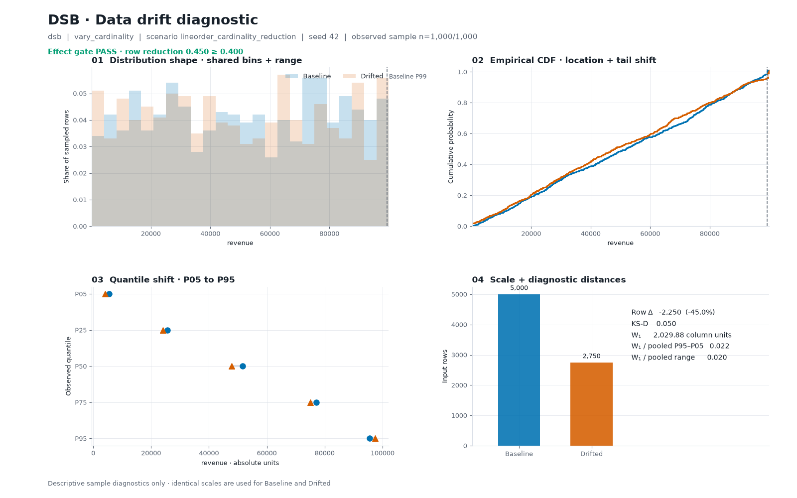

- DriftSpec: [`specs/data/dsb/lineorder_cardinality_reduction.yaml`](specs/data/dsb/lineorder_cardinality_reduction.yaml)
- Manifest: [`manifests/data/dsb/lineorder_cardinality_reduction.json`](manifests/data/dsb/lineorder_cardinality_reduction.json)
- Configuration: `{"column":"revenue","drift_type":"vary_cardinality","scale":0.55,"table":"lineorder"}`
- Effect: **PASS** — row_reduction_rate `0.4500` gte `0.4000` (✓)
- Seed/sample: `42` / `1000`
- Reproduce: `python -m visualization.cli generate --benchmark dsb --kind data --scenario lineorder_cardinality_reduction --seed 42 --sample-size 1000 --offline`

### Query Drift

#### `region_hotset` — PASS

Concentrate DSB queries on regional revenue analysis.

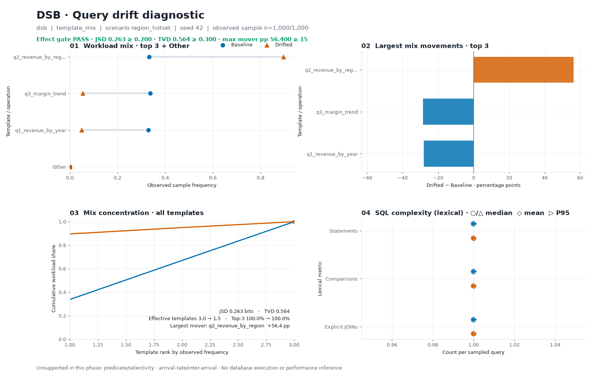

- DriftSpec: [`specs/query/dsb/region_hotset.yaml`](specs/query/dsb/region_hotset.yaml)
- Manifest: [`manifests/query/dsb/region_hotset.json`](manifests/query/dsb/region_hotset.json)
- Configuration: `{"baseline_weights":{"q1_revenue_by_year":0.3333333333333333,"q2_revenue_by_region":0.3333333333333333,"q3_margin_trend":0.3333333333333333},"sample_size":1000,"target_weights":{"q1_revenue_by_year":0.05,"q2_revenue_by_region":0.9,"q3_margin_trend":0.05}}`
- Effect: **PASS** — jensen_shannon_divergence_bits `0.2629` gte `0.2000` (✓); total_variation_distance `0.5640` gte `0.3000` (✓); max_mover_absolute_pp `56.4000` gte `15` (✓)
- Seed/sample: `42` / `1000`
- Reproduce: `python -m visualization.cli generate --benchmark dsb --kind query --scenario region_hotset --seed 42 --sample-size 1000 --offline`

#### `margin_hotset` — PASS

Move the DSB hotset to margin-trend analysis.

- DriftSpec: [`specs/query/dsb/margin_hotset.yaml`](specs/query/dsb/margin_hotset.yaml)
- Manifest: [`manifests/query/dsb/margin_hotset.json`](manifests/query/dsb/margin_hotset.json)
- Configuration: `{"baseline_weights":{"q1_revenue_by_year":0.3333333333333333,"q2_revenue_by_region":0.3333333333333333,"q3_margin_trend":0.3333333333333333},"sample_size":1000,"target_weights":{"q1_revenue_by_year":0.05,"q2_revenue_by_region":0.05,"q3_margin_trend":0.9}}`
- Effect: **PASS** — jensen_shannon_divergence_bits `0.2772` gte `0.2000` (✓); total_variation_distance `0.5730` gte `0.3000` (✓); max_mover_absolute_pp `57.3000` gte `15` (✓)
- Seed/sample: `42` / `1000`
- Reproduce: `python -m visualization.cli generate --benchmark dsb --kind query --scenario margin_hotset --seed 42 --sample-size 1000 --offline`

**Current limitations:** SQL metrics are lexical and no database selectivity or observed arrival timestamps are measured.

## pgbench (`pgbench`)

Synthetic TPC-B-like input data and three public pgbench workload scripts.

### Data Drift

#### `balance_skew` — PASS

Reweight account balances into a visibly skewed distribution.

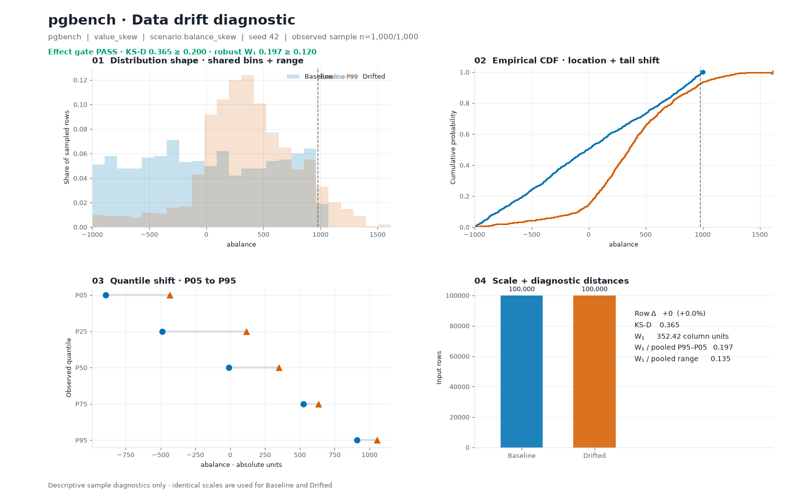

- DriftSpec: [`specs/data/pgbench/balance_skew.yaml`](specs/data/pgbench/balance_skew.yaml)
- Manifest: [`manifests/data/pgbench/balance_skew.json`](manifests/data/pgbench/balance_skew.json)
- Configuration: `{"column":"abalance","columns":["abalance"],"drift_type":"value_skew","portion":0.8,"skewness":5,"table":"pgbench_accounts"}`
- Effect: **PASS** — ks_distance `0.3650` gte `0.2000` (✓); normalized_wasserstein_p95_p05 `0.1968` gte `0.1200` (✓)
- Seed/sample: `42` / `1000`
- Reproduce: `python -m visualization.cli generate --benchmark pgbench --kind data --scenario balance_skew --seed 42 --sample-size 1000 --offline`

#### `balance_outliers` — PASS

Inject a high-balance tail while retaining all baseline accounts.

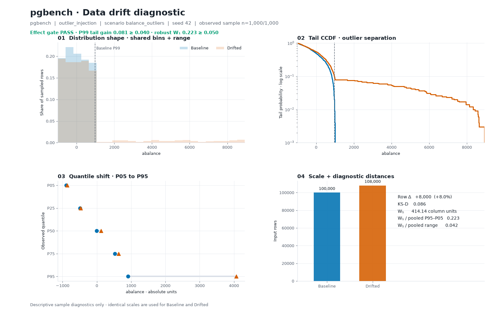

- DriftSpec: [`specs/data/pgbench/balance_outliers.yaml`](specs/data/pgbench/balance_outliers.yaml)
- Manifest: [`manifests/data/pgbench/balance_outliers.json`](manifests/data/pgbench/balance_outliers.json)
- Configuration: `{"column":"abalance","drift_type":"outlier_injection","extreme_direction":"high","extreme_scale":4,"n_ratio":0.08,"table":"pgbench_accounts"}`
- Effect: **PASS** — tail_gain_over_baseline_p99 `0.0810` gte `0.0400` (✓); normalized_wasserstein_p95_p05 `0.2226` gte `0.0500` (✓)
- Seed/sample: `42` / `1000`
- Reproduce: `python -m visualization.cli generate --benchmark pgbench --kind data --scenario balance_outliers --seed 42 --sample-size 1000 --offline`

#### `account_cardinality_reduction` — PASS

Reduce the account population by 45% so volume drift is immediately visible.

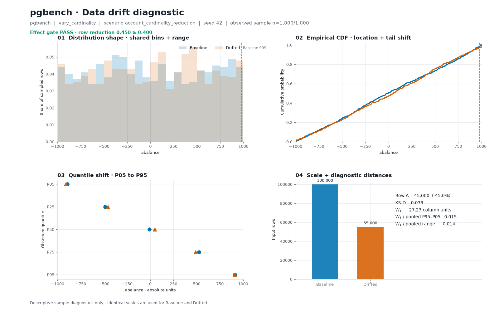

- DriftSpec: [`specs/data/pgbench/account_cardinality_reduction.yaml`](specs/data/pgbench/account_cardinality_reduction.yaml)
- Manifest: [`manifests/data/pgbench/account_cardinality_reduction.json`](manifests/data/pgbench/account_cardinality_reduction.json)
- Configuration: `{"column":"abalance","drift_type":"vary_cardinality","scale":0.55,"table":"pgbench_accounts"}`
- Effect: **PASS** — row_reduction_rate `0.4500` gte `0.4000` (✓)
- Seed/sample: `42` / `1000`
- Reproduce: `python -m visualization.cli generate --benchmark pgbench --kind data --scenario account_cardinality_reduction --seed 42 --sample-size 1000 --offline`

### Query Drift

#### `select_only_hotset` — PASS

Concentrate the mix on read-only point lookups.

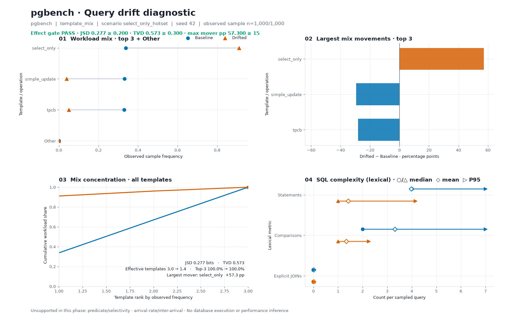

- DriftSpec: [`specs/query/pgbench/select_only_hotset.yaml`](specs/query/pgbench/select_only_hotset.yaml)
- Manifest: [`manifests/query/pgbench/select_only_hotset.json`](manifests/query/pgbench/select_only_hotset.json)
- Configuration: `{"baseline_weights":{"select_only":0.3333333333333333,"simple_update":0.3333333333333333,"tpcb":0.3333333333333333},"sample_size":1000,"target_weights":{"select_only":0.9,"simple_update":0.05,"tpcb":0.05}}`
- Effect: **PASS** — jensen_shannon_divergence_bits `0.2772` gte `0.2000` (✓); total_variation_distance `0.5730` gte `0.3000` (✓); max_mover_absolute_pp `57.3000` gte `15` (✓)
- Seed/sample: `42` / `1000`
- Reproduce: `python -m visualization.cli generate --benchmark pgbench --kind query --scenario select_only_hotset --seed 42 --sample-size 1000 --offline`

#### `complexity_mix_shift` — PASS

Shift the mix toward the full TPC-B transaction script.

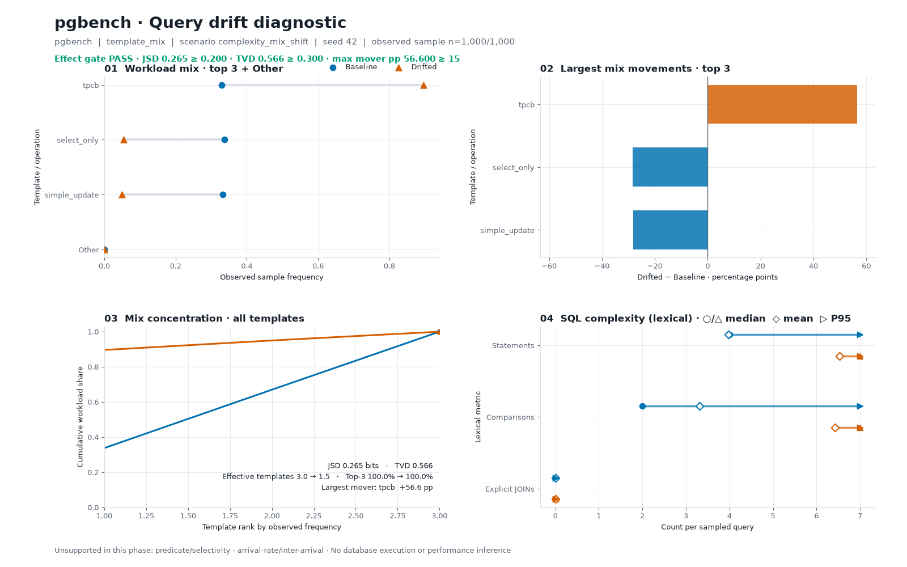

- DriftSpec: [`specs/query/pgbench/complexity_mix_shift.yaml`](specs/query/pgbench/complexity_mix_shift.yaml)
- Manifest: [`manifests/query/pgbench/complexity_mix_shift.json`](manifests/query/pgbench/complexity_mix_shift.json)
- Configuration: `{"baseline_weights":{"select_only":0.3333333333333333,"simple_update":0.3333333333333333,"tpcb":0.3333333333333333},"sample_size":1000,"target_weights":{"select_only":0.05,"simple_update":0.05,"tpcb":0.9}}`
- Effect: **PASS** — jensen_shannon_divergence_bits `0.2646` gte `0.2000` (✓); total_variation_distance `0.5660` gte `0.3000` (✓); max_mover_absolute_pp `56.6000` gte `15` (✓)
- Seed/sample: `42` / `1000`
- Reproduce: `python -m visualization.cli generate --benchmark pgbench --kind query --scenario complexity_mix_shift --seed 42 --sample-size 1000 --offline`

**Current limitations:** No PostgreSQL server is executed; SQL metrics are lexical and configured rates are not observed arrivals.
