# DriftBench Visualization Gallery

Canonical seed `42`, observed sample size `1,000`. Every entry below is a validated one-to-one PNG ↔ manifest ↔ executable DriftSpec result; no target database performance test is run.

## Canonical verdict and trace matrix

| Benchmark | Data scenarios | Query scenarios | Verdict |
|---|---|---|---|
| `tpch` | `price_outliers`, `price_skew`, `lineitem_cardinality_reduction` | `hotset_concentration`, `complexity_mix_shift` | 5/5 PASS |
| `tpcds` | `item_cardinality_reduction`, `price_skew`, `price_outliers` | `early_id_hotset`, `late_id_hotset` | 5/5 PASS |
| `tpcc` | `discount_skew`, `customer_cardinality_reduction`, `order_amount_outliers` | `new_order_hotset`, `complexity_mix_shift` | 5/5 PASS |
| `tpcc_skew` | `stock_quantity_skew`, `stock_quantity_outliers`, `stock_cardinality_reduction` | `new_order_hotset`, `complexity_mix_shift` | 5/5 PASS |
| `job` | `pre_1980_title_deletion`, `production_year_skew`, `post_2000_title_deletion` | `hotset_concentration`, `complexity_mix_shift` | 5/5 PASS |
| `ycsb` | `field0_hot_value_skew`, `record_cardinality_reduction`, `record_cardinality_growth` | `scan_heavy_profile`, `read_only_profile` | 5/5 PASS |
| `dsb` | `revenue_outliers`, `revenue_skew`, `lineorder_cardinality_reduction` | `region_hotset`, `margin_hotset` | 5/5 PASS |
| `pgbench` | `balance_skew`, `balance_outliers`, `account_cardinality_reduction` | `select_only_hotset`, `complexity_mix_shift` | 5/5 PASS |

## Reading the diagnostics

- Numeric dashboards combine shared-bin distributions, ECDF or log-tail CCDF, quantile shifts, row scale, KS-D, W₁, and a visible effect verdict.
- Categorical/query dashboards use full-support JSD/TVD, ranked movers, concentration, entropy/effective count, and shared Baseline/Drifted scales.
- Predicate selectivity and temporal arrival metrics remain Unsupported; SQL complexity is lexical only when public adapter SQL exists.

## TPC-H (`tpch`)

Decision-support workload with 22 parameterized analytical query templates.

### Data Drift

#### `price_outliers` — PASS

Inject a visible high-price tail while preserving the original lineitem population.

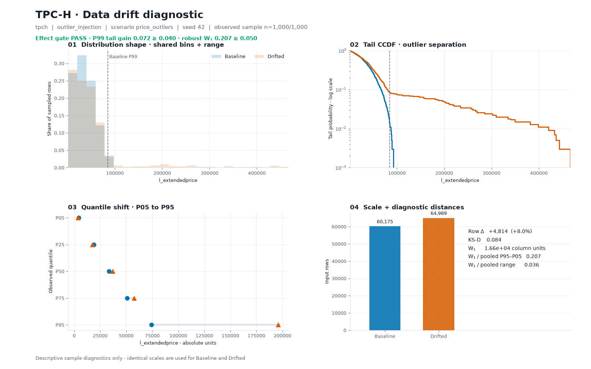

- DriftSpec: [`specs/data/tpch/price_outliers.yaml`](specs/data/tpch/price_outliers.yaml)
- Manifest: [`manifests/data/tpch/price_outliers.json`](manifests/data/tpch/price_outliers.json)
- Configuration: `{"column":"l_extendedprice","drift_type":"outlier_injection","extreme_direction":"high","extreme_scale":4,"n_ratio":0.08,"table":"lineitem"}`
- Effect: **PASS** — tail_gain_over_baseline_p99 `0.072` gte `0.04` (✓); normalized_wasserstein_p95_p05 `0.206981` gte `0.05` (✓)
- Seed/sample: `42` / `1000`
- Reproduce: `python -m visualization.cli generate --benchmark tpch --kind data --scenario price_outliers --seed 42 --sample-size 1000 --offline`

#### `price_skew` — PASS

Reweight most extended prices toward a strongly right-skewed distribution.

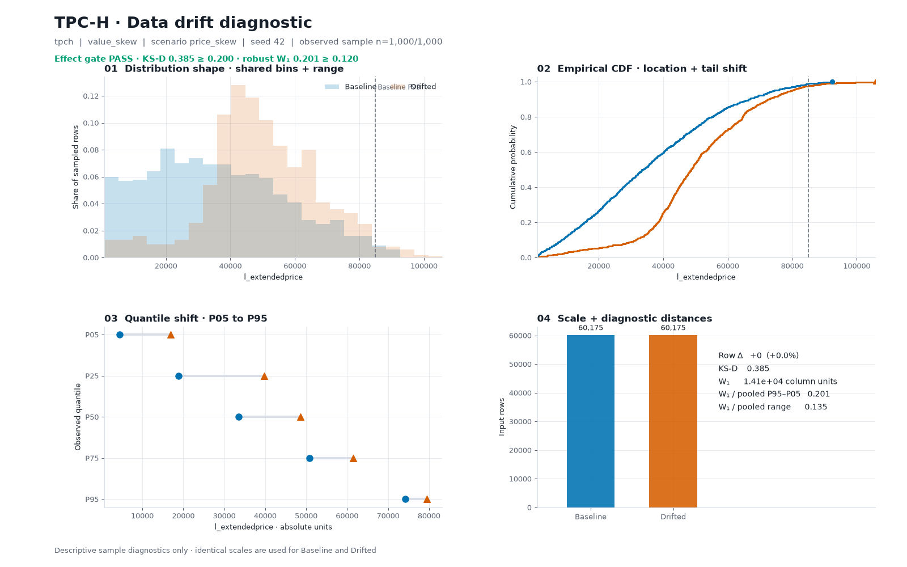

- DriftSpec: [`specs/data/tpch/price_skew.yaml`](specs/data/tpch/price_skew.yaml)
- Manifest: [`manifests/data/tpch/price_skew.json`](manifests/data/tpch/price_skew.json)
- Configuration: `{"column":"l_extendedprice","columns":["l_extendedprice"],"drift_type":"value_skew","portion":0.8,"skewness":5,"table":"lineitem"}`
- Effect: **PASS** — ks_distance `0.385` gte `0.2` (✓); normalized_wasserstein_p95_p05 `0.200942` gte `0.12` (✓)
- Seed/sample: `42` / `1000`
- Reproduce: `python -m visualization.cli generate --benchmark tpch --kind data --scenario price_skew --seed 42 --sample-size 1000 --offline`

#### `lineitem_cardinality_reduction` — PASS

Reduce the lineitem population by 45% so input-scale drift is unmistakable.

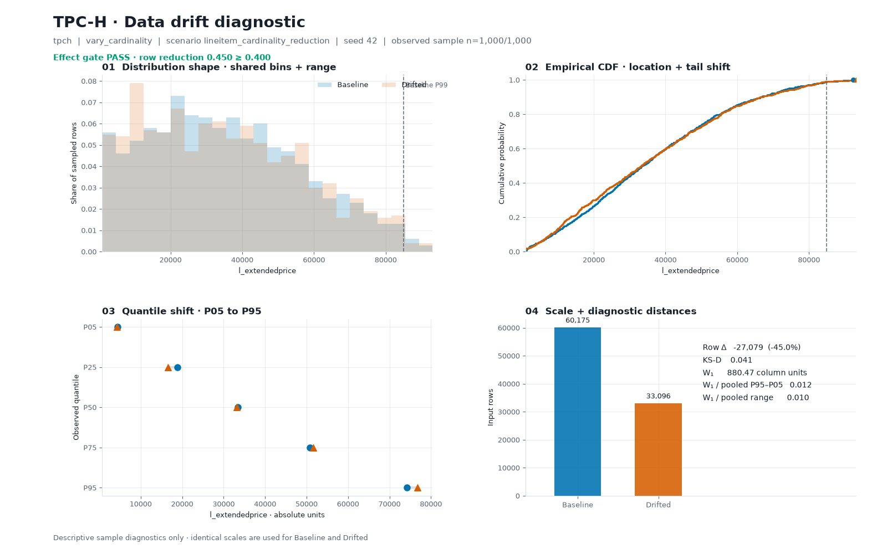

- DriftSpec: [`specs/data/tpch/lineitem_cardinality_reduction.yaml`](specs/data/tpch/lineitem_cardinality_reduction.yaml)
- Manifest: [`manifests/data/tpch/lineitem_cardinality_reduction.json`](manifests/data/tpch/lineitem_cardinality_reduction.json)
- Configuration: `{"column":"l_extendedprice","drift_type":"vary_cardinality","scale":0.55,"table":"lineitem"}`
- Effect: **PASS** — row_reduction_rate `0.450004` gte `0.4` (✓)
- Seed/sample: `42` / `1000`
- Reproduce: `python -m visualization.cli generate --benchmark tpch --kind data --scenario lineitem_cardinality_reduction --seed 42 --sample-size 1000 --offline`

### Query Drift

#### `hotset_concentration` — PASS

Concentrate the workload on Q1, Q9, and Q18.

- DriftSpec: [`specs/query/tpch/hotset_concentration.yaml`](specs/query/tpch/hotset_concentration.yaml)
- Manifest: [`manifests/query/tpch/hotset_concentration.json`](manifests/query/tpch/hotset_concentration.json)
- Configuration: `{"baseline_weights":{"q1":0.045455,"q10":0.045455,"q11":0.045455,"q12":0.045455,"q13":0.045455,"q14":0.045455,"q15":0.045455,"q16":0.045455,"q17":0.045455,"q18":0.045455,"q19":0.045455,"q2":0.045455,"q20":0.045454,"q21":0.045454,"q22":0.045454,"q3":0.045454,"q4":0.045454,"q5":0.045454,"q6":0.045454,"q7":0.045454,"q8":0.045454,"q9":0.045454},"sample_size":1000,"target_weights":{"q1":0.3,"q10":0.005264,"q11":0.005264,"q12":0.005264,"q13":0.005263,"q14":0.005263,"q15":0.005263,"q16":0.005263,"q17":0.005263,"q18":0.3,"q19":0.005263,"q2":0.005263,"q20":0.005263,"q21":0.005263,"q22":0.005263,"q3":0.005263,"q4":0.005263,"q5":0.005263,"q6":0.005263,"q7":0.005263,"q8":0.005263,"q9":0.3}}`
- Effect: **PASS** — jensen_shannon_divergence_bits `0.499532` gte `0.2` (✓); total_variation_distance `0.772` gte `0.3` (✓); max_mover_absolute_pp `26.5` gte `15` (✓)
- Seed/sample: `42` / `1000`
- Reproduce: `python -m visualization.cli generate --benchmark tpch --kind query --scenario hotset_concentration --seed 42 --sample-size 1000 --offline`

#### `complexity_mix_shift` — PASS

Reweight toward lexically more involved Q19, Q2, and Q21 templates.

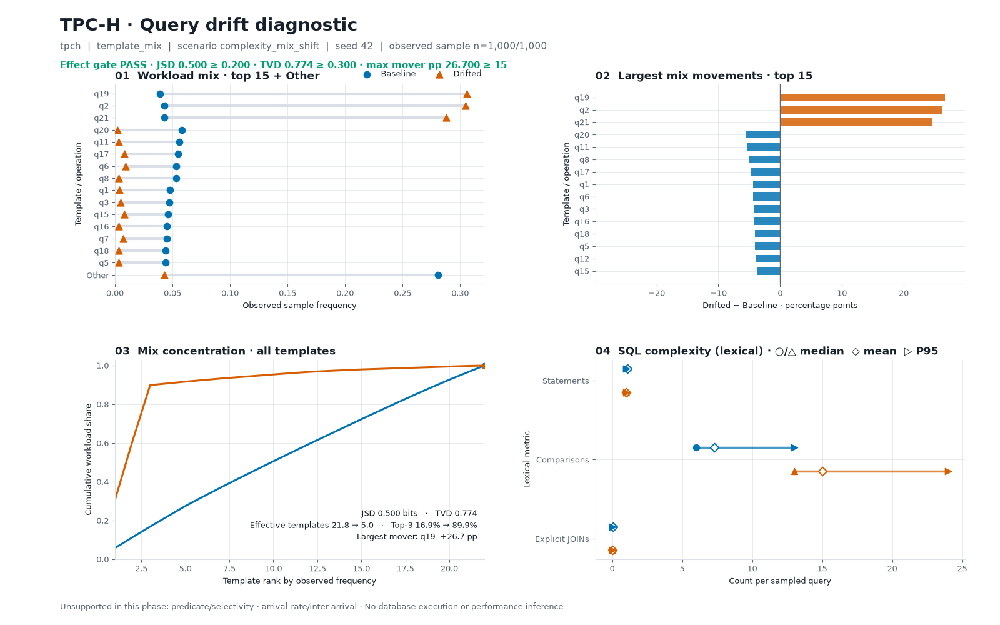

- DriftSpec: [`specs/query/tpch/complexity_mix_shift.yaml`](specs/query/tpch/complexity_mix_shift.yaml)
- Manifest: [`manifests/query/tpch/complexity_mix_shift.json`](manifests/query/tpch/complexity_mix_shift.json)
- Configuration: `{"baseline_weights":{"q1":0.045455,"q10":0.045455,"q11":0.045455,"q12":0.045455,"q13":0.045455,"q14":0.045455,"q15":0.045455,"q16":0.045455,"q17":0.045455,"q18":0.045455,"q19":0.045455,"q2":0.045455,"q20":0.045454,"q21":0.045454,"q22":0.045454,"q3":0.045454,"q4":0.045454,"q5":0.045454,"q6":0.045454,"q7":0.045454,"q8":0.045454,"q9":0.045454},"sample_size":1000,"target_weights":{"q1":0.005264,"q10":0.005264,"q11":0.005264,"q12":0.005263,"q13":0.005263,"q14":0.005263,"q15":0.005263,"q16":0.005263,"q17":0.005263,"q18":0.005263,"q19":0.3,"q2":0.3,"q20":0.005263,"q21":0.3,"q22":0.005263,"q3":0.005263,"q4":0.005263,"q5":0.005263,"q6":0.005263,"q7":0.005263,"q8":0.005263,"q9":0.005263}}`
- Effect: **PASS** — jensen_shannon_divergence_bits `0.499574` gte `0.2` (✓); total_variation_distance `0.774` gte `0.3` (✓); max_mover_absolute_pp `26.7` gte `15` (✓)
- Seed/sample: `42` / `1000`
- Reproduce: `python -m visualization.cli generate --benchmark tpch --kind query --scenario complexity_mix_shift --seed 42 --sample-size 1000 --offline`

**Current limitations:** Real predicate selectivity and observed query arrival times are not available without database execution.

## TPC-DS (`tpcds`)

Synthetic small-scale TPC-DS data with the public 99-query identifier workload.

### Data Drift

#### `item_cardinality_reduction` — PASS

Reduce the item population to expose a clear input-scale change.

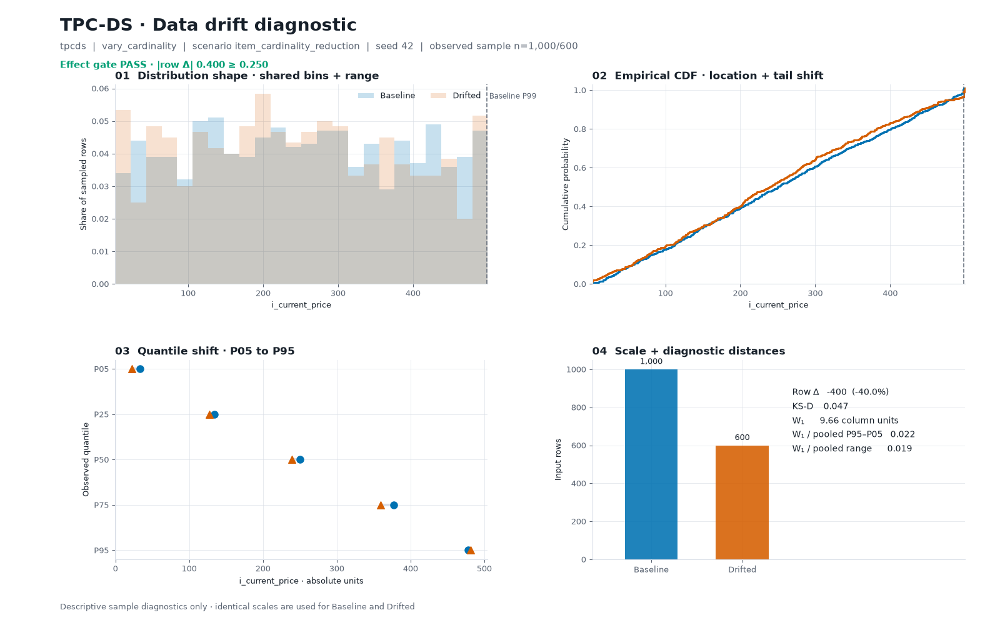

- DriftSpec: [`specs/data/tpcds/item_cardinality_reduction.yaml`](specs/data/tpcds/item_cardinality_reduction.yaml)
- Manifest: [`manifests/data/tpcds/item_cardinality_reduction.json`](manifests/data/tpcds/item_cardinality_reduction.json)
- Configuration: `{"column":"i_current_price","drift_type":"vary_cardinality","scale":0.6,"table":"item"}`
- Effect: **PASS** — absolute_row_rate `0.4` gte `0.25` (✓)
- Seed/sample: `42` / `1000`
- Reproduce: `python -m visualization.cli generate --benchmark tpcds --kind data --scenario item_cardinality_reduction --seed 42 --sample-size 1000 --offline`

#### `price_skew` — PASS

Shift the current-price distribution without changing row count.

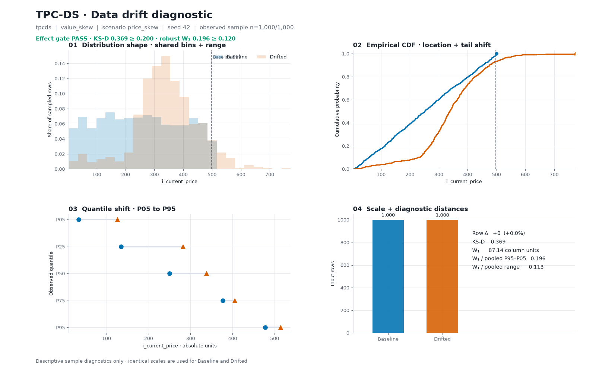

- DriftSpec: [`specs/data/tpcds/price_skew.yaml`](specs/data/tpcds/price_skew.yaml)
- Manifest: [`manifests/data/tpcds/price_skew.json`](manifests/data/tpcds/price_skew.json)
- Configuration: `{"column":"i_current_price","columns":["i_current_price"],"drift_type":"value_skew","portion":0.8,"skewness":5,"table":"item"}`
- Effect: **PASS** — ks_distance `0.369` gte `0.2` (✓); normalized_wasserstein_p95_p05 `0.196381` gte `0.12` (✓)
- Seed/sample: `42` / `1000`
- Reproduce: `python -m visualization.cli generate --benchmark tpcds --kind data --scenario price_skew --seed 42 --sample-size 1000 --offline`

#### `price_outliers` — PASS

Inject a 10% high-price population with a pronounced upper tail.

- DriftSpec: [`specs/data/tpcds/price_outliers.yaml`](specs/data/tpcds/price_outliers.yaml)
- Manifest: [`manifests/data/tpcds/price_outliers.json`](manifests/data/tpcds/price_outliers.json)
- Configuration: `{"column":"i_current_price","drift_type":"outlier_injection","extreme_direction":"high","extreme_scale":5,"n_ratio":0.1,"table":"item"}`
- Effect: **PASS** — row_growth_rate `0.1` gte `0.095` (✓); row_growth_rate `0.1` lte `0.105` (✓); tail_gain_over_baseline_p99 `0.094` gte `0.08` (✓); normalized_wasserstein_p95_p05 `0.282515` gte `0.08` (✓)
- Seed/sample: `42` / `1000`
- Reproduce: `python -m visualization.cli generate --benchmark tpcds --kind data --scenario price_outliers --seed 42 --sample-size 1000 --offline`

### Query Drift

#### `early_id_hotset` — PASS

Concentrate identifier-only workload artifacts on query01-query03.

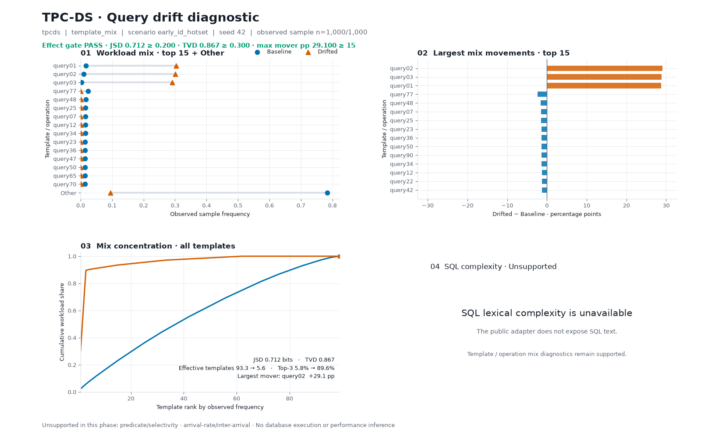

- DriftSpec: [`specs/query/tpcds/early_id_hotset.yaml`](specs/query/tpcds/early_id_hotset.yaml)
- Manifest: [`manifests/query/tpcds/early_id_hotset.json`](manifests/query/tpcds/early_id_hotset.json)
- Configuration: `{"baseline_weights":{"query01":0.010102,"query02":0.010101,"query03":0.010101,"query04":0.010101,"query05":0.010101,"query06":0.010101,"query07":0.010101,"query08":0.010101,"query09":0.010101,"query10":0.010101,"query11":0.010101,"query12":0.010101,"query13":0.010101,"query14":0.010101,"query15":0.010101,"query16":0.010101,"query17":0.010101,"query18":0.010101,"query19":0.010101,"query20":0.010101,"query21":0.010101,"query22":0.010101,"query23":0.010101,"query24":0.010101,"query25":0.010101,"query26":0.010101,"query27":0.010101,"query28":0.010101,"query29":0.010101,"query30":0.010101,"query31":0.010101,"query32":0.010101,"query33":0.010101,"query34":0.010101,"query35":0.010101,"query36":0.010101,"query37":0.010101,"query38":0.010101,"query39":0.010101,"query40":0.010101,"query41":0.010101,"query42":0.010101,"query43":0.010101,"query44":0.010101,"query45":0.010101,"query46":0.010101,"query47":0.010101,"query48":0.010101,"query49":0.010101,"query50":0.010101,"query51":0.010101,"query52":0.010101,"query53":0.010101,"query54":0.010101,"query55":0.010101,"query56":0.010101,"query57":0.010101,"query58":0.010101,"query59":0.010101,"query60":0.010101,"query61":0.010101,"query62":0.010101,"query63":0.010101,"query64":0.010101,"query65":0.010101,"query66":0.010101,"query67":0.010101,"query68":0.010101,"query69":0.010101,"query70":0.010101,"query71":0.010101,"query72":0.010101,"query73":0.010101,"query74":0.010101,"query75":0.010101,"query76":0.010101,"query77":0.010101,"query78":0.010101,"query79":0.010101,"query80":0.010101,"query81":0.010101,"query82":0.010101,"query83":0.010101,"query84":0.010101,"query85":0.010101,"query86":0.010101,"query87":0.010101,"query88":0.010101,"query89":0.010101,"query90":0.010101,"query91":0.010101,"query92":0.010101,"query93":0.010101,"query94":0.010101,"query95":0.010101,"query96":0.010101,"query97":0.010101,"query98":0.010101,"query99":0.010101},"sample_size":1000,"target_weights":{"query01":0.3,"query02":0.3,"query03":0.3,"query04":0.001042,"query05":0.001042,"query06":0.001042,"query07":0.001042,"query08":0.001042,"query09":0.001042,"query10":0.001042,"query11":0.001042,"query12":0.001042,"query13":0.001042,"query14":0.001042,"query15":0.001042,"query16":0.001042,"query17":0.001042,"query18":0.001042,"query19":0.001042,"query20":0.001042,"query21":0.001042,"query22":0.001042,"query23":0.001042,"query24":0.001042,"query25":0.001042,"query26":0.001042,"query27":0.001042,"query28":0.001042,"query29":0.001042,"query30":0.001042,"query31":0.001042,"query32":0.001042,"query33":0.001042,"query34":0.001042,"query35":0.001042,"query36":0.001042,"query37":0.001042,"query38":0.001042,"query39":0.001042,"query40":0.001042,"query41":0.001042,"query42":0.001042,"query43":0.001042,"query44":0.001042,"query45":0.001042,"query46":0.001042,"query47":0.001042,"query48":0.001042,"query49":0.001042,"query50":0.001042,"query51":0.001042,"query52":0.001042,"query53":0.001042,"query54":0.001042,"query55":0.001042,"query56":0.001042,"query57":0.001042,"query58":0.001042,"query59":0.001042,"query60":0.001042,"query61":0.001042,"query62":0.001042,"query63":0.001042,"query64":0.001042,"query65":0.001042,"query66":0.001042,"query67":0.001042,"query68":0.001041,"query69":0.001041,"query70":0.001041,"query71":0.001041,"query72":0.001041,"query73":0.001041,"query74":0.001041,"query75":0.001041,"query76":0.001041,"query77":0.001041,"query78":0.001041,"query79":0.001041,"query80":0.001041,"query81":0.001041,"query82":0.001041,"query83":0.001041,"query84":0.001041,"query85":0.001041,"query86":0.001041,"query87":0.001041,"query88":0.001041,"query89":0.001041,"query90":0.001041,"query91":0.001041,"query92":0.001041,"query93":0.001041,"query94":0.001041,"query95":0.001041,"query96":0.001041,"query97":0.001041,"query98":0.001041,"query99":0.001041}}`
- Effect: **PASS** — jensen_shannon_divergence_bits `0.712194` gte `0.2` (✓); total_variation_distance `0.867` gte `0.3` (✓); max_mover_absolute_pp `29.1` gte `15` (✓)
- Seed/sample: `42` / `1000`
- Reproduce: `python -m visualization.cli generate --benchmark tpcds --kind query --scenario early_id_hotset --seed 42 --sample-size 1000 --offline`

#### `late_id_hotset` — PASS

Shift the identifier-only hotset to query97-query99.

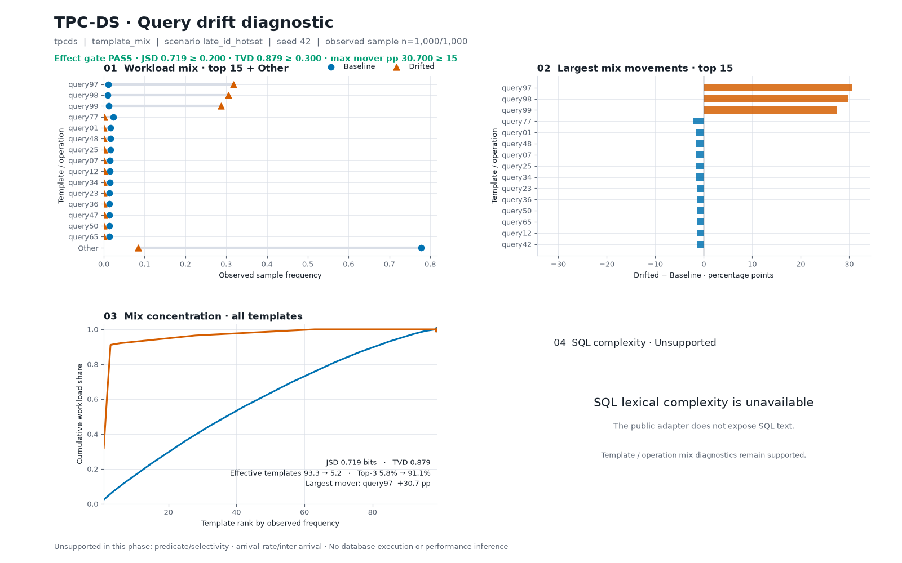

- DriftSpec: [`specs/query/tpcds/late_id_hotset.yaml`](specs/query/tpcds/late_id_hotset.yaml)
- Manifest: [`manifests/query/tpcds/late_id_hotset.json`](manifests/query/tpcds/late_id_hotset.json)
- Configuration: `{"baseline_weights":{"query01":0.010102,"query02":0.010101,"query03":0.010101,"query04":0.010101,"query05":0.010101,"query06":0.010101,"query07":0.010101,"query08":0.010101,"query09":0.010101,"query10":0.010101,"query11":0.010101,"query12":0.010101,"query13":0.010101,"query14":0.010101,"query15":0.010101,"query16":0.010101,"query17":0.010101,"query18":0.010101,"query19":0.010101,"query20":0.010101,"query21":0.010101,"query22":0.010101,"query23":0.010101,"query24":0.010101,"query25":0.010101,"query26":0.010101,"query27":0.010101,"query28":0.010101,"query29":0.010101,"query30":0.010101,"query31":0.010101,"query32":0.010101,"query33":0.010101,"query34":0.010101,"query35":0.010101,"query36":0.010101,"query37":0.010101,"query38":0.010101,"query39":0.010101,"query40":0.010101,"query41":0.010101,"query42":0.010101,"query43":0.010101,"query44":0.010101,"query45":0.010101,"query46":0.010101,"query47":0.010101,"query48":0.010101,"query49":0.010101,"query50":0.010101,"query51":0.010101,"query52":0.010101,"query53":0.010101,"query54":0.010101,"query55":0.010101,"query56":0.010101,"query57":0.010101,"query58":0.010101,"query59":0.010101,"query60":0.010101,"query61":0.010101,"query62":0.010101,"query63":0.010101,"query64":0.010101,"query65":0.010101,"query66":0.010101,"query67":0.010101,"query68":0.010101,"query69":0.010101,"query70":0.010101,"query71":0.010101,"query72":0.010101,"query73":0.010101,"query74":0.010101,"query75":0.010101,"query76":0.010101,"query77":0.010101,"query78":0.010101,"query79":0.010101,"query80":0.010101,"query81":0.010101,"query82":0.010101,"query83":0.010101,"query84":0.010101,"query85":0.010101,"query86":0.010101,"query87":0.010101,"query88":0.010101,"query89":0.010101,"query90":0.010101,"query91":0.010101,"query92":0.010101,"query93":0.010101,"query94":0.010101,"query95":0.010101,"query96":0.010101,"query97":0.010101,"query98":0.010101,"query99":0.010101},"sample_size":1000,"target_weights":{"query01":0.001042,"query02":0.001042,"query03":0.001042,"query04":0.001042,"query05":0.001042,"query06":0.001042,"query07":0.001042,"query08":0.001042,"query09":0.001042,"query10":0.001042,"query11":0.001042,"query12":0.001042,"query13":0.001042,"query14":0.001042,"query15":0.001042,"query16":0.001042,"query17":0.001042,"query18":0.001042,"query19":0.001042,"query20":0.001042,"query21":0.001042,"query22":0.001042,"query23":0.001042,"query24":0.001042,"query25":0.001042,"query26":0.001042,"query27":0.001042,"query28":0.001042,"query29":0.001042,"query30":0.001042,"query31":0.001042,"query32":0.001042,"query33":0.001042,"query34":0.001042,"query35":0.001042,"query36":0.001042,"query37":0.001042,"query38":0.001042,"query39":0.001042,"query40":0.001042,"query41":0.001042,"query42":0.001042,"query43":0.001042,"query44":0.001042,"query45":0.001042,"query46":0.001042,"query47":0.001042,"query48":0.001042,"query49":0.001042,"query50":0.001042,"query51":0.001042,"query52":0.001042,"query53":0.001042,"query54":0.001042,"query55":0.001042,"query56":0.001042,"query57":0.001042,"query58":0.001042,"query59":0.001042,"query60":0.001042,"query61":0.001042,"query62":0.001042,"query63":0.001042,"query64":0.001042,"query65":0.001041,"query66":0.001041,"query67":0.001041,"query68":0.001041,"query69":0.001041,"query70":0.001041,"query71":0.001041,"query72":0.001041,"query73":0.001041,"query74":0.001041,"query75":0.001041,"query76":0.001041,"query77":0.001041,"query78":0.001041,"query79":0.001041,"query80":0.001041,"query81":0.001041,"query82":0.001041,"query83":0.001041,"query84":0.001041,"query85":0.001041,"query86":0.001041,"query87":0.001041,"query88":0.001041,"query89":0.001041,"query90":0.001041,"query91":0.001041,"query92":0.001041,"query93":0.001041,"query94":0.001041,"query95":0.001041,"query96":0.001041,"query97":0.3,"query98":0.3,"query99":0.3}}`
- Effect: **PASS** — jensen_shannon_divergence_bits `0.718738` gte `0.2` (✓); total_variation_distance `0.879` gte `0.3` (✓); max_mover_absolute_pp `30.7` gte `15` (✓)
- Seed/sample: `42` / `1000`
- Reproduce: `python -m visualization.cli generate --benchmark tpcds --kind query --scenario late_id_hotset --seed 42 --sample-size 1000 --offline`

**Current limitations:** The adapter exposes query IDs and XML only; SQL complexity, predicate selectivity, and temporal observations are unsupported.

## TPC-C (`tpcc`)

Synthetic one-warehouse transactional data with five public SQL transaction templates.

### Data Drift

#### `discount_skew` — PASS

Concentrate customer discounts into a visibly skewed operating regime.

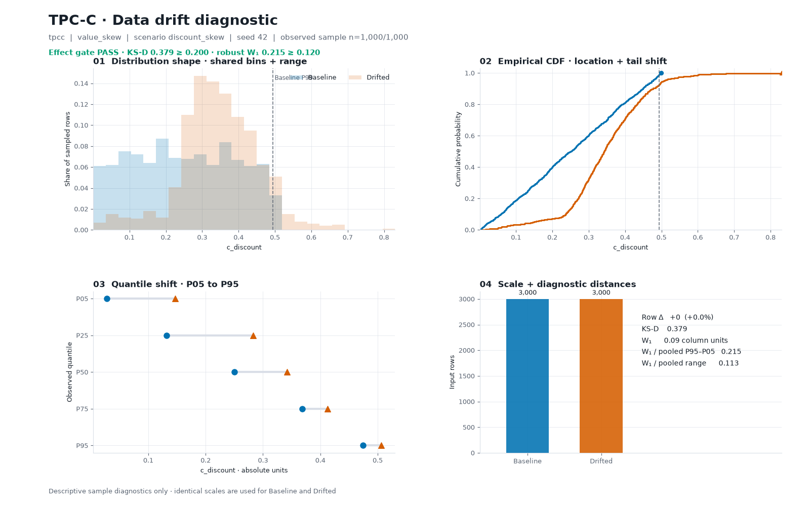

- DriftSpec: [`specs/data/tpcc/discount_skew.yaml`](specs/data/tpcc/discount_skew.yaml)
- Manifest: [`manifests/data/tpcc/discount_skew.json`](manifests/data/tpcc/discount_skew.json)
- Configuration: `{"column":"c_discount","columns":["c_discount"],"drift_type":"value_skew","portion":0.8,"skewness":5,"table":"customer"}`
- Effect: **PASS** — ks_distance `0.379` gte `0.2` (✓); normalized_wasserstein_p95_p05 `0.215021` gte `0.12` (✓)
- Seed/sample: `42` / `1000`
- Reproduce: `python -m visualization.cli generate --benchmark tpcc --kind data --scenario discount_skew --seed 42 --sample-size 1000 --offline`

#### `customer_cardinality_reduction` — PASS

Reduce the customer population while retaining adapter-shaped records.

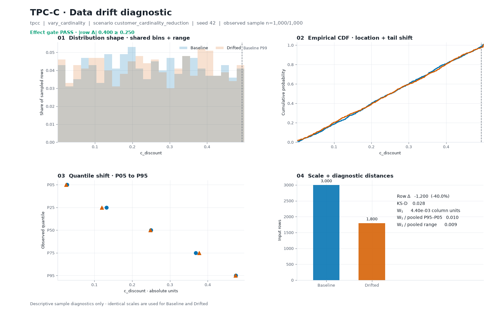

- DriftSpec: [`specs/data/tpcc/customer_cardinality_reduction.yaml`](specs/data/tpcc/customer_cardinality_reduction.yaml)
- Manifest: [`manifests/data/tpcc/customer_cardinality_reduction.json`](manifests/data/tpcc/customer_cardinality_reduction.json)
- Configuration: `{"column":"c_discount","drift_type":"vary_cardinality","scale":0.6,"table":"customer"}`
- Effect: **PASS** — absolute_row_rate `0.4` gte `0.25` (✓)
- Seed/sample: `42` / `1000`
- Reproduce: `python -m visualization.cli generate --benchmark tpcc --kind data --scenario customer_cardinality_reduction --seed 42 --sample-size 1000 --offline`

#### `order_amount_outliers` — PASS

Inject a 10% high-value tail into order-line amounts.

- DriftSpec: [`specs/data/tpcc/order_amount_outliers.yaml`](specs/data/tpcc/order_amount_outliers.yaml)
- Manifest: [`manifests/data/tpcc/order_amount_outliers.json`](manifests/data/tpcc/order_amount_outliers.json)
- Configuration: `{"column":"ol_amount","drift_type":"outlier_injection","extreme_direction":"high","extreme_scale":5,"n_ratio":0.1,"table":"order_line"}`
- Effect: **PASS** — row_growth_rate `0.099983` gte `0.095` (✓); row_growth_rate `0.099983` lte `0.105` (✓); tail_gain_over_baseline_p99 `0.087` gte `0.08` (✓); normalized_wasserstein_p95_p05 `0.293407` gte `0.08` (✓)
- Seed/sample: `42` / `1000`
- Reproduce: `python -m visualization.cli generate --benchmark tpcc --kind data --scenario order_amount_outliers --seed 42 --sample-size 1000 --offline`

### Query Drift

#### `new_order_hotset` — PASS

Move the native transaction mix decisively toward New-Order.

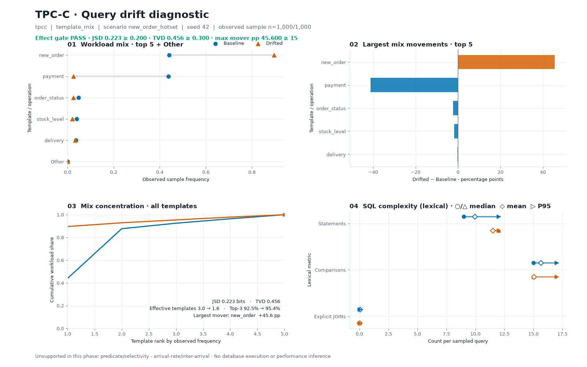

- DriftSpec: [`specs/query/tpcc/new_order_hotset.yaml`](specs/query/tpcc/new_order_hotset.yaml)
- Manifest: [`manifests/query/tpcc/new_order_hotset.json`](manifests/query/tpcc/new_order_hotset.json)
- Configuration: `{"baseline_weights":{"delivery":0.04,"new_order":0.45,"order_status":0.04,"payment":0.43,"stock_level":0.04},"sample_size":1000,"target_weights":{"delivery":0.025,"new_order":0.9,"order_status":0.025,"payment":0.025,"stock_level":0.025}}`
- Effect: **PASS** — jensen_shannon_divergence_bits `0.222828` gte `0.2` (✓); total_variation_distance `0.456` gte `0.3` (✓); max_mover_absolute_pp `45.6` gte `15` (✓)
- Seed/sample: `42` / `1000`
- Reproduce: `python -m visualization.cli generate --benchmark tpcc --kind query --scenario new_order_hotset --seed 42 --sample-size 1000 --offline`

#### `complexity_mix_shift` — PASS

Reweight the transaction mix toward Delivery's SQL template.

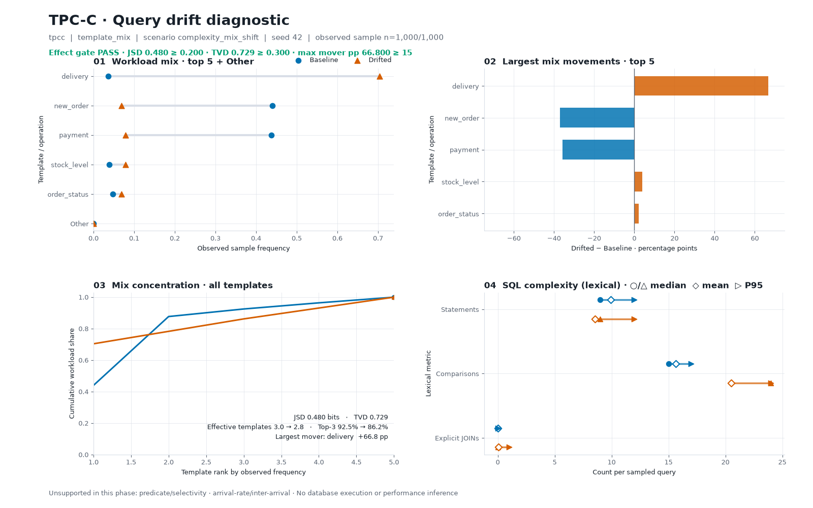

- DriftSpec: [`specs/query/tpcc/complexity_mix_shift.yaml`](specs/query/tpcc/complexity_mix_shift.yaml)
- Manifest: [`manifests/query/tpcc/complexity_mix_shift.json`](manifests/query/tpcc/complexity_mix_shift.json)
- Configuration: `{"baseline_weights":{"delivery":0.04,"new_order":0.45,"order_status":0.04,"payment":0.43,"stock_level":0.04},"sample_size":1000,"target_weights":{"delivery":0.7,"new_order":0.075,"order_status":0.075,"payment":0.075,"stock_level":0.075}}`
- Effect: **PASS** — jensen_shannon_divergence_bits `0.479997` gte `0.2` (✓); total_variation_distance `0.729` gte `0.3` (✓); max_mover_absolute_pp `66.8` gte `15` (✓)
- Seed/sample: `42` / `1000`
- Reproduce: `python -m visualization.cli generate --benchmark tpcc --kind query --scenario complexity_mix_shift --seed 42 --sample-size 1000 --offline`

**Current limitations:** SQL metrics are lexical; no database selectivity or observed arrival timestamps are measured.

## TPC-C Skew (`tpcc_skew`)

TPC-C data and transactions annotated with a skewed warehouse-access profile.

### Data Drift

#### `stock_quantity_skew` — PASS

Add a second strong stock-quantity skew on top of the benchmark's native access skew.

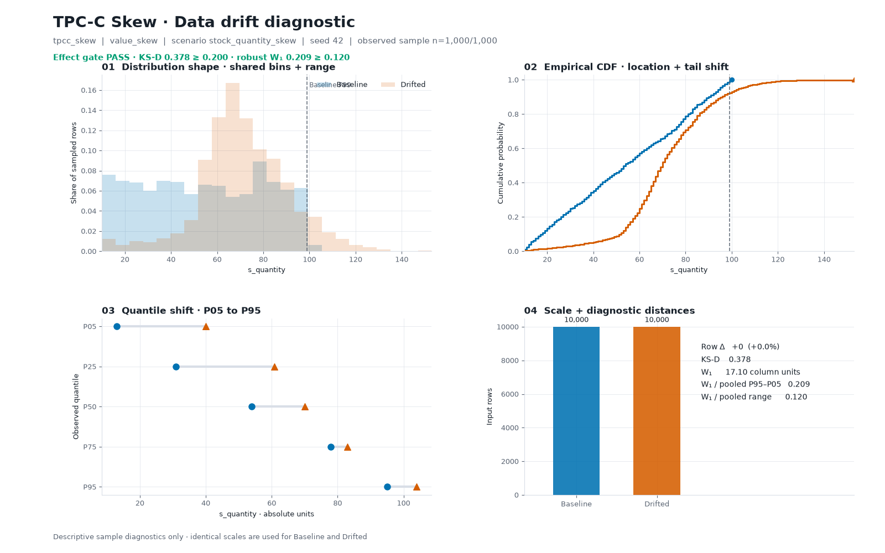

- DriftSpec: [`specs/data/tpcc_skew/stock_quantity_skew.yaml`](specs/data/tpcc_skew/stock_quantity_skew.yaml)
- Manifest: [`manifests/data/tpcc_skew/stock_quantity_skew.json`](manifests/data/tpcc_skew/stock_quantity_skew.json)
- Configuration: `{"column":"s_quantity","columns":["s_quantity"],"drift_type":"value_skew","portion":0.85,"skewness":6,"table":"stock"}`
- Effect: **PASS** — ks_distance `0.378` gte `0.2` (✓); normalized_wasserstein_p95_p05 `0.208524` gte `0.12` (✓)
- Seed/sample: `42` / `1000`
- Reproduce: `python -m visualization.cli generate --benchmark tpcc_skew --kind data --scenario stock_quantity_skew --seed 42 --sample-size 1000 --offline`

#### `stock_quantity_outliers` — PASS

Inject a distinct high-quantity tail into the stock table.

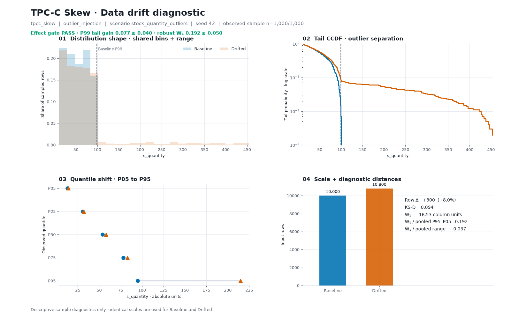

- DriftSpec: [`specs/data/tpcc_skew/stock_quantity_outliers.yaml`](specs/data/tpcc_skew/stock_quantity_outliers.yaml)
- Manifest: [`manifests/data/tpcc_skew/stock_quantity_outliers.json`](manifests/data/tpcc_skew/stock_quantity_outliers.json)
- Configuration: `{"column":"s_quantity","drift_type":"outlier_injection","extreme_direction":"high","extreme_scale":4,"n_ratio":0.08,"table":"stock"}`
- Effect: **PASS** — tail_gain_over_baseline_p99 `0.077` gte `0.04` (✓); normalized_wasserstein_p95_p05 `0.192198` gte `0.05` (✓)
- Seed/sample: `42` / `1000`
- Reproduce: `python -m visualization.cli generate --benchmark tpcc_skew --kind data --scenario stock_quantity_outliers --seed 42 --sample-size 1000 --offline`

#### `stock_cardinality_reduction` — PASS

Reduce the stock population by 45% while retaining the skew benchmark's input shape.

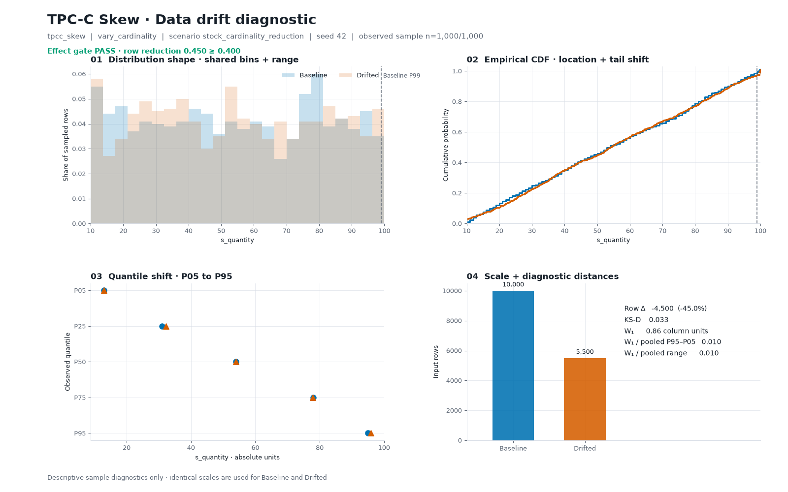

- DriftSpec: [`specs/data/tpcc_skew/stock_cardinality_reduction.yaml`](specs/data/tpcc_skew/stock_cardinality_reduction.yaml)
- Manifest: [`manifests/data/tpcc_skew/stock_cardinality_reduction.json`](manifests/data/tpcc_skew/stock_cardinality_reduction.json)
- Configuration: `{"column":"s_quantity","drift_type":"vary_cardinality","scale":0.55,"table":"stock"}`
- Effect: **PASS** — row_reduction_rate `0.45` gte `0.4` (✓)
- Seed/sample: `42` / `1000`
- Reproduce: `python -m visualization.cli generate --benchmark tpcc_skew --kind data --scenario stock_cardinality_reduction --seed 42 --sample-size 1000 --offline`

### Query Drift

#### `new_order_hotset` — PASS

Combine skewed access with a strongly New-Order-heavy transaction mix.

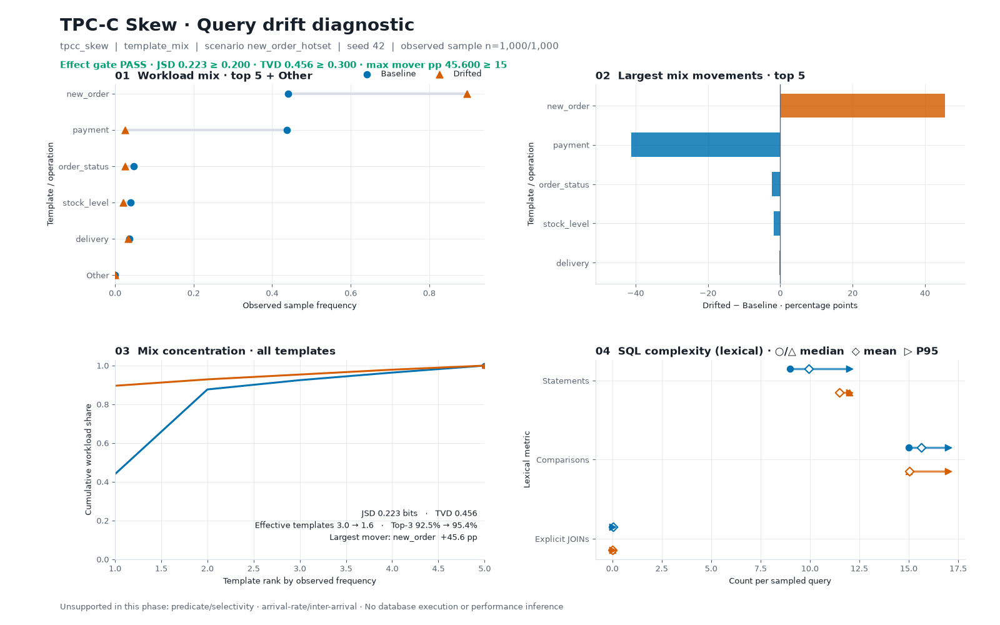

- DriftSpec: [`specs/query/tpcc_skew/new_order_hotset.yaml`](specs/query/tpcc_skew/new_order_hotset.yaml)
- Manifest: [`manifests/query/tpcc_skew/new_order_hotset.json`](manifests/query/tpcc_skew/new_order_hotset.json)
- Configuration: `{"baseline_weights":{"delivery":0.04,"new_order":0.45,"order_status":0.04,"payment":0.43,"stock_level":0.04},"sample_size":1000,"target_weights":{"delivery":0.025,"new_order":0.9,"order_status":0.025,"payment":0.025,"stock_level":0.025}}`
- Effect: **PASS** — jensen_shannon_divergence_bits `0.222828` gte `0.2` (✓); total_variation_distance `0.456` gte `0.3` (✓); max_mover_absolute_pp `45.6` gte `15` (✓)
- Seed/sample: `42` / `1000`
- Reproduce: `python -m visualization.cli generate --benchmark tpcc_skew --kind query --scenario new_order_hotset --seed 42 --sample-size 1000 --offline`

#### `complexity_mix_shift` — PASS

Reweight the skewed benchmark toward Delivery's SQL template.

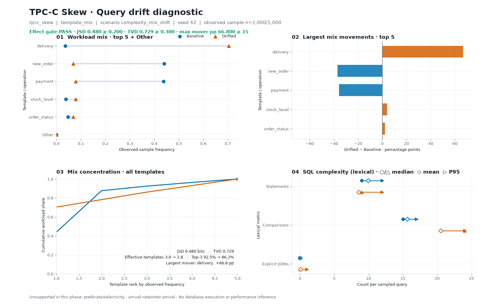

- DriftSpec: [`specs/query/tpcc_skew/complexity_mix_shift.yaml`](specs/query/tpcc_skew/complexity_mix_shift.yaml)
- Manifest: [`manifests/query/tpcc_skew/complexity_mix_shift.json`](manifests/query/tpcc_skew/complexity_mix_shift.json)
- Configuration: `{"baseline_weights":{"delivery":0.04,"new_order":0.45,"order_status":0.04,"payment":0.43,"stock_level":0.04},"sample_size":1000,"target_weights":{"delivery":0.7,"new_order":0.075,"order_status":0.075,"payment":0.075,"stock_level":0.075}}`
- Effect: **PASS** — jensen_shannon_divergence_bits `0.479997` gte `0.2` (✓); total_variation_distance `0.729` gte `0.3` (✓); max_mover_absolute_pp `66.8` gte `15` (✓)
- Seed/sample: `42` / `1000`
- Reproduce: `python -m visualization.cli generate --benchmark tpcc_skew --kind query --scenario complexity_mix_shift --seed 42 --sample-size 1000 --offline`

**Current limitations:** SQL metrics are lexical; configured warehouse weights are not observed arrival timestamps.

## JOB (`job`)

Synthetic 11-table IMDB subset with 20 representative join-order query templates.

### Data Drift

#### `pre_1980_title_deletion` — PASS

Delete a seeded share of pre-1980 titles and propagate keys across dependent tables.

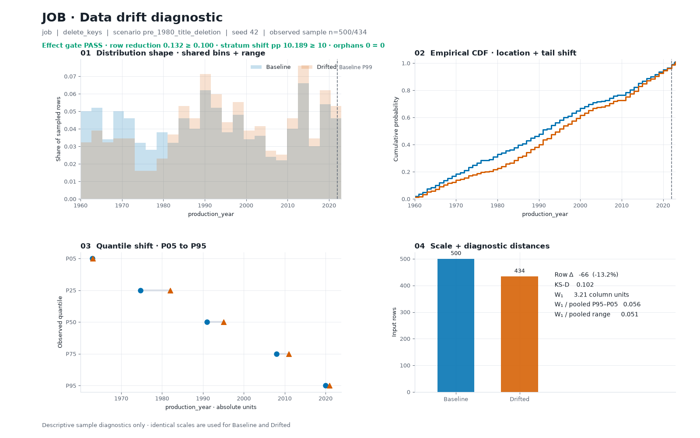

- DriftSpec: [`specs/data/job/pre_1980_title_deletion.yaml`](specs/data/job/pre_1980_title_deletion.yaml)
- Manifest: [`manifests/data/job/pre_1980_title_deletion.json`](manifests/data/job/pre_1980_title_deletion.json)
- Configuration: `{"column":"production_year","drift_steps":[{"filter":{"column":"production_year","max":1980},"fraction":0.4,"key_column":"id","op":"delete_keys","propagate":[{"policy":"drop","relationship":"cast_info_title"},{"policy":"drop","relationship":"movie_info_title"},{"policy":"drop","relationship":"movie_companies_title"},{"policy":"drop","relationship":"movie_keyword_title"}],"target":"title"}],"table":"title","validate_integrity":true}`
- Effect: **PASS** — row_reduction_rate `0.132` gte `0.1` (✓); target_stratum_share_shift_pp `10.18894` gte `10` (✓); orphan_count `0` eq `0` (✓)
- Seed/sample: `42` / `1000`
- Reproduce: `python -m visualization.cli generate --benchmark job --kind data --scenario pre_1980_title_deletion --seed 42 --sample-size 1000 --offline`

#### `production_year_skew` — PASS

Shift the title production-year distribution without fabricating query execution.

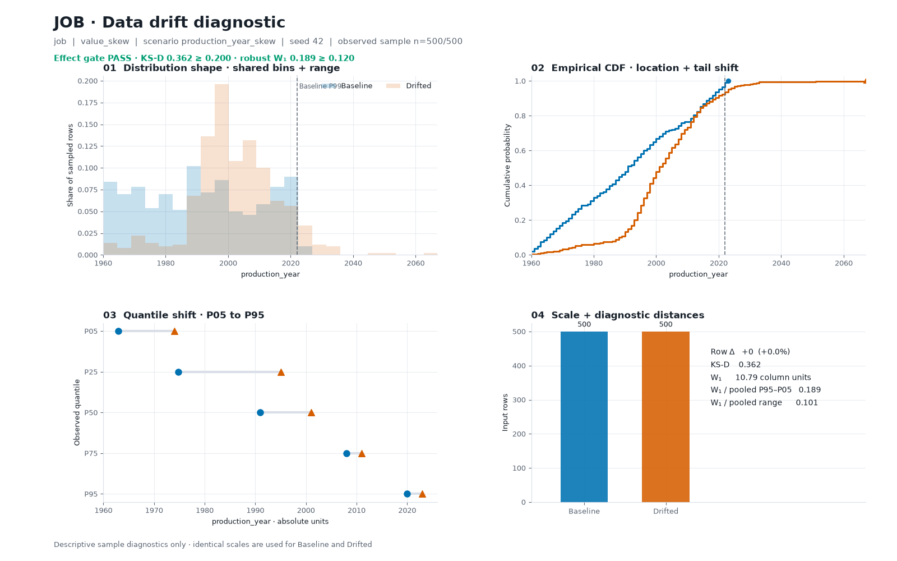

- DriftSpec: [`specs/data/job/production_year_skew.yaml`](specs/data/job/production_year_skew.yaml)
- Manifest: [`manifests/data/job/production_year_skew.json`](manifests/data/job/production_year_skew.json)
- Configuration: `{"column":"production_year","columns":["production_year"],"drift_type":"value_skew","portion":0.8,"skewness":5,"table":"title"}`
- Effect: **PASS** — ks_distance `0.362` gte `0.2` (✓); normalized_wasserstein_p95_p05 `0.189333` gte `0.12` (✓)
- Seed/sample: `42` / `1000`
- Reproduce: `python -m visualization.cli generate --benchmark job --kind data --scenario production_year_skew --seed 42 --sample-size 1000 --offline`

#### `post_2000_title_deletion` — PASS

Delete a seeded share of titles after 2000 and propagate every affected foreign key.

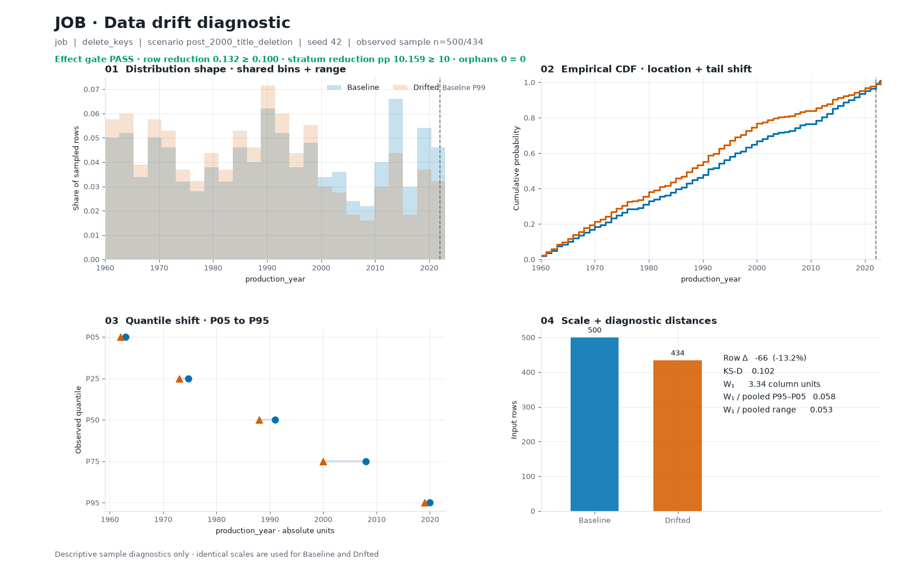

- DriftSpec: [`specs/data/job/post_2000_title_deletion.yaml`](specs/data/job/post_2000_title_deletion.yaml)
- Manifest: [`manifests/data/job/post_2000_title_deletion.json`](manifests/data/job/post_2000_title_deletion.json)
- Configuration: `{"column":"production_year","drift_steps":[{"filter":{"column":"production_year","min":2001},"fraction":0.4,"key_column":"id","op":"delete_keys","propagate":[{"policy":"drop","relationship":"cast_info_title"},{"policy":"drop","relationship":"movie_info_title"},{"policy":"drop","relationship":"movie_companies_title"},{"policy":"drop","relationship":"movie_keyword_title"}],"target":"title"}],"table":"title","validate_integrity":true}`
- Effect: **PASS** — row_reduction_rate `0.132` gte `0.1` (✓); target_stratum_share_reduction_pp `10.158525` gte `10` (✓); orphan_count `0` eq `0` (✓)
- Seed/sample: `42` / `1000`
- Reproduce: `python -m visualization.cli generate --benchmark job --kind data --scenario post_2000_title_deletion --seed 42 --sample-size 1000 --offline`

### Query Drift

#### `hotset_concentration` — PASS

Concentrate the JOB mix on two selective low-index families.

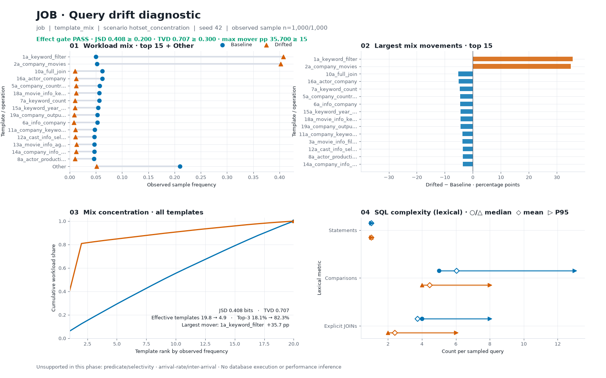

- DriftSpec: [`specs/query/job/hotset_concentration.yaml`](specs/query/job/hotset_concentration.yaml)
- Manifest: [`manifests/query/job/hotset_concentration.json`](manifests/query/job/hotset_concentration.json)
- Configuration: `{"baseline_weights":{"10a_full_join":0.05,"11a_company_keyword_year":0.05,"12a_cast_info_selective":0.05,"13a_movie_info_aggregate":0.05,"14a_company_info_cast":0.05,"15a_keyword_year_range":0.05,"16a_actor_company":0.05,"17a_selective_cast_keyword":0.05,"18a_movie_info_keyword":0.05,"19a_company_output_volume":0.05,"1a_keyword_filter":0.05,"20a_full_eight_table":0.05,"2a_company_movies":0.05,"3a_movie_info_filter":0.05,"4a_cast_keyword":0.05,"5a_company_country_cast":0.05,"6a_info_company":0.05,"7a_keyword_count":0.05,"8a_actor_productivity":0.05,"9a_multi_keyword_movie":0.05},"sample_size":1000,"target_weights":{"10a_full_join":0.011112,"11a_company_keyword_year":0.011112,"12a_cast_info_selective":0.011111,"13a_movie_info_aggregate":0.011111,"14a_company_info_cast":0.011111,"15a_keyword_year_range":0.011111,"16a_actor_company":0.011111,"17a_selective_cast_keyword":0.011111,"18a_movie_info_keyword":0.011111,"19a_company_output_volume":0.011111,"1a_keyword_filter":0.4,"20a_full_eight_table":0.011111,"2a_company_movies":0.4,"3a_movie_info_filter":0.011111,"4a_cast_keyword":0.011111,"5a_company_country_cast":0.011111,"6a_info_company":0.011111,"7a_keyword_count":0.011111,"8a_actor_productivity":0.011111,"9a_multi_keyword_movie":0.011111}}`
- Effect: **PASS** — jensen_shannon_divergence_bits `0.407803` gte `0.2` (✓); total_variation_distance `0.707` gte `0.3` (✓); max_mover_absolute_pp `35.7` gte `15` (✓)
- Seed/sample: `42` / `1000`
- Reproduce: `python -m visualization.cli generate --benchmark job --kind query --scenario hotset_concentration --seed 42 --sample-size 1000 --offline`

#### `complexity_mix_shift` — PASS

Reweight JOB toward the ten-table and eight-table join families.

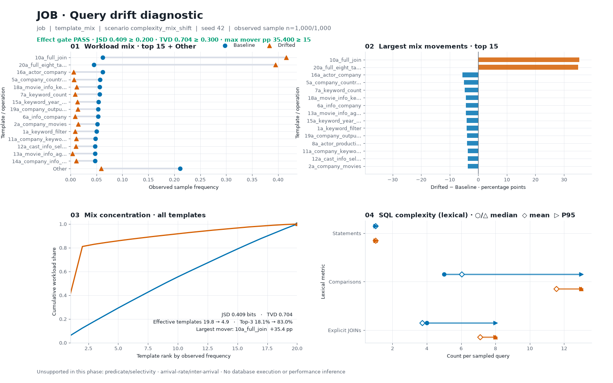

- DriftSpec: [`specs/query/job/complexity_mix_shift.yaml`](specs/query/job/complexity_mix_shift.yaml)
- Manifest: [`manifests/query/job/complexity_mix_shift.json`](manifests/query/job/complexity_mix_shift.json)
- Configuration: `{"baseline_weights":{"10a_full_join":0.05,"11a_company_keyword_year":0.05,"12a_cast_info_selective":0.05,"13a_movie_info_aggregate":0.05,"14a_company_info_cast":0.05,"15a_keyword_year_range":0.05,"16a_actor_company":0.05,"17a_selective_cast_keyword":0.05,"18a_movie_info_keyword":0.05,"19a_company_output_volume":0.05,"1a_keyword_filter":0.05,"20a_full_eight_table":0.05,"2a_company_movies":0.05,"3a_movie_info_filter":0.05,"4a_cast_keyword":0.05,"5a_company_country_cast":0.05,"6a_info_company":0.05,"7a_keyword_count":0.05,"8a_actor_productivity":0.05,"9a_multi_keyword_movie":0.05},"sample_size":1000,"target_weights":{"10a_full_join":0.4,"11a_company_keyword_year":0.011112,"12a_cast_info_selective":0.011112,"13a_movie_info_aggregate":0.011111,"14a_company_info_cast":0.011111,"15a_keyword_year_range":0.011111,"16a_actor_company":0.011111,"17a_selective_cast_keyword":0.011111,"18a_movie_info_keyword":0.011111,"19a_company_output_volume":0.011111,"1a_keyword_filter":0.011111,"20a_full_eight_table":0.4,"2a_company_movies":0.011111,"3a_movie_info_filter":0.011111,"4a_cast_keyword":0.011111,"5a_company_country_cast":0.011111,"6a_info_company":0.011111,"7a_keyword_count":0.011111,"8a_actor_productivity":0.011111,"9a_multi_keyword_movie":0.011111}}`
- Effect: **PASS** — jensen_shannon_divergence_bits `0.409109` gte `0.2` (✓); total_variation_distance `0.704` gte `0.3` (✓); max_mover_absolute_pp `35.4` gte `15` (✓)
- Seed/sample: `42` / `1000`
- Reproduce: `python -m visualization.cli generate --benchmark job --kind query --scenario complexity_mix_shift --seed 42 --sample-size 1000 --offline`

**Current limitations:** The adapter contains 20 representative templates rather than the complete 113-query JOB corpus; selectivity is unsupported.

## YCSB (`ycsb`)

Synthetic key-value records and public YCSB operation-mix profiles.

### Data Drift

#### `field0_hot_value_skew` — PASS

Turn a near-unique string field into a pronounced hot-value distribution.

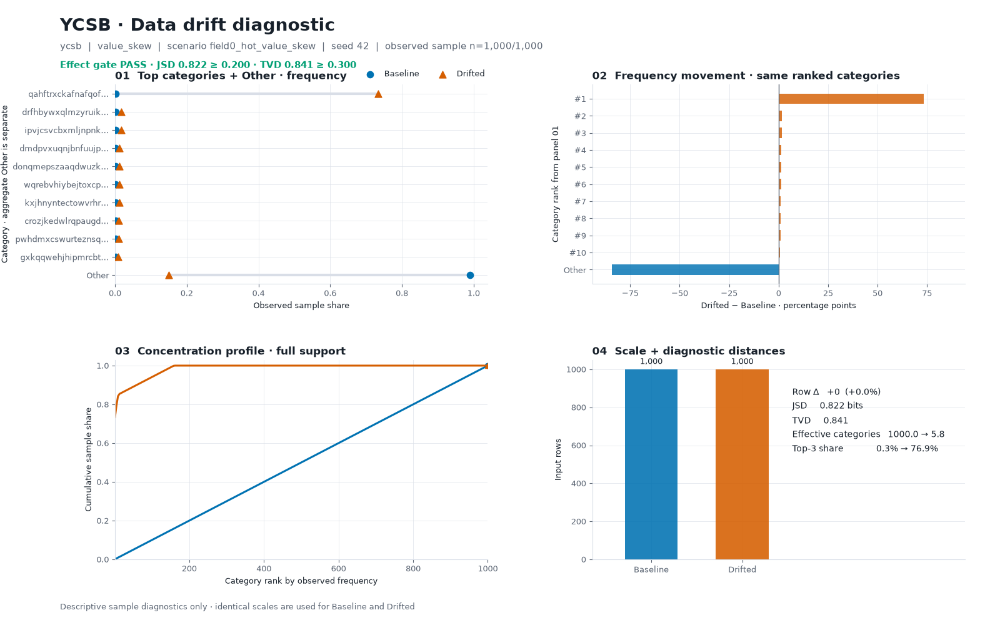

- DriftSpec: [`specs/data/ycsb/field0_hot_value_skew.yaml`](specs/data/ycsb/field0_hot_value_skew.yaml)
- Manifest: [`manifests/data/ycsb/field0_hot_value_skew.json`](manifests/data/ycsb/field0_hot_value_skew.json)
- Configuration: `{"column":"FIELD0","columns":["FIELD0"],"drift_type":"value_skew","portion":0.85,"skewness":6,"table":"usertable"}`
- Effect: **PASS** — jensen_shannon_divergence_bits `0.822257` gte `0.2` (✓); total_variation_distance `0.841` gte `0.3` (✓)
- Seed/sample: `42` / `1000`
- Reproduce: `python -m visualization.cli generate --benchmark ycsb --kind data --scenario field0_hot_value_skew --seed 42 --sample-size 1000 --offline`

#### `record_cardinality_reduction` — PASS

Reduce the record population while preserving the adapter's field schema.

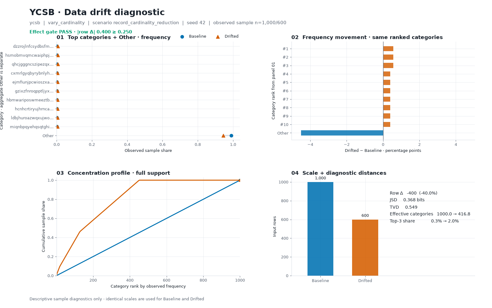

- DriftSpec: [`specs/data/ycsb/record_cardinality_reduction.yaml`](specs/data/ycsb/record_cardinality_reduction.yaml)
- Manifest: [`manifests/data/ycsb/record_cardinality_reduction.json`](manifests/data/ycsb/record_cardinality_reduction.json)
- Configuration: `{"column":"FIELD0","drift_type":"vary_cardinality","scale":0.6,"table":"usertable"}`
- Effect: **PASS** — absolute_row_rate `0.4` gte `0.25` (✓)
- Seed/sample: `42` / `1000`
- Reproduce: `python -m visualization.cli generate --benchmark ycsb --kind data --scenario record_cardinality_reduction --seed 42 --sample-size 1000 --offline`

#### `record_cardinality_growth` — PASS

Grow adapter-shaped records by 50%; this is a volume drift and makes no key-integrity claim.

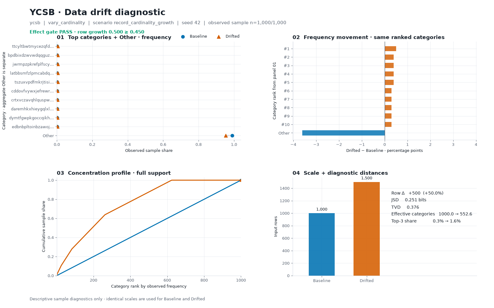

- DriftSpec: [`specs/data/ycsb/record_cardinality_growth.yaml`](specs/data/ycsb/record_cardinality_growth.yaml)
- Manifest: [`manifests/data/ycsb/record_cardinality_growth.json`](manifests/data/ycsb/record_cardinality_growth.json)
- Configuration: `{"column":"FIELD0","drift_type":"vary_cardinality","scale":1.5,"table":"usertable"}`
- Effect: **PASS** — row_growth_rate `0.5` gte `0.45` (✓)
- Seed/sample: `42` / `1000`
- Reproduce: `python -m visualization.cli generate --benchmark ycsb --kind data --scenario record_cardinality_growth --seed 42 --sample-size 1000 --offline`

### Query Drift

#### `scan_heavy_profile` — PASS

Shift public workload profile A to scan-heavy profile E.

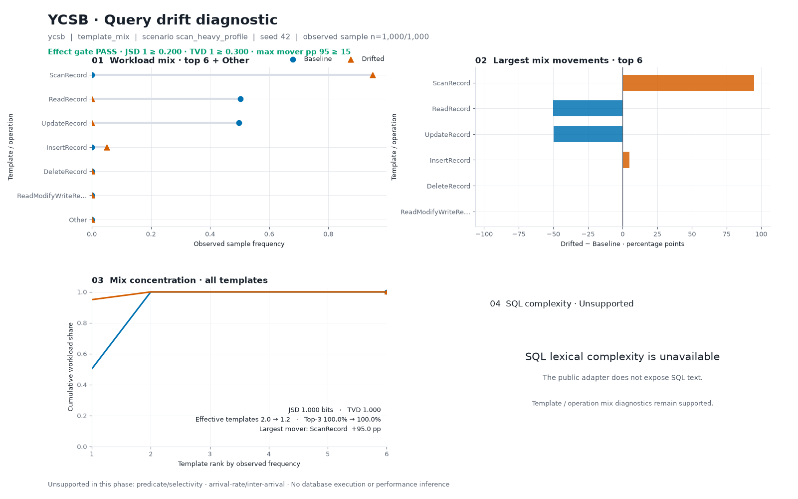

- DriftSpec: [`specs/query/ycsb/scan_heavy_profile.yaml`](specs/query/ycsb/scan_heavy_profile.yaml)
- Manifest: [`manifests/query/ycsb/scan_heavy_profile.json`](manifests/query/ycsb/scan_heavy_profile.json)
- Configuration: `{"baseline_weights":{"DeleteRecord":0.0,"InsertRecord":0.0,"ReadModifyWriteRecord":0.0,"ReadRecord":0.5,"ScanRecord":0.0,"UpdateRecord":0.5},"sample_size":1000,"target_weights":{"DeleteRecord":0.0,"InsertRecord":0.05,"ReadModifyWriteRecord":0.0,"ReadRecord":0.0,"ScanRecord":0.95,"UpdateRecord":0.0}}`
- Effect: **PASS** — jensen_shannon_divergence_bits `1` gte `0.2` (✓); total_variation_distance `1` gte `0.3` (✓); max_mover_absolute_pp `95` gte `15` (✓)
- Seed/sample: `42` / `1000`
- Reproduce: `python -m visualization.cli generate --benchmark ycsb --kind query --scenario scan_heavy_profile --seed 42 --sample-size 1000 --offline`

#### `read_only_profile` — PASS

Shift public workload profile A to read-only profile C.

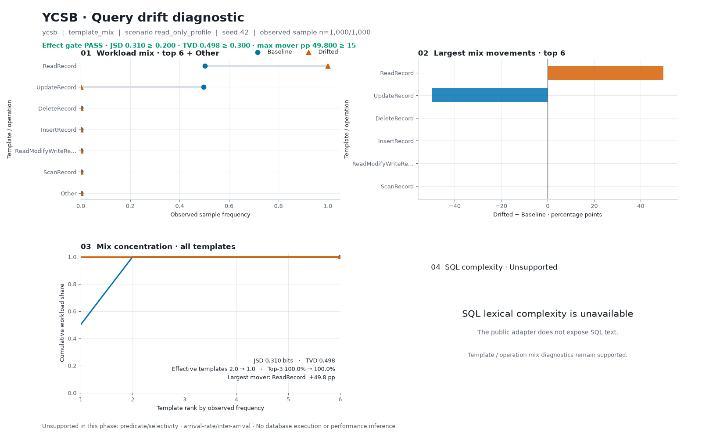

- DriftSpec: [`specs/query/ycsb/read_only_profile.yaml`](specs/query/ycsb/read_only_profile.yaml)
- Manifest: [`manifests/query/ycsb/read_only_profile.json`](manifests/query/ycsb/read_only_profile.json)
- Configuration: `{"baseline_weights":{"DeleteRecord":0.0,"InsertRecord":0.0,"ReadModifyWriteRecord":0.0,"ReadRecord":0.5,"ScanRecord":0.0,"UpdateRecord":0.5},"sample_size":1000,"target_weights":{"DeleteRecord":0.0,"InsertRecord":0.0,"ReadModifyWriteRecord":0.0,"ReadRecord":1.0,"ScanRecord":0.0,"UpdateRecord":0.0}}`
- Effect: **PASS** — jensen_shannon_divergence_bits `0.309695` gte `0.2` (✓); total_variation_distance `0.498` gte `0.3` (✓); max_mover_absolute_pp `49.8` gte `15` (✓)
- Seed/sample: `42` / `1000`
- Reproduce: `python -m visualization.cli generate --benchmark ycsb --kind query --scenario read_only_profile --seed 42 --sample-size 1000 --offline`

**Current limitations:** YCSB exposes operation weights rather than SQL; SQL complexity, selectivity, and observed temporal metrics are unsupported.

## DSB (`dsb`)

Synthetic star-schema benchmark with three analytical SQL templates.

### Data Drift

#### `revenue_outliers` — PASS

Add a measurable high-revenue tail to lineorder.

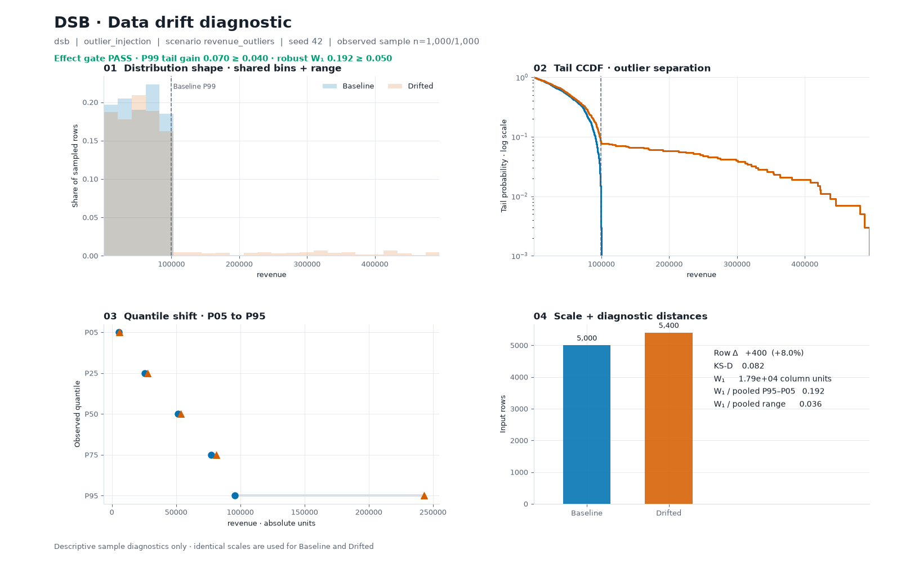

- DriftSpec: [`specs/data/dsb/revenue_outliers.yaml`](specs/data/dsb/revenue_outliers.yaml)
- Manifest: [`manifests/data/dsb/revenue_outliers.json`](manifests/data/dsb/revenue_outliers.json)
- Configuration: `{"column":"revenue","drift_type":"outlier_injection","extreme_direction":"high","extreme_scale":4,"n_ratio":0.08,"table":"lineorder"}`
- Effect: **PASS** — tail_gain_over_baseline_p99 `0.07` gte `0.04` (✓); normalized_wasserstein_p95_p05 `0.191747` gte `0.05` (✓)
- Seed/sample: `42` / `1000`
- Reproduce: `python -m visualization.cli generate --benchmark dsb --kind data --scenario revenue_outliers --seed 42 --sample-size 1000 --offline`

#### `revenue_skew` — PASS

Shift most revenue values toward a right-skewed regime.

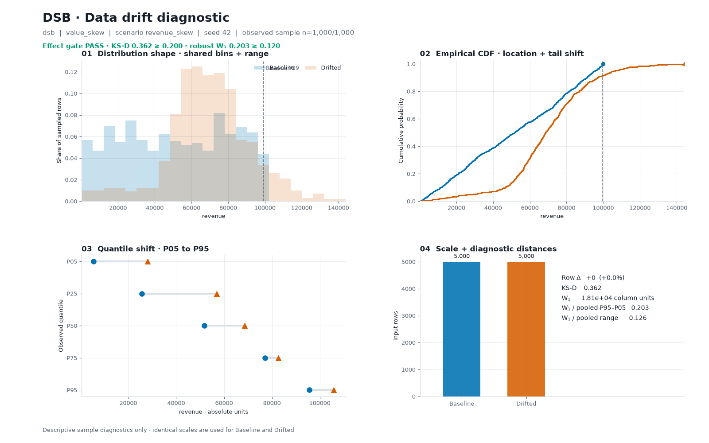

- DriftSpec: [`specs/data/dsb/revenue_skew.yaml`](specs/data/dsb/revenue_skew.yaml)
- Manifest: [`manifests/data/dsb/revenue_skew.json`](manifests/data/dsb/revenue_skew.json)
- Configuration: `{"column":"revenue","columns":["revenue"],"drift_type":"value_skew","portion":0.8,"skewness":5,"table":"lineorder"}`
- Effect: **PASS** — ks_distance `0.362` gte `0.2` (✓); normalized_wasserstein_p95_p05 `0.20337` gte `0.12` (✓)
- Seed/sample: `42` / `1000`
- Reproduce: `python -m visualization.cli generate --benchmark dsb --kind data --scenario revenue_skew --seed 42 --sample-size 1000 --offline`

#### `lineorder_cardinality_reduction` — PASS

Reduce the lineorder population by 45% to expose a strong fact-table volume drift.

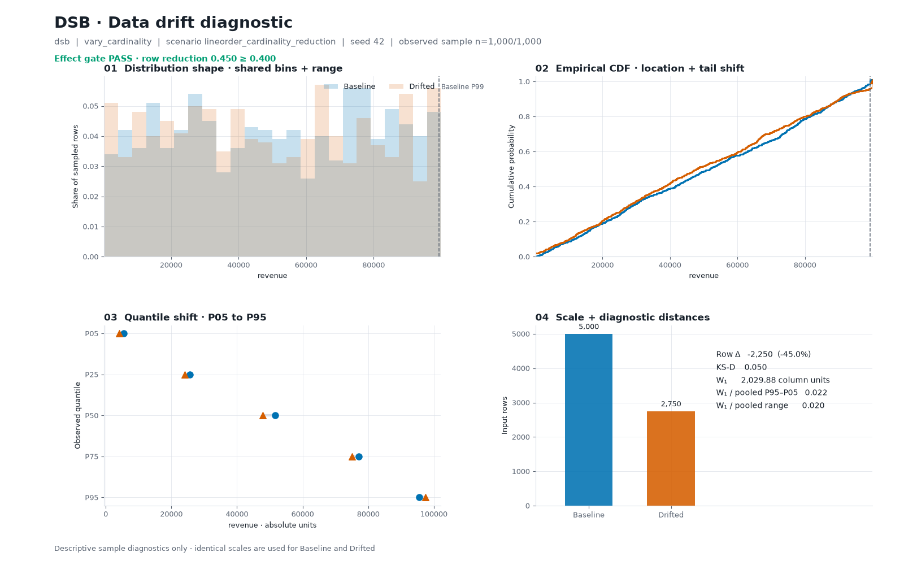

- DriftSpec: [`specs/data/dsb/lineorder_cardinality_reduction.yaml`](specs/data/dsb/lineorder_cardinality_reduction.yaml)
- Manifest: [`manifests/data/dsb/lineorder_cardinality_reduction.json`](manifests/data/dsb/lineorder_cardinality_reduction.json)
- Configuration: `{"column":"revenue","drift_type":"vary_cardinality","scale":0.55,"table":"lineorder"}`
- Effect: **PASS** — row_reduction_rate `0.45` gte `0.4` (✓)
- Seed/sample: `42` / `1000`
- Reproduce: `python -m visualization.cli generate --benchmark dsb --kind data --scenario lineorder_cardinality_reduction --seed 42 --sample-size 1000 --offline`

### Query Drift

#### `region_hotset` — PASS

Concentrate DSB queries on regional revenue analysis.

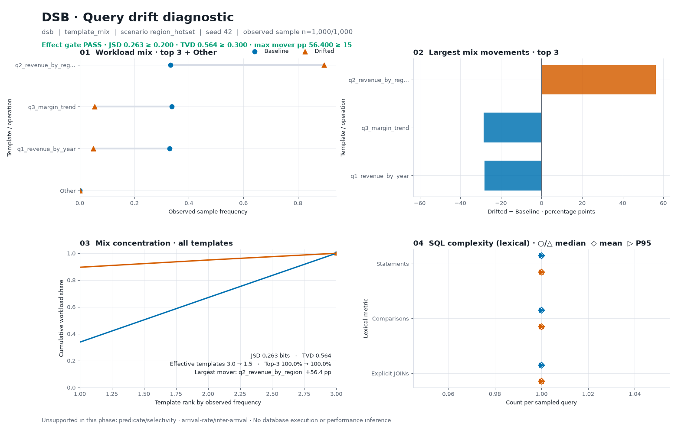

- DriftSpec: [`specs/query/dsb/region_hotset.yaml`](specs/query/dsb/region_hotset.yaml)
- Manifest: [`manifests/query/dsb/region_hotset.json`](manifests/query/dsb/region_hotset.json)
- Configuration: `{"baseline_weights":{"q1_revenue_by_year":0.333334,"q2_revenue_by_region":0.333333,"q3_margin_trend":0.333333},"sample_size":1000,"target_weights":{"q1_revenue_by_year":0.05,"q2_revenue_by_region":0.9,"q3_margin_trend":0.05}}`
- Effect: **PASS** — jensen_shannon_divergence_bits `0.26294` gte `0.2` (✓); total_variation_distance `0.564` gte `0.3` (✓); max_mover_absolute_pp `56.4` gte `15` (✓)
- Seed/sample: `42` / `1000`
- Reproduce: `python -m visualization.cli generate --benchmark dsb --kind query --scenario region_hotset --seed 42 --sample-size 1000 --offline`

#### `margin_hotset` — PASS

Move the DSB hotset to margin-trend analysis.

- DriftSpec: [`specs/query/dsb/margin_hotset.yaml`](specs/query/dsb/margin_hotset.yaml)
- Manifest: [`manifests/query/dsb/margin_hotset.json`](manifests/query/dsb/margin_hotset.json)
- Configuration: `{"baseline_weights":{"q1_revenue_by_year":0.333334,"q2_revenue_by_region":0.333333,"q3_margin_trend":0.333333},"sample_size":1000,"target_weights":{"q1_revenue_by_year":0.05,"q2_revenue_by_region":0.05,"q3_margin_trend":0.9}}`
- Effect: **PASS** — jensen_shannon_divergence_bits `0.277249` gte `0.2` (✓); total_variation_distance `0.573` gte `0.3` (✓); max_mover_absolute_pp `57.3` gte `15` (✓)
- Seed/sample: `42` / `1000`
- Reproduce: `python -m visualization.cli generate --benchmark dsb --kind query --scenario margin_hotset --seed 42 --sample-size 1000 --offline`

**Current limitations:** SQL metrics are lexical and no database selectivity or observed arrival timestamps are measured.

## pgbench (`pgbench`)

Synthetic TPC-B-like input data and three public pgbench workload scripts.

### Data Drift

#### `balance_skew` — PASS

Reweight account balances into a visibly skewed distribution.

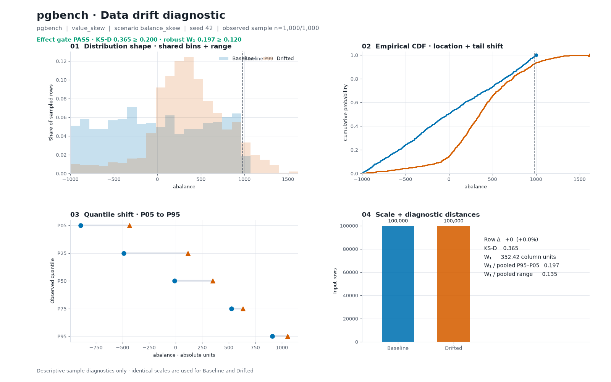

- DriftSpec: [`specs/data/pgbench/balance_skew.yaml`](specs/data/pgbench/balance_skew.yaml)
- Manifest: [`manifests/data/pgbench/balance_skew.json`](manifests/data/pgbench/balance_skew.json)
- Configuration: `{"column":"abalance","columns":["abalance"],"drift_type":"value_skew","portion":0.8,"skewness":5,"table":"pgbench_accounts"}`
- Effect: **PASS** — ks_distance `0.365` gte `0.2` (✓); normalized_wasserstein_p95_p05 `0.196768` gte `0.12` (✓)
- Seed/sample: `42` / `1000`
- Reproduce: `python -m visualization.cli generate --benchmark pgbench --kind data --scenario balance_skew --seed 42 --sample-size 1000 --offline`

#### `balance_outliers` — PASS

Inject a high-balance tail while retaining all baseline accounts.

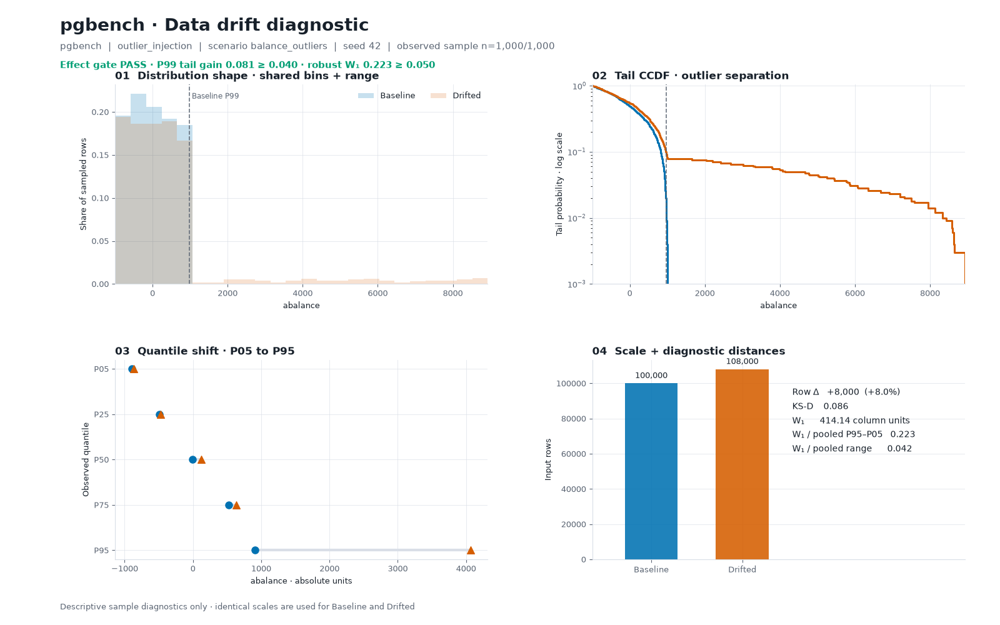

- DriftSpec: [`specs/data/pgbench/balance_outliers.yaml`](specs/data/pgbench/balance_outliers.yaml)
- Manifest: [`manifests/data/pgbench/balance_outliers.json`](manifests/data/pgbench/balance_outliers.json)
- Configuration: `{"column":"abalance","drift_type":"outlier_injection","extreme_direction":"high","extreme_scale":4,"n_ratio":0.08,"table":"pgbench_accounts"}`
- Effect: **PASS** — tail_gain_over_baseline_p99 `0.081` gte `0.04` (✓); normalized_wasserstein_p95_p05 `0.222649` gte `0.05` (✓)
- Seed/sample: `42` / `1000`
- Reproduce: `python -m visualization.cli generate --benchmark pgbench --kind data --scenario balance_outliers --seed 42 --sample-size 1000 --offline`

#### `account_cardinality_reduction` — PASS

Reduce the account population by 45% so volume drift is immediately visible.

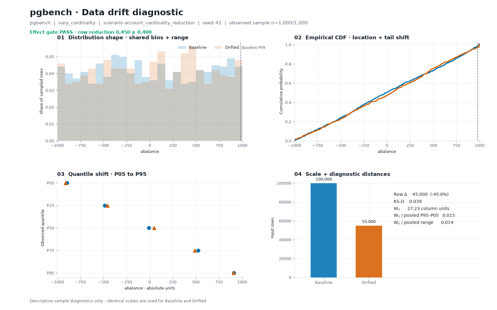

- DriftSpec: [`specs/data/pgbench/account_cardinality_reduction.yaml`](specs/data/pgbench/account_cardinality_reduction.yaml)
- Manifest: [`manifests/data/pgbench/account_cardinality_reduction.json`](manifests/data/pgbench/account_cardinality_reduction.json)
- Configuration: `{"column":"abalance","drift_type":"vary_cardinality","scale":0.55,"table":"pgbench_accounts"}`
- Effect: **PASS** — row_reduction_rate `0.45` gte `0.4` (✓)
- Seed/sample: `42` / `1000`
- Reproduce: `python -m visualization.cli generate --benchmark pgbench --kind data --scenario account_cardinality_reduction --seed 42 --sample-size 1000 --offline`

### Query Drift

#### `select_only_hotset` — PASS

Concentrate the mix on read-only point lookups.

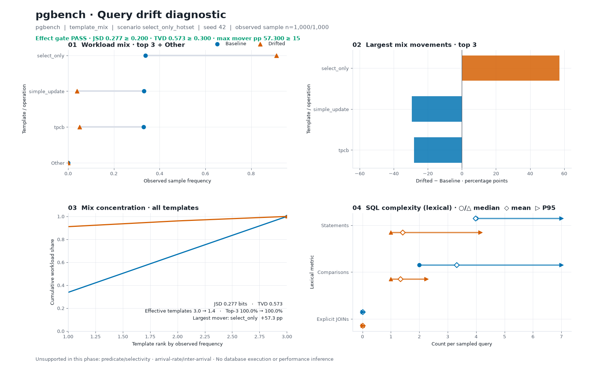

- DriftSpec: [`specs/query/pgbench/select_only_hotset.yaml`](specs/query/pgbench/select_only_hotset.yaml)
- Manifest: [`manifests/query/pgbench/select_only_hotset.json`](manifests/query/pgbench/select_only_hotset.json)
- Configuration: `{"baseline_weights":{"select_only":0.333334,"simple_update":0.333333,"tpcb":0.333333},"sample_size":1000,"target_weights":{"select_only":0.9,"simple_update":0.05,"tpcb":0.05}}`
- Effect: **PASS** — jensen_shannon_divergence_bits `0.277249` gte `0.2` (✓); total_variation_distance `0.573` gte `0.3` (✓); max_mover_absolute_pp `57.3` gte `15` (✓)
- Seed/sample: `42` / `1000`
- Reproduce: `python -m visualization.cli generate --benchmark pgbench --kind query --scenario select_only_hotset --seed 42 --sample-size 1000 --offline`

#### `complexity_mix_shift` — PASS

Shift the mix toward the full TPC-B transaction script.

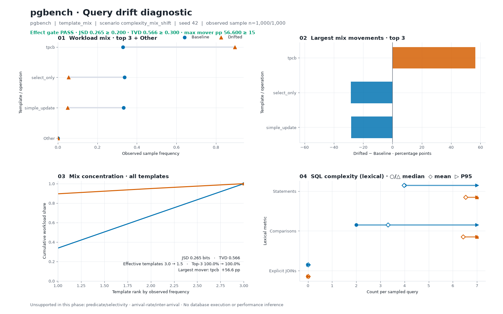

- DriftSpec: [`specs/query/pgbench/complexity_mix_shift.yaml`](specs/query/pgbench/complexity_mix_shift.yaml)
- Manifest: [`manifests/query/pgbench/complexity_mix_shift.json`](manifests/query/pgbench/complexity_mix_shift.json)
- Configuration: `{"baseline_weights":{"select_only":0.333334,"simple_update":0.333333,"tpcb":0.333333},"sample_size":1000,"target_weights":{"select_only":0.05,"simple_update":0.05,"tpcb":0.9}}`
- Effect: **PASS** — jensen_shannon_divergence_bits `0.264627` gte `0.2` (✓); total_variation_distance `0.566` gte `0.3` (✓); max_mover_absolute_pp `56.6` gte `15` (✓)
- Seed/sample: `42` / `1000`
- Reproduce: `python -m visualization.cli generate --benchmark pgbench --kind query --scenario complexity_mix_shift --seed 42 --sample-size 1000 --offline`

**Current limitations:** No PostgreSQL server is executed; SQL metrics are lexical and configured rates are not observed arrivals.
